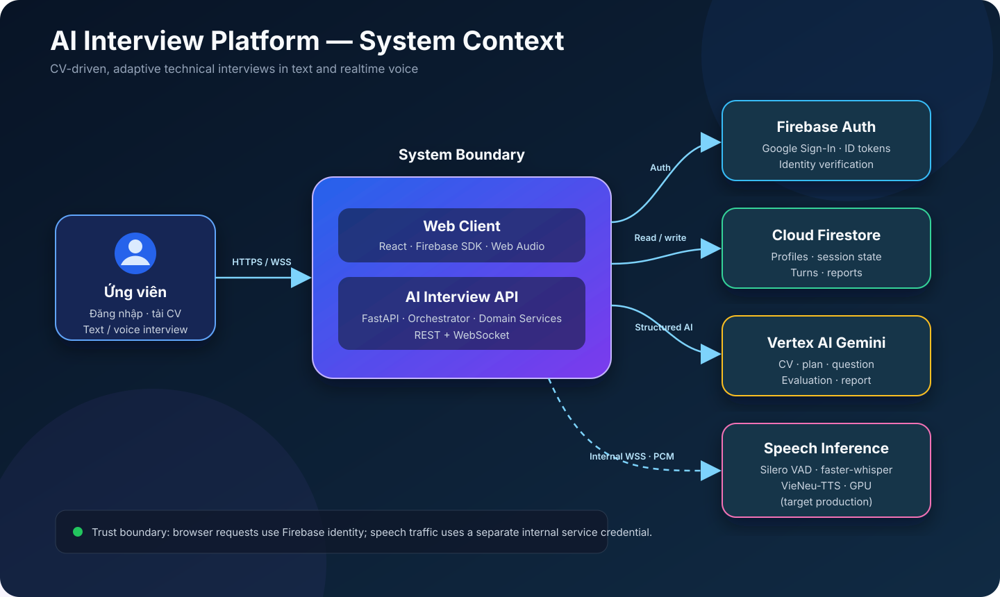
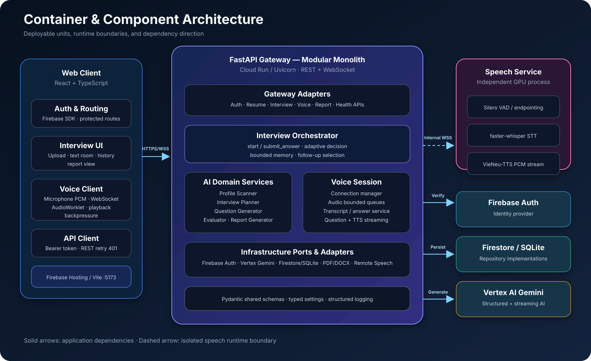
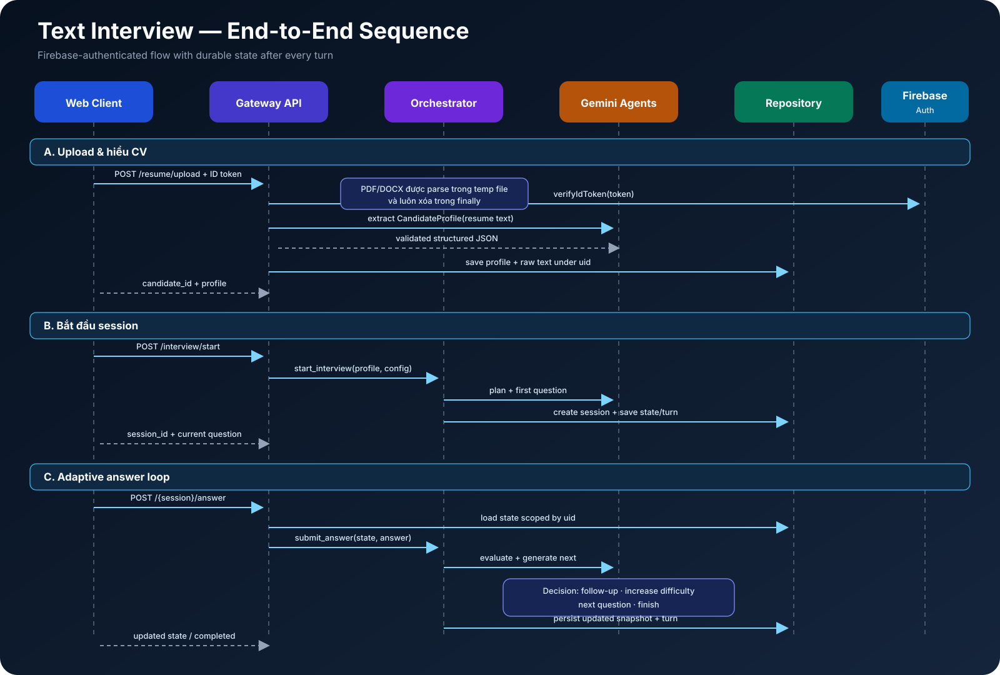
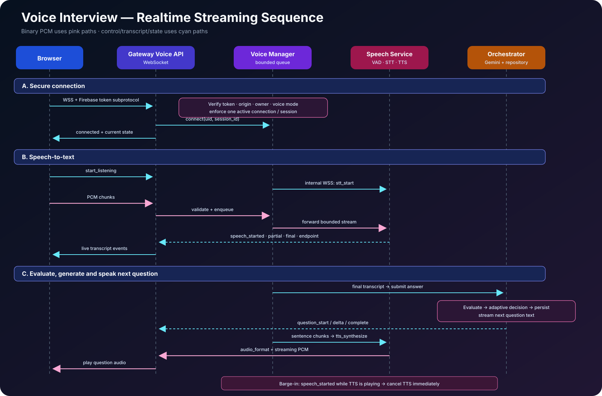
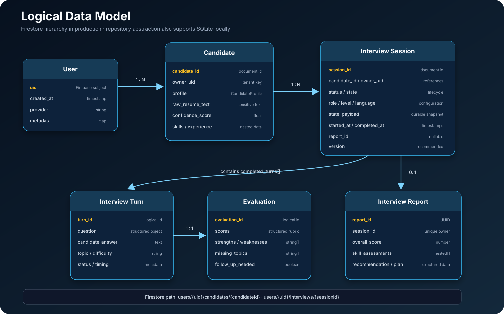

# System Design — AI Interview Platform

> Phiên bản: 1.0 — cập nhật theo code ngày 24/07/2026  
> Phạm vi: kiến trúc V2 đang chạy qua `gateway.main`, không mô tả các module legacy.

## 1. Tóm tắt

AI Interview Platform là nền tảng phỏng vấn kỹ thuật dựa trên CV. Người dùng đăng nhập bằng Firebase, tải CV PDF/DOCX, cấu hình buổi phỏng vấn, trả lời bằng văn bản hoặc giọng nói, sau đó nhận báo cáo đánh giá do Gemini tạo.

Backend được tổ chức theo **modular monolith**: một FastAPI gateway chứa API, orchestration và các domain service; phần suy luận giọng nói được tách thành một tiến trình riêng để có thể chạy trên GPU và scale độc lập. Repository abstraction cho phép dùng SQLite khi phát triển và Firestore khi triển khai.



### Trạng thái triển khai

- **Code hiện tại:** hỗ trợ text interview và voice interview end-to-end.
- **Local:** React `:5173`, FastAPI `:8000`, speech inference `:9000`.
- **Production đã được xác nhận trong `DEPLOYMENT_REPORT.md` ngày 23/07/2026:** frontend trên Firebase Hosting, backend trên Cloud Run, dữ liệu trên Firestore, AI trên Vertex AI.
- **Khoảng cách cần lưu ý:** báo cáo production gần nhất mới công bố text interview; speech service GPU chưa được xác nhận đã deploy production. Vì vậy sơ đồ production voice trong tài liệu này là **target architecture**.

## 2. Yêu cầu hệ thống

### 2.1. Yêu cầu chức năng

1. Đăng nhập Google/Firebase và bảo vệ toàn bộ tài nguyên theo `uid`.
2. Nhận CV PDF/DOCX tối đa 10 MB, trích xuất text và chuẩn hóa thành `CandidateProfile`.
3. Tạo interview plan dựa trên CV, level, ngôn ngữ, phong cách và mục tiêu.
4. Sinh câu hỏi, chấm câu trả lời, chọn follow-up hoặc tăng độ khó thích ứng.
5. Hỗ trợ phỏng vấn text qua REST.
6. Hỗ trợ phỏng vấn voice realtime qua WebSocket:
   - microphone PCM → VAD → faster-whisper → transcript;
   - transcript cuối → evaluation/orchestrator;
   - câu hỏi kế tiếp → streaming Gemini → VieNeu-TTS → PCM playback;
   - hỗ trợ barge-in để dừng TTS khi ứng viên bắt đầu nói.
7. Sinh báo cáo cuối, lưu và đọc lại lịch sử phỏng vấn.
8. Hỗ trợ tiếng Việt và tiếng Anh.

### 2.2. Yêu cầu phi chức năng

| Thuộc tính | Mục tiêu thiết kế |
| --- | --- |
| Bảo mật | Firebase ID token; ownership theo `uid`; CORS/origin allowlist; internal token cho speech service |
| Riêng tư | Không lưu/log audio; file CV tạm phải bị xóa; log không chứa token/body |
| Khả dụng | Health/readiness riêng; retry có backoff cho lỗi Gemini tạm thời |
| Hiệu năng | REST không gọi LLM: p95 < 500 ms; transcript partial < 1.5 s; first TTS audio < 2 s là mục tiêu đề xuất |
| Khả năng mở rộng | Gateway stateless ngoài voice connection; Firestore managed; speech worker scale theo GPU |
| Tính đúng đắn | Structured JSON + Pydantic validation cho đầu ra LLM; report generation idempotent |
| Giới hạn | answer ≤ 12.000 ký tự; audio chunk ≤ 256 KB; voice session ≤ 64 MB |

Các con số latency ở trên là **SLO đề xuất**, chưa phải kết quả benchmark của repository.

## 3. Kiến trúc tổng thể



### 3.1. Các container

| Container | Công nghệ | Trách nhiệm |
| --- | --- | --- |
| Web Client | React 18, TypeScript, Vite, React Query, Zustand | UI, Firebase sign-in, upload CV, text/voice room, playback PCM, report/history |
| API Gateway | FastAPI, Uvicorn, Python 3.12 | Auth, REST/WebSocket contract, orchestration, persistence, gọi Gemini |
| Speech Service | FastAPI WebSocket, Silero VAD, faster-whisper, VieNeu-TTS | Endpointing, STT streaming, TTS streaming; giữ audio trong bounded queue |
| Firebase Auth | Managed service | Google sign-in, phát và kiểm tra ID token |
| Firestore | Managed NoSQL | Candidate, session state, turns/evaluations và report theo từng user |
| Vertex AI Gemini | Managed AI | Parse CV, plan, question, evaluation, report và question streaming |

### 3.2. Vì sao dùng modular monolith

- Luồng interview cần chia sẻ schema và state chặt chẽ; gọi in-process đơn giản hơn microservice.
- Transaction boundary quanh session/turn dễ kiểm soát hơn.
- Deployment và debug phù hợp giai đoạn MVP.
- Speech được tách riêng vì có profile tài nguyên khác hẳn: GPU, model cache, binary streaming và thời gian khởi động dài.

## 4. Thiết kế backend theo component

```text
gateway/
  api/                 HTTP + WebSocket adapters
core/
  settings.py          typed environment configuration
  dependencies.py      dependency composition
  middleware.py        request correlation
orchestrator/
  interview_orchestrator.py
  decision_service.py
  memory_service.py
  follow_up_service.py
services/
  profile_scanner/     CV -> CandidateProfile
  interview_planner/   Profile + config -> InterviewPlan
  question_generator/  Round -> InterviewQuestion
  answer_evaluator/    Answer -> AnswerEvaluation
  report_generator/    Completed session -> InterviewReport
  voice_session/       voice state, queues, transcript, TTS
infrastructure/
  auth/                Firebase adapter
  llm/                 Vertex Gemini adapter
  repositories/        SQLite / Firestore adapters
  documents/           PDF / DOCX extraction
  speech/              local or remote STT/TTS adapters
shared/schemas/        Pydantic domain contracts
speech_service/        GPU-friendly inference process
```

Dependency flow chủ đạo:

```text
Gateway API
   -> Domain/Orchestration services
      -> Repository, LLM, document, speech interfaces
         -> Firebase / Firestore / Vertex / local model implementations
```

API không nên gọi trực tiếp SDK Firestore, Vertex hoặc model speech. `core.dependencies` là composition root quyết định implementation theo environment.

## 5. Luồng phỏng vấn văn bản



### 5.1. Khởi tạo

1. Client gửi Firebase ID token và CV.
2. Gateway xác thực token, kiểm tra loại/kích thước file.
3. `DocumentService` trích xuất text từ PDF/DOCX; file tạm bị xóa trong `finally`.
4. `ResumeAgent` yêu cầu Gemini trả về `CandidateProfile` đúng JSON schema.
5. Profile và raw resume text được lưu dưới owner `uid`.
6. Khi bắt đầu phỏng vấn, `InterviewPlannerAgent` tạo plan; `QuestionGeneratorAgent` tạo câu đầu.
7. Gateway tạo session, lưu toàn bộ `InterviewSessionState`, sau đó trả `session_id`.

### 5.2. Mỗi lượt trả lời

1. Gateway load state theo `(uid, session_id)`.
2. `EvaluatorAgent` chấm điểm, điểm mạnh/yếu, missing topics và nhu cầu follow-up.
3. `InterviewDecisionService` áp dụng rule:
   - `follow_up_needed` → follow-up;
   - score ≥ 8 → tăng difficulty;
   - còn round → câu tiếp theo;
   - đủ `question_count`/hết plan → kết thúc.
4. State và turn được persist trước khi trả response.
5. Khi session hoàn tất, `ReportService` tạo report một lần; các request sau trả report đã lưu.

## 6. Luồng phỏng vấn giọng nói



### 6.1. Kết nối và xác thực

- Client mở `WS /api/v2/voice/interview/{session_id}`.
- Firebase token được truyền qua WebSocket subprotocol.
- Gateway kiểm tra token, origin allowlist, ownership và `interview_config.mode == voice`.
- Mỗi `(uid, session_id)` chỉ có một voice connection active.

### 6.2. Audio pipeline

1. Browser gửi control event `start_listening`, sau đó gửi PCM binary chunks.
2. Gateway đẩy chunks vào bounded queue và forward qua internal WebSocket.
3. Speech service chạy Silero VAD và faster-whisper, trả `transcript_partial`, `transcript_final`, `speech_started`, `endpoint`.
4. Transcript cuối được submit như một answer bình thường vào `InterviewOrchestrator`.
5. Gateway stream text câu hỏi mới từ Gemini; đồng thời chunk câu theo ngữ nghĩa cho TTS.
6. VieNeu-TTS stream PCM về Gateway rồi về Browser.
7. Nếu VAD phát hiện ứng viên nói trong lúc phát TTS, Gateway cancel TTS (barge-in).

### 6.3. Nguyên tắc backpressure

- Queue STT và TTS đều có giới hạn.
- Client theo dõi `WebSocket.bufferedAmount`; server reject chunk quá lớn.
- Audio chỉ tồn tại trong memory và không được đưa vào Firestore/log.
- Khi queue đầy, hệ thống fail fast thay vì tăng memory không giới hạn.

## 7. Thiết kế dữ liệu



### 7.1. Firestore production

```text
users/{uid}
  candidates/{candidateId}
    profile
    raw_resume_text
  interviews/{sessionId}
    candidate_id
    status
    role / level / language
    state_payload
      candidate_profile
      interview_config
      interview_plan
      current_turn
      completed_turns[]
      memory
      voice_analytics
    turns[]
    evaluations[]
    interview_report
```

Ưu điểm của hierarchy này là tenant boundary rõ ràng: mọi query bắt đầu từ `users/{uid}`. Gateway vẫn phải kiểm tra ownership; không dựa vào ID khó đoán.

### 7.2. SQLite local

SQLite dùng các bảng `users`, `sessions`, `messages`, `evaluations`. Domain state phức tạp được serialize JSON vào các cột hiện có. Đây là adapter phát triển, không phải lựa chọn tốt cho nhiều gateway replica vì locking và local disk.

### 7.3. Vòng đời session

```text
created -> IN_PROGRESS/INTERVIEWING -> COMPLETED/ENDED -> REPORT_GENERATED
```

- `state_payload` là snapshot khôi phục chính.
- `completed_turns` là lịch sử đã chấm.
- `current_turn == null` biểu thị interview đã kết thúc ở domain layer.
- Report chỉ được tạo khi session completed và không còn current turn.

## 8. API contract chính

| Method | Endpoint | Mục đích |
| --- | --- | --- |
| `GET` | `/api/v2/auth/me` | Lấy identity hiện tại |
| `POST` | `/api/v2/resume/upload` | Upload và parse CV |
| `POST` | `/api/v2/interview/start` | Tạo plan/session/câu đầu |
| `POST` | `/api/v2/interview/{id}/answer` | Chấm answer và lấy câu tiếp |
| `GET` | `/api/v2/interview/{id}` | Khôi phục session |
| `WS` | `/api/v2/voice/interview/{id}` | Voice interview realtime |
| `POST` | `/api/v2/interview/{id}/report` | Sinh report idempotent |
| `GET` | `/api/v2/interview/{id}/report` | Đọc report |
| `GET` | `/api/v2/interviews` | Lịch sử có pagination |
| `GET` | `/health`, `/ready` | Liveness và readiness |

Mọi business endpoint đều cần Firebase bearer token, trừ health/readiness. Internal speech WebSocket dùng secret riêng trong production.

## 9. Bảo mật và quyền riêng tư

### Đã có trong code

- Firebase ID token validation ở gateway.
- Ownership check bằng `uid` trên candidate/session/report.
- Exact CORS và WebSocket origin allowlist.
- Giới hạn file, answer, WebSocket message, audio chunk và tổng audio.
- File CV tạm được xóa sau xử lý.
- Speech service có bearer token nội bộ khi chạy production.
- Request correlation và structured log; không log request body/audio.
- Cloud service dùng Application Default Credentials, không cần private key trong image.

### Khuyến nghị bổ sung

1. Dùng Secret Manager cho `SPEECH_SERVICE_TOKEN`; rotate định kỳ.
2. Dùng Cloud Armor/rate limit ở edge và per-user quota trong gateway.
3. Thiết lập retention cho raw CV và quyền “xóa dữ liệu của tôi”.
4. Mã hóa backup, audit log cho thao tác đọc/xóa dữ liệu nhạy cảm.
5. Không gửi raw CV vào log, trace hoặc analytics.
6. Nếu speech service public trên Cloud Run, yêu cầu IAM/internal ingress; application token chỉ là lớp bổ sung.

## 10. Khả năng mở rộng và độ tin cậy

### 10.1. Backend text

Gateway có thể scale ngang vì state lâu dài nằm trong Firestore. Điểm cần xử lý khi tăng tải:

- Gemini là dependency chậm và có quota: áp dụng timeout, exponential backoff, jitter và per-user concurrency limit.
- Không retry mù request có side effect. Dùng idempotency key cho `start`, `answer`, `report`.
- `state_payload` hiện được read-modify-write; nên thêm `version` và Firestore transaction để tránh hai answer cập nhật cùng lúc.
- History hiện có thể cần composite index và cursor pagination khi dữ liệu lớn.

### 10.2. Backend voice

WebSocket là connection có trạng thái trong memory nên:

- Một session phải được sticky vào một gateway instance trong suốt connection.
- Reconnect load lại durable interview state, nhưng transcript/audio buffer chưa hoàn thành có thể mất.
- Speech worker scale theo số stream GPU đồng thời, không theo HTTP request rate.
- Nên có admission control; khi GPU đầy, trả trạng thái busy/retry-after thay vì queue vô hạn.

### 10.3. Cache

- Không cache dữ liệu user nhạy cảm ở CDN.
- Có thể cache model, tokenizer và voice asset trong speech worker.
- Có thể cache template/prompt tĩnh trong process.
- Không cache LLM answer theo raw prompt nếu chưa có chiến lược tenant isolation.

## 11. Deployment

### 11.1. Local

```text
Browser -> Vite :5173
        -> Gateway :8000
        -> Speech :9000
Gateway -> Firestore + Vertex AI qua Google ADC
```

`docker-compose.local.yml` giữ nguyên service boundary. Backend gọi speech bằng DNS `speech-service:9000`.

### 11.2. Production hiện tại

```text
Firebase Hosting -> Cloud Run Gateway -> Firestore
                                  \----> Vertex AI Gemini
Firebase Auth -------------------------> token verification
```

Theo báo cáo gần nhất: gateway 1 CPU/1 GiB, concurrency 20, min 0, max 5. Cấu hình này phù hợp text MVP nhưng cold start và LLM latency cần được đo bằng SLO thực tế.

### 11.3. Target production cho voice

```text
Browser WSS -> Cloud Run Gateway
                  |
                  +-- private WSS --> GPU Speech Service
                                      |-- Silero VAD
                                      |-- faster-whisper
                                      `-- VieNeu-TTS
```

Speech service nên nằm cùng region với gateway, có GPU, min instance ≥ 1 nếu cần tránh model cold start, internal ingress và model cache bền hoặc baked image.

## 12. Observability

### Log

- JSON log với `request_id`, `session_id` đã hash/được kiểm soát, route, status và latency.
- Không ghi token, CV, answer, transcript hoặc audio.

### Metrics đề xuất

| Nhóm | Metric |
| --- | --- |
| API | request rate, 4xx/5xx, p50/p95/p99 latency |
| LLM | latency theo agent/model, retry count, invalid JSON rate, token/cost |
| Interview | start/completion rate, turns/session, report success |
| Voice | active sockets, audio queue depth, partial/final latency, first audio latency, barge-in count |
| Speech | GPU utilization/memory, real-time factor STT/TTS, model load time |
| Data | Firestore read/write errors, transaction conflicts |

### Alert đề xuất

- 5xx > 2% trong 5 phút.
- Gemini invalid structured output > 3%.
- Voice first-audio p95 > 3 giây.
- GPU memory > 90% hoặc admission rejection tăng liên tục.
- Readiness fail ở bất kỳ service nào.

## 13. Rủi ro và trade-off

| Quyết định | Lợi ích | Đánh đổi |
| --- | --- | --- |
| Modular monolith | Nhanh phát triển, shared schema, ít network hop | Gateway còn chịu nhiều trách nhiệm |
| Firestore snapshot JSON | Khôi phục session đơn giản | Document lớn, contention khi concurrent update |
| LLM structured output | Contract rõ và validate được | Có retry/latency khi model trả JSON sai |
| Remote speech service | Scale GPU độc lập | Thêm WebSocket hop và failure mode |
| Không lưu audio | Tốt cho riêng tư và chi phí | Không replay/debug được lỗi âm thanh |
| Streaming question + TTS | Giảm time-to-first-audio | Coordination/cancel/backpressure phức tạp |

## 14. Lộ trình kỹ thuật đề xuất

### P0 — trước khi bật voice production

1. Deploy speech service GPU private và chạy load test stream đồng thời.
2. Thêm session version + optimistic concurrency/transaction.
3. Thêm rate limit, quota và admission control GPU.
4. Đo p95 STT final, Gemini evaluation và first TTS audio.
5. Kiểm thử reconnect, barge-in, queue-full và model timeout.

### P1 — ổn định

1. Idempotency key cho các mutation API.
2. OpenTelemetry trace xuyên gateway → Vertex/speech.
3. Cursor pagination và Firestore indexes.
4. Data retention/delete workflow cho CV, transcript và report.
5. Prompt/model version được lưu cùng session/report để audit.

### P2 — quy mô lớn

1. Đưa report generation sang job queue nếu thời gian xử lý dài.
2. Tách LLM worker khi cần quota routing/batching riêng.
3. Dùng Redis/distributed lease cho voice connection ownership nếu nhiều gateway replica.
4. Multi-region chỉ khi có yêu cầu RTO/RPO rõ ràng; speech và data residency phải được đánh giá trước.

## 15. Capacity planning mẫu

Chưa có số liệu traffic thực tế, nên dùng công thức thay vì khẳng định capacity:

```text
Gateway concurrency cần thiết
  = peak_requests_per_second × p95_request_duration_seconds

Speech streams cần thiết
  = concurrent_voice_users × safety_factor

Firestore writes mỗi interview
  ≈ 1 candidate + 1 session + 2 × số_turn + 1 report

LLM calls mỗi interview text
  ≈ 1 CV parse + 1 plan + số_turn × (1 evaluation + 1 question) + 1 report
```

Ví dụ 100 interview đồng thời, trung bình 10 lượt, không đồng bộ hoàn toàn, cần load test theo rate thực tế; không thể suy trực tiếp rằng 100 user tương đương 100 Gemini call cùng lúc.

## 16. Nguồn code dùng để thiết kế

- `backend/gateway/main.py`, `backend/gateway/api/*`
- `backend/orchestrator/*`
- `backend/services/*`
- `backend/infrastructure/*`
- `backend/shared/schemas/*`
- `backend/speech_service/*`
- `frontend/src/App.tsx`, `frontend/src/lib/api.ts`
- `docker-compose.local.yml`
- `DEPLOYMENT_REPORT.md`

