# Architecture Diagram Suite

Generated from a repository audit on 2026-08-20. Each diagram states its purpose, principal flow, decisions, failure behavior, source evidence, and known gaps. The standalone `.mmd` source is authoritative for rendering.

Status vocabulary: `IMPLEMENTED` is present in executable source; `PARTIAL` is present but does not satisfy the documented target contract; `SPEC-PENDING` exists only in a binding specification or ADR; `UNKNOWN` cannot be established from the repository; `IMPLEMENTED OFFLINE` belongs to evaluation tooling rather than the production request path.

## 1. System Context

- **Category:** Architecture
- **Implementation status:** IMPLEMENTED/PARTIAL
- **Purpose:** Shows users, runtime boundaries, persistent stores, and external AI and identity providers.
- **Main flow:** Candidate uses the React client; the client calls FastAPI; FastAPI verifies Firebase identity, persists through SQLite or Firestore, calls Vertex AI, and optionally calls the speech service.
- **Key decision:** SQLite and local lexical retrieval are defaults; Firestore, vector retrieval, and remote speech are configuration-selected implementations.
- **Failure path:** Identity, provider, repository, document, and speech failures are isolated at the gateway boundary.
- **Code evidence:** frontend/src/App.tsx; backend/gateway/main.py; backend/core/dependencies.py; backend/core/settings.py
- **Gap / unknown:** Profile mutation and upload-operation target contracts remain SPEC-PENDING.
- **Standalone source:** [diagrams/01-system-context.mmd](diagrams/01-system-context.mmd)

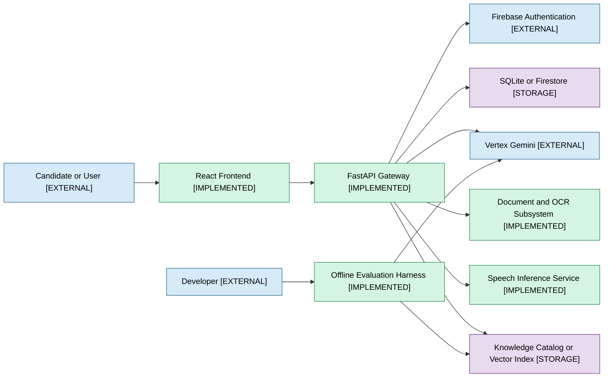

## 2. Container Architecture

- **Category:** Architecture
- **Implementation status:** IMPLEMENTED/PARTIAL
- **Purpose:** Maps deployable and in-process runtime containers without inventing workers or queues.
- **Main flow:** Browser serves the SPA, calls the backend container, and uses an optional speech container; backend owns agents and repositories.
- **Key decision:** AI pipeline, interview engine, and resume processor are modules inside the backend, not independently deployed services.
- **Failure path:** A backend failure affects text runtime; speech-service failure affects voice while text can remain available.
- **Code evidence:** docker-compose.local.yml; backend/Dockerfile; backend/Dockerfile.speech; frontend/firebase.json
- **Gap / unknown:** No durable background worker or broker exists.
- **Standalone source:** [diagrams/02-container-architecture.mmd](diagrams/02-container-architecture.mmd)

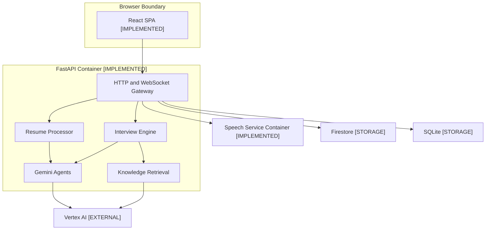

## 3. Backend Components

- **Category:** Architecture
- **Implementation status:** IMPLEMENTED
- **Purpose:** Shows active backend components and dependency direction.
- **Main flow:** Gateway routes resolve dependencies, call application services and orchestrator, which call provider and repository adapters.
- **Key decision:** The active seams are gateway, shared, services, orchestrator, and infrastructure; backend/app is compatibility re-export code.
- **Failure path:** Repository or LLM errors propagate through structured or FastAPI error responses.
- **Code evidence:** backend/core/dependencies.py; backend/gateway/api; backend/services; backend/orchestrator; backend/infrastructure
- **Gap / unknown:** Some route annotations still name SQLiteInterviewRepository although Firestore is injected in production.
- **Standalone source:** [diagrams/03-backend-components.mmd](diagrams/03-backend-components.mmd)

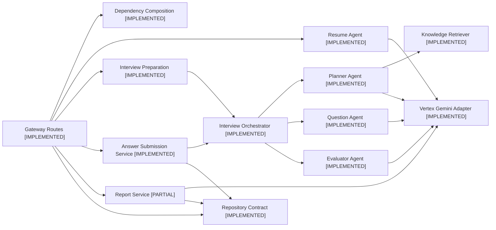

## 4. Frontend Architecture

- **Category:** Frontend
- **Implementation status:** IMPLEMENTED/PARTIAL
- **Purpose:** Maps production routes, shared state, API access, and voice hooks.
- **Main flow:** Protected routes use Firebase auth; pages use the centralized API adapter, TanStack Query provider, Zustand UI state, and WebSocket hooks.
- **Key decision:** Candidate Profile Review is a read-only production page even though the target spec defines an editor.
- **Failure path:** Network and authentication failures are normalized by ApiError and userFacingError.
- **Code evidence:** frontend/src/App.tsx; frontend/src/lib/api.ts; frontend/src/pages; frontend/src/store; frontend/src/hooks
- **Gap / unknown:** No production PATCH adapter, replacement upload state, or editable review form exists.
- **Standalone source:** [diagrams/04-frontend-architecture.mmd](diagrams/04-frontend-architecture.mmd)

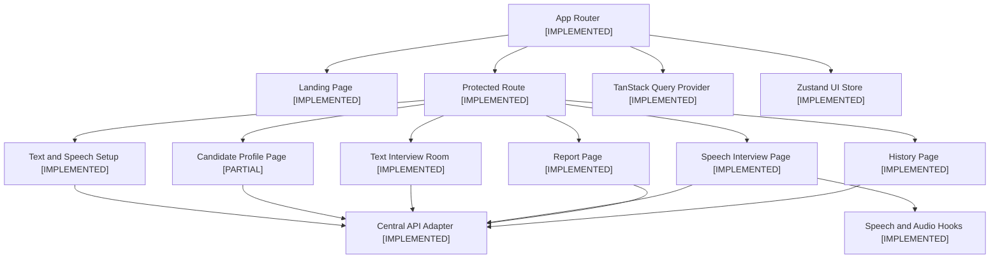

## 5. Complete End-to-End Pipeline

- **Category:** Runtime
- **Implementation status:** IMPLEMENTED/PARTIAL
- **Purpose:** Reconstructs the current successful path from Resume to report.
- **Main flow:** Upload validates and extracts a Resume, creates a Candidate Profile, prepares a plan, starts a session, evaluates answers adaptively, and generates a report.
- **Key decision:** Readiness is calculated on Profile GET but is not enforced by start.
- **Failure path:** Rejected documents stop before profile creation; provider and persistence errors can interrupt non-atomic upload or start.
- **Code evidence:** docs/PIPELINE_CV_TO_INTERVIEW_DEEP_DIVE_VI.md; backend/gateway/api; backend/orchestrator/interview_orchestrator.py
- **Gap / unknown:** Atomic versioned snapshot and historical report profile immutability are incomplete.
- **Standalone source:** [diagrams/05-end-to-end-pipeline.mmd](diagrams/05-end-to-end-pipeline.mmd)

```mermaid
%% Complete End-to-End Pipeline
%% Status: IMPLEMENTED/PARTIAL
%% Evidence: docs/PIPELINE_CV_TO_INTERVIEW_DEEP_DIVE_VI.md; backend/gateway/api; backend/orchestrator/interview_orchestrator.py
flowchart LR
  Upload["Upload Resume [IMPLEMENTED]"] --> Validate["Validate File [IMPLEMENTED]"]
  Validate --> Extract["Native Extract or OCR [IMPLEMENTED]"]
  Extract --> Profile["Candidate Profile [IMPLEMENTED]"]
  Profile --> Ready["Readiness Read Model [IMPLEMENTED]"]
  Profile --> Plan["Interview Plan [IMPLEMENTED]"]
  Plan --> Question["Question Generation [IMPLEMENTED]"]
  Question --> Answer["Candidate Answer [IMPLEMENTED]"]
  Answer --> Evaluate["Answer Evaluation [IMPLEMENTED]"]
  Evaluate --> Decide{"Continue or Complete"}
  Decide -->|Continue| Question
  Decide -->|Complete| Report["Interview Report [PARTIAL]"]
  classDef implemented fill:#dcfce7,stroke:#166534,color:#14532d
  classDef partial fill:#fef3c7,stroke:#92400e,color:#78350f
  classDef pending fill:#fee2e2,stroke:#991b1b,color:#7f1d1d
  classDef external fill:#e0e7ff,stroke:#3730a3,color:#312e81
  classDef storage fill:#e0f2fe,stroke:#075985,color:#0c4a6e
```

## 6. Resume Ingestion Pipeline

- **Category:** Resume
- **Implementation status:** IMPLEMENTED
- **Purpose:** Details synchronous initial Resume upload and extraction.
- **Main flow:** The route writes one UploadFile to a temporary file, validates size and actual format, extracts PDF or DOCX, hashes content, and invokes profile extraction.
- **Key decision:** Only PDF and DOCX are accepted; the route does not implement multipart cardinality or Idempotency-Key.
- **Failure path:** Unsupported, mismatched, malformed, encrypted, or unreadable files are rejected and temporary files are deleted.
- **Code evidence:** backend/gateway/api/resume.py; backend/infrastructure/documents/pdf_service.py
- **Gap / unknown:** Initial persistence spans multiple writes and is not atomic.
- **Standalone source:** [diagrams/06-resume-ingestion.mmd](diagrams/06-resume-ingestion.mmd)

```mermaid
%% Resume Ingestion Pipeline
%% Status: IMPLEMENTED
%% Evidence: backend/gateway/api/resume.py; backend/infrastructure/documents/pdf_service.py
flowchart LR
  File["PDF or DOCX [EXTERNAL]"] --> Temp["Named Temporary File [IMPLEMENTED]"]
  Temp --> Size{"At most 10 MiB"}
  Size -->|No| RejectSize["413 File Too Large"]
  Size -->|Yes| Signature["Extension MIME Signature Check"]
  Signature -->|PDF| PDF["PDF Native Text"]
  Signature -->|DOCX| DOCX["Paragraph and Table Text"]
  Signature -->|Mismatch| RejectType["415 or 422 Rejection"]
  PDF --> OCR["Conditional OCR Fallback"]
  OCR --> Normalize["NFKC Text Cleanup"]
  DOCX --> Normalize
  Normalize --> Minimum{"At least 50 characters"}
  Minimum -->|No| RejectText["422 No Extractable Text"]
  Minimum -->|Yes| Profile["Profile Extraction"]
  Profile --> Cleanup["Delete Temporary File"]
  classDef implemented fill:#dcfce7,stroke:#166534,color:#14532d
  classDef partial fill:#fef3c7,stroke:#92400e,color:#78350f
  classDef pending fill:#fee2e2,stroke:#991b1b,color:#7f1d1d
  classDef external fill:#e0e7ff,stroke:#3730a3,color:#312e81
  classDef storage fill:#e0f2fe,stroke:#075985,color:#0c4a6e
```

## 7. OCR and Document Extraction Decision Tree

- **Category:** Resume
- **Implementation status:** IMPLEMENTED
- **Purpose:** Explains the real PDF OCR decision conditions.
- **Main flow:** pypdf extracts pages; TextQuality triggers OCR only for IMAGE_ONLY or SPARSE documents and only for pages below 50 alphanumeric characters.
- **Key decision:** OCR is capped at 20 pages with a 30-second document deadline and lazy RapidOCR loading.
- **Failure path:** Timeout, empty OCR, and failed OCR become warnings; less than 50 final characters becomes rejection.
- **Code evidence:** backend/infrastructure/documents/quality.py; backend/infrastructure/documents/pdf_service.py; backend/infrastructure/documents/ocr.py
- **Gap / unknown:** ADR 0004 says image-only documents are rejected without OCR, which conflicts with current runtime.
- **Standalone source:** [diagrams/07-ocr-decision-tree.mmd](diagrams/07-ocr-decision-tree.mmd)

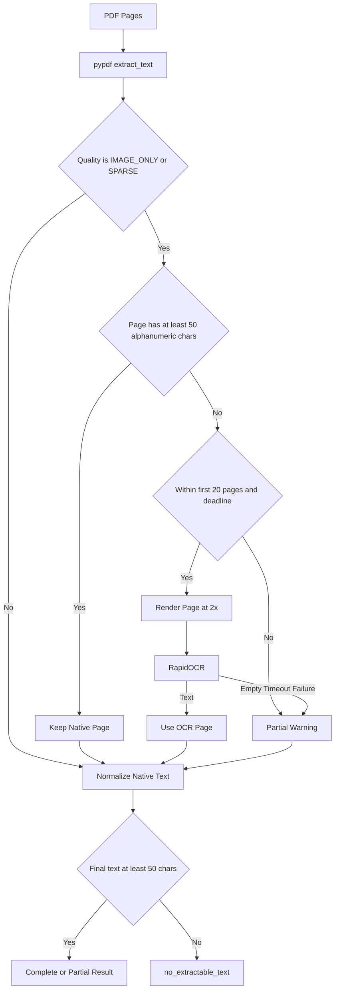

## 8. Candidate Profile Generation

- **Category:** Candidate
- **Implementation status:** IMPLEMENTED/PARTIAL
- **Purpose:** Shows how normalized Resume text becomes the canonical Candidate Profile.
- **Main flow:** Section-aware context feeds a structured Gemini extraction, semantic classification gate, schema conversion, and rule-based reconciliation.
- **Key decision:** Classification threshold is 0.7 and output arrays are bounded.
- **Failure path:** Non-resume content is rejected; invalid provider output is retried by the provider adapter except Resume uses one attempt.
- **Code evidence:** backend/services/profile_scanner/context.py; backend/services/profile_scanner/agent.py; backend/services/profile_scanner/schemas.py; backend/services/profile_scanner/verification.py; backend/services/profile_scanner/prompts.py
- **Gap / unknown:** Field provenance exists in memory but is not persisted or returned.
- **Standalone source:** [diagrams/08-candidate-profile-generation.mmd](diagrams/08-candidate-profile-generation.mmd)

```mermaid
%% Candidate Profile Generation
%% Status: IMPLEMENTED/PARTIAL
%% Evidence: backend/services/profile_scanner/context.py; backend/services/profile_scanner/agent.py; backend/services/profile_scanner/schemas.py; backend/services/profile_scanner/verification.py; backend/services/profile_scanner/prompts.py
flowchart LR
  Text["Normalized Resume Text"] --> Context["Section-aware Context max 16000 chars"]
  Context --> LLM["Gemini Resume Extraction"]
  LLM --> Classify{"Resume and confidence at least 0.7"}
  Classify -->|No| Reject["not_a_resume"]
  Classify -->|Yes| Raw["ResumeExtractionResult"]
  Raw --> Bounds["Limit Skills Evidence Projects Experiences"]
  Bounds --> Canonical["CandidateProfile"]
  Canonical --> Verify["Rule Verification and Reconciliation"]
  Verify --> Profile["Persistable Candidate Profile"]
  Verify --> Prov["Provenance Records [PARTIAL]"]
  classDef implemented fill:#dcfce7,stroke:#166534,color:#14532d
  classDef partial fill:#fef3c7,stroke:#92400e,color:#78350f
  classDef pending fill:#fee2e2,stroke:#991b1b,color:#7f1d1d
  classDef external fill:#e0e7ff,stroke:#3730a3,color:#312e81
  classDef storage fill:#e0f2fe,stroke:#075985,color:#0c4a6e
```

## 9. Candidate Profile Data Model

- **Category:** Data
- **Implementation status:** IMPLEMENTED/PARTIAL
- **Purpose:** Documents actual Candidate Profile fields and nested value objects.
- **Main flow:** PersistedCandidateProfile extends CandidateProfile with candidate_id and profile_version.
- **Key decision:** Education accepts a legacy string or structured entries; Skill Evidence lacks target evidence_id.
- **Failure path:** Pydantic validation rejects invalid confidence ranges but unknown correction keys are not strictly rejected by this response model.
- **Code evidence:** backend/shared/schemas/candidate.py; frontend/src/types/index.ts
- **Gap / unknown:** Editable and read-only fields remain mixed in one model.
- **Standalone source:** [diagrams/09-candidate-profile-data-model.mmd](diagrams/09-candidate-profile-data-model.mmd)

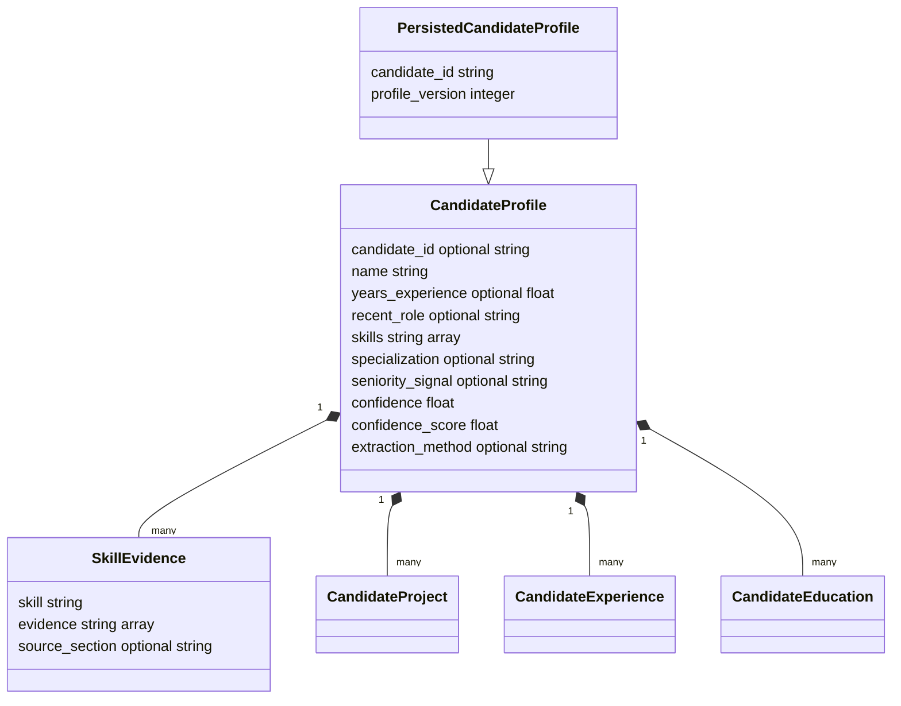

## 10. Profile Readiness Pipeline

- **Category:** Candidate
- **Implementation status:** IMPLEMENTED/PARTIAL
- **Purpose:** Shows the backend-authoritative readiness evaluator and its current integration boundary.
- **Main flow:** NFKC normalization checks identity, skills, interviewable evidence, and legacy validity issues and returns every issue.
- **Key decision:** Profile GET calls the evaluator; interview start currently does not.
- **Failure path:** A non-ready profile can still start through the API, creating a contract gap.
- **Code evidence:** backend/services/candidate_profile/readiness.py; backend/services/candidate_profile/normalization.py; backend/gateway/api/candidate_profile.py; backend/gateway/api/interview.py
- **Gap / unknown:** Shared start enforcement for text and voice is SPEC-PENDING.
- **Standalone source:** [diagrams/10-profile-readiness.mmd](diagrams/10-profile-readiness.mmd)

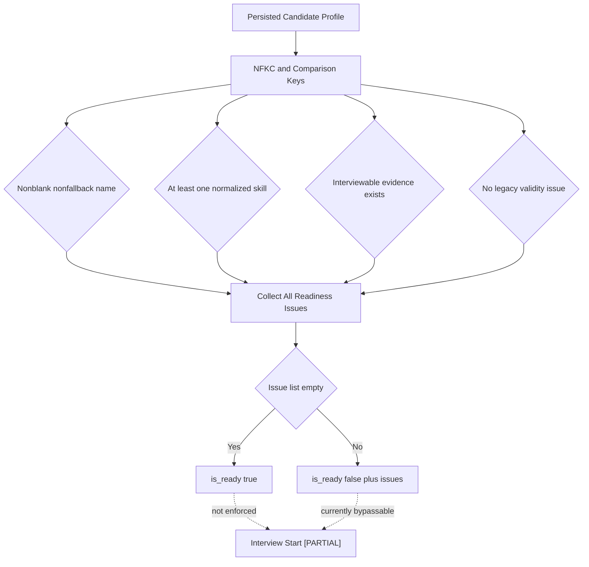

## 11. Interview Plan Generation

- **Category:** Interview
- **Implementation status:** IMPLEMENTED
- **Purpose:** Explains planner inputs and outputs.
- **Main flow:** The planner combines the Candidate Profile, InterviewConfig, and curated knowledge topics in a Gemini structured-output call.
- **Key decision:** Knowledge guides topic depth while candidate evidence remains authoritative.
- **Failure path:** Empty or undersized rounds can end an interview before question_count is reached.
- **Code evidence:** backend/services/interview_planner/agent.py; backend/services/interview_planner/prompts.py; backend/services/interview_knowledge; backend/shared/schemas/interview.py
- **Gap / unknown:** There is no schema invariant tying total round budget to question_count.
- **Standalone source:** [diagrams/11-interview-plan-generation.mmd](diagrams/11-interview-plan-generation.mmd)

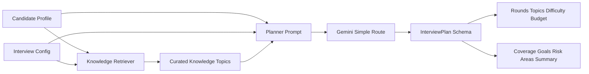

## 12. Interview Plan Data Model

- **Category:** Data
- **Implementation status:** IMPLEMENTED
- **Purpose:** Shows the actual plan and round schema.
- **Main flow:** InterviewPlan owns a list of InterviewRound value objects and summary fields.
- **Key decision:** Difficulty is easy, medium, or hard; question_budget is at least one.
- **Failure path:** Schema validation rejects out-of-range duration, weight, and budget.
- **Code evidence:** backend/shared/schemas/interview.py
- **Gap / unknown:** The schema permits an empty rounds list.
- **Standalone source:** [diagrams/12-interview-plan-data-model.mmd](diagrams/12-interview-plan-data-model.mmd)

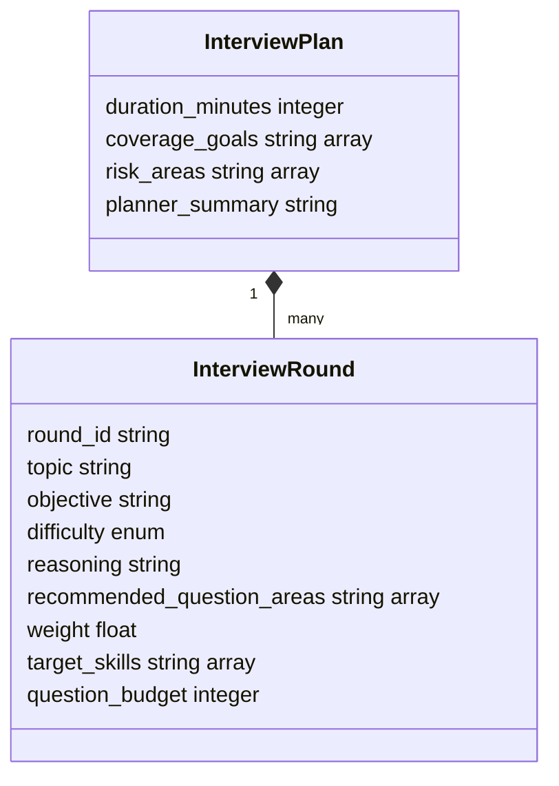

## 13. Question Generation Pipeline

- **Category:** Question Generation
- **Implementation status:** IMPLEMENTED
- **Purpose:** Shows the production question generator inputs and validation.
- **Main flow:** CandidateProfile, selected InterviewRound, and InterviewConfig are serialized into a prompt and validated as InterviewQuestion.
- **Key decision:** Retrieved knowledge influences the round through planning; it is not passed separately into QuestionGeneratorAgent.
- **Failure path:** Provider timeout or invalid structured output fails the request after configured retries.
- **Code evidence:** backend/services/question_generator/agent.py; backend/services/question_generator/prompts.py; backend/shared/schemas/interview.py
- **Gap / unknown:** Question history only influences regenerated follow-ups through avoid strings, not a general history input.
- **Standalone source:** [diagrams/13-question-generation-pipeline.mmd](diagrams/13-question-generation-pipeline.mmd)

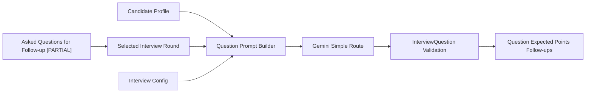

## 14. Question Generation Sequence

- **Category:** Question Generation
- **Implementation status:** IMPLEMENTED
- **Purpose:** Traces first-question generation during session start.
- **Main flow:** The API loads a profile, reuses or creates a plan, then asks the orchestrator to generate a question before creating the session.
- **Key decision:** Session creation happens after provider calls.
- **Failure path:** A provider failure leaves no session, while prepare artifact writes may already exist.
- **Code evidence:** backend/gateway/api/interview.py; backend/orchestrator/interview_orchestrator.py; backend/services/question_generator/agent.py
- **Gap / unknown:** Target architecture creates an immutable snapshot before orchestration.
- **Standalone source:** [diagrams/14-question-generation-sequence.mmd](diagrams/14-question-generation-sequence.mmd)

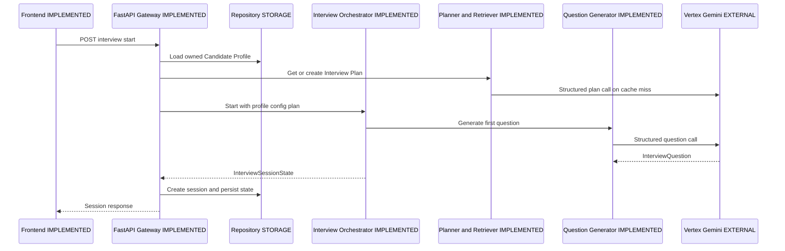

## 15. RAG Overview

- **Category:** RAG
- **Implementation status:** IMPLEMENTED/PARTIAL
- **Purpose:** Separates production planning retrieval from offline RAG experiments.
- **Main flow:** Packaged knowledge becomes local lexical topics or Firestore vector chunks; retrieved strings augment the planner prompt.
- **Key decision:** There is no production hybrid ranker and no per-question retriever call.
- **Failure path:** Local retrieval may return only domain and level guidance; vector provider or index failure currently fails planning.
- **Code evidence:** backend/services/interview_knowledge; backend/infrastructure/interview_knowledge/firestore_vector.py; evaluation/m6
- **Gap / unknown:** Hybrid retrieval is an offline evaluation capability, not a selectable production backend.
- **Standalone source:** [diagrams/15-rag-overview.mmd](diagrams/15-rag-overview.mmd)

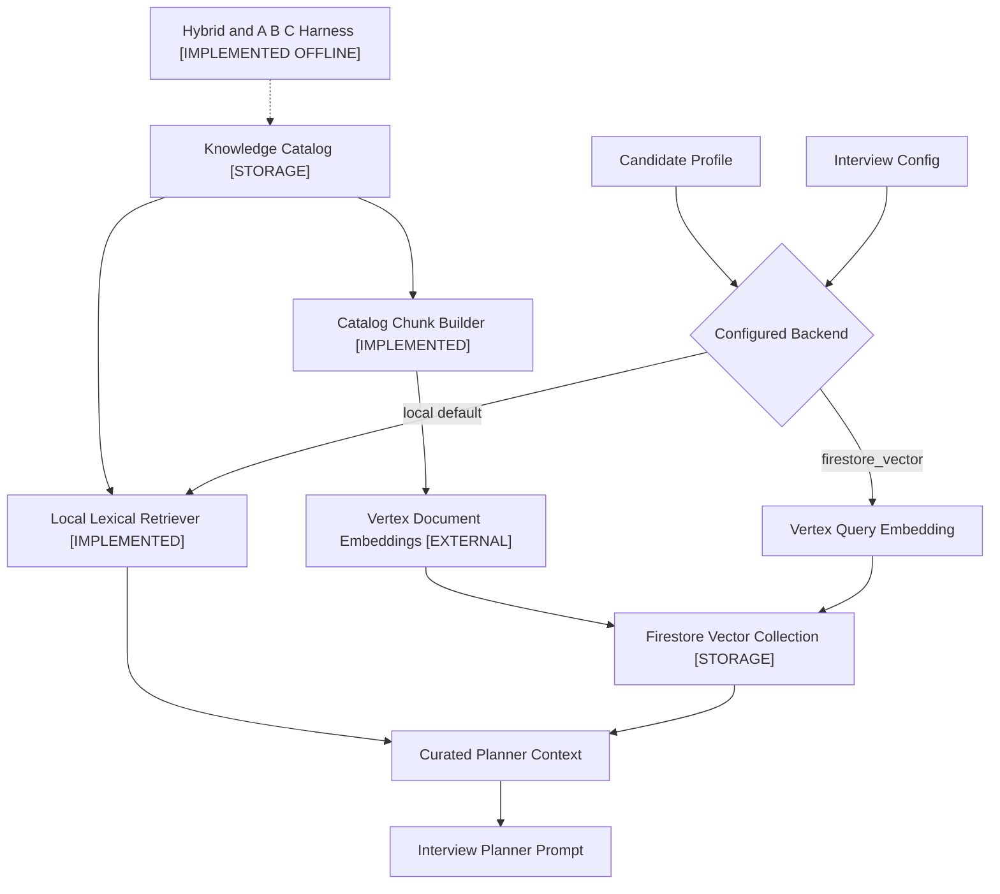

## 16. Knowledge Ingestion Pipeline

- **Category:** RAG
- **Implementation status:** IMPLEMENTED
- **Purpose:** Shows packaged catalog creation and optional vector indexing.
- **Main flow:** Knowledge and level files are compiled into catalog.json; catalog entries become stable hashed chunks and are embedded and batch-upserted when changed.
- **Key decision:** Indexer compares content hash, model, and dimensions for idempotent synchronization.
- **Failure path:** Embedding or Firestore batch failure stops the CLI; rerun skips unchanged records.
- **Code evidence:** backend/scripts/build_interview_knowledge_catalog.py; backend/services/interview_knowledge/chunks.py; backend/scripts/index_interview_knowledge_vectors.py
- **Gap / unknown:** Indexing is an operator CLI, not an automatic background worker.
- **Standalone source:** [diagrams/16-knowledge-ingestion.mmd](diagrams/16-knowledge-ingestion.mmd)

```mermaid
%% Knowledge Ingestion Pipeline
%% Status: IMPLEMENTED
%% Evidence: backend/scripts/build_interview_knowledge_catalog.py; backend/services/interview_knowledge/chunks.py; backend/scripts/index_interview_knowledge_vectors.py
flowchart LR
  Files["Knowledge and Level Markdown [STORAGE]"] --> Build["Catalog Build Script [IMPLEMENTED]"]
  Build --> Catalog["catalog.json [STORAGE]"]
  Catalog --> Local["Local Lexical Runtime"]
  Catalog --> Chunks["KnowledgeChunk Builder"]
  Chunks --> Compare["Hash Model Dimension Check"]
  Compare -->|Unchanged| Skip["Skip Existing"]
  Compare -->|Changed| Embed["Vertex Document Embedding"]
  Embed --> Batch["Firestore Batch Upsert"]
  Batch --> Index["Vector Collection and Index [STORAGE]"]
  classDef implemented fill:#dcfce7,stroke:#166534,color:#14532d
  classDef partial fill:#fef3c7,stroke:#92400e,color:#78350f
  classDef pending fill:#fee2e2,stroke:#991b1b,color:#7f1d1d
  classDef external fill:#e0e7ff,stroke:#3730a3,color:#312e81
  classDef storage fill:#e0f2fe,stroke:#075985,color:#0c4a6e
```

## 17. Lexical Retrieval Pipeline

- **Category:** RAG
- **Implementation status:** IMPLEMENTED
- **Purpose:** Details the production local retrieval algorithm.
- **Main flow:** All Candidate Profile strings are tokenized; domain is selected by weighted term overlap, then catalog topics are ranked by overlap and exact title bonus.
- **Key decision:** The algorithm is custom set-overlap scoring, not BM25 or TF-IDF.
- **Failure path:** An empty catalog raises; zero topic matches still returns domain and optional level guidance.
- **Code evidence:** backend/services/interview_knowledge/local.py; backend/services/interview_knowledge/catalog.json
- **Gap / unknown:** No persisted lexical index exists; catalog JSON is loaded in process.
- **Standalone source:** [diagrams/17-lexical-retrieval.mmd](diagrams/17-lexical-retrieval.mmd)

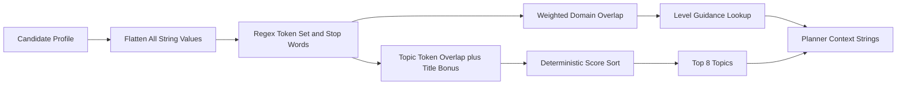

## 18. Vector Retrieval Pipeline

- **Category:** RAG
- **Implementation status:** IMPLEMENTED
- **Purpose:** Details the opt-in production Firestore vector path.
- **Main flow:** A privacy-reduced query excludes candidate name, is embedded with gemini-embedding-001 at 768 dimensions, and searches Firestore cosine KNN.
- **Key decision:** Default top-k is five and similarity is derived from returned distance.
- **Failure path:** Embedding or Firestore errors propagate; no fallback to local retrieval is coded.
- **Code evidence:** backend/infrastructure/interview_knowledge/firestore_vector.py; backend/core/dependencies.py; docs/FIRESTORE_VECTOR_KNOWLEDGE.md
- **Gap / unknown:** Operational provisioning evidence exists, but deployment enablement is configuration-specific.
- **Standalone source:** [diagrams/18-vector-retrieval.mmd](diagrams/18-vector-retrieval.mmd)

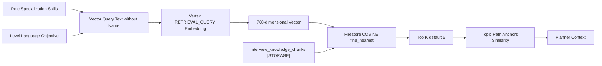

## 19. Retrieval Mode Comparison

- **Category:** RAG
- **Implementation status:** IMPLEMENTED OFFLINE
- **Purpose:** Compares the controlled A, B, and C evaluation conditions.
- **Main flow:** All conditions share frozen scenarios and generation configuration; only supplied retrieval context changes.
- **Key decision:** A/B/C is an offline evaluation matrix, not a production feature flag with these labels.
- **Failure path:** Missing context makes grounding not applicable for A; retrieval failures affect B or C.
- **Code evidence:** evaluation/defense_extension/e3_ablation_analysis.py; evaluation/m6/engine.py; docs/evaluation/defense_extension/e3_ablation
- **Gap / unknown:** M6 also evaluates HYBRID, but the requested A/B/C suite intentionally excludes it.
- **Standalone source:** [diagrams/19-retrieval-mode-comparison.mmd](diagrams/19-retrieval-mode-comparison.mmd)

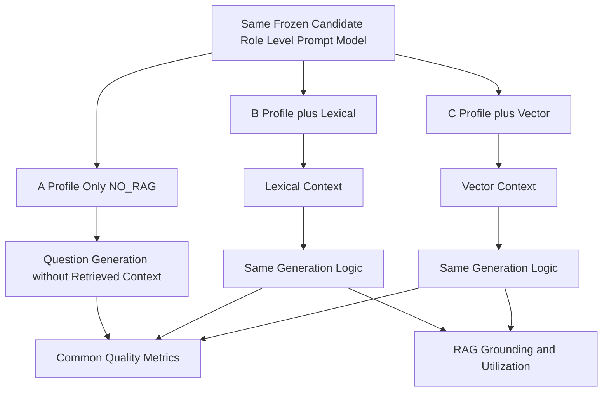

## 20. RAG Query Construction

- **Category:** RAG
- **Implementation status:** IMPLEMENTED
- **Purpose:** Shows actual production lexical and vector query inputs.
- **Main flow:** Local retrieval flattens the entire Candidate Profile; vector retrieval projects role, level, language, specialization, skills, and objective and omits name.
- **Key decision:** Previous questions and selected InterviewRound are not production retrieval inputs.
- **Failure path:** Blank vector inputs are prevented by formatted defaults; provider errors propagate.
- **Code evidence:** backend/services/interview_knowledge/local.py; backend/infrastructure/interview_knowledge/firestore_vector.py
- **Gap / unknown:** Offline M6 query construction includes target topic and question type and must not be confused with production.
- **Standalone source:** [diagrams/20-rag-query-construction.mmd](diagrams/20-rag-query-construction.mmd)

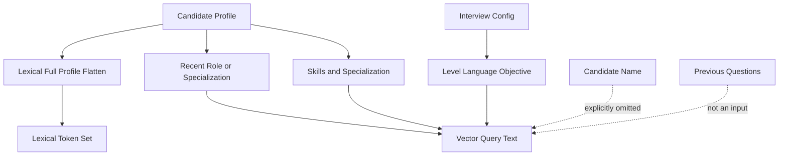

## 21. Context Assembly and Prompt Augmentation

- **Category:** LLM
- **Implementation status:** IMPLEMENTED
- **Purpose:** Maps the planner and question prompt context layers.
- **Main flow:** System instruction, language rules, candidate data, interview configuration, selected round, and curated knowledge are serialized into task prompts.
- **Key decision:** Curated knowledge is attached to the planner, then represented indirectly in generated rounds.
- **Failure path:** Oversized Resume context is bounded separately; normal interview prompt size has no explicit token budget.
- **Code evidence:** backend/services/prompt_builder.py; backend/services/interview_planner/prompts.py; backend/services/question_generator/prompts.py
- **Gap / unknown:** No generic context-window manager or prompt registry exists.
- **Standalone source:** [diagrams/21-context-assembly.mmd](diagrams/21-context-assembly.mmd)

```mermaid
%% Context Assembly and Prompt Augmentation
%% Status: IMPLEMENTED
%% Evidence: backend/services/prompt_builder.py; backend/services/interview_planner/prompts.py; backend/services/question_generator/prompts.py
flowchart LR
  System["System Instruction"] --> Final["Final Agent Prompt"]
  Language["Language Instruction"] --> Final
  Candidate["Candidate Profile JSON"] --> Final
  Config["Interview Config JSON"] --> Final
  Knowledge["Curated Knowledge"] --> Planner["Planner Prompt"]
  Planner --> Plan["Interview Round"]
  Plan --> Final
  Requirements["Task Rules and Output Schema"] --> Final
  Final --> Gemini["Vertex Gemini"]
  classDef implemented fill:#dcfce7,stroke:#166534,color:#14532d
  classDef partial fill:#fef3c7,stroke:#92400e,color:#78350f
  classDef pending fill:#fee2e2,stroke:#991b1b,color:#7f1d1d
  classDef external fill:#e0e7ff,stroke:#3730a3,color:#312e81
  classDef storage fill:#e0f2fe,stroke:#075985,color:#0c4a6e
```

## 22. Prompt Architecture

- **Category:** LLM
- **Implementation status:** IMPLEMENTED
- **Purpose:** Inventories production prompt families and consumers.
- **Main flow:** Each agent owns a system instruction and builder; VertexGeminiService adds the JSON-only suffix and provider schema.
- **Key decision:** All production agents use static prompt builders rather than a dynamic prompt router.
- **Failure path:** Invalid JSON or schema mismatch enters provider retry handling.
- **Code evidence:** backend/services/profile_scanner/prompts.py; backend/services/interview_planner/prompts.py; backend/services/question_generator/prompts.py; backend/services/answer_evaluator/prompts.py; backend/services/report_generator/prompts.py
- **Gap / unknown:** Offline judge prompts live in evaluation modules and are not production prompts.
- **Standalone source:** [diagrams/22-prompt-architecture.mmd](diagrams/22-prompt-architecture.mmd)

```mermaid
%% Prompt Architecture
%% Status: IMPLEMENTED
%% Evidence: backend/services/profile_scanner/prompts.py; backend/services/interview_planner/prompts.py; backend/services/question_generator/prompts.py; backend/services/answer_evaluator/prompts.py; backend/services/report_generator/prompts.py
flowchart TB
  Resume["Resume Extraction Prompt"] --> ResumeSchema["ResumeExtractionResult"]
  Planner["Interview Planner Prompt"] --> PlanSchema["InterviewPlan"]
  Question["Question Generator Prompt"] --> QuestionSchema["InterviewQuestion"]
  Evaluator["Answer Evaluator Prompt"] --> EvalSchema["AnswerEvaluation"]
  Report["Report Generator Prompt"] --> ReportSchema["InterviewReport"]
  ResumeSchema --> Vertex["Vertex Gemini Adapter"]
  PlanSchema --> Vertex
  QuestionSchema --> Vertex
  EvalSchema --> Vertex
  ReportSchema --> Vertex
  Judge["Offline Evaluation Judge Prompts"] --> Vertex
  classDef implemented fill:#dcfce7,stroke:#166534,color:#14532d
  classDef partial fill:#fef3c7,stroke:#92400e,color:#78350f
  classDef pending fill:#fee2e2,stroke:#991b1b,color:#7f1d1d
  classDef external fill:#e0e7ff,stroke:#3730a3,color:#312e81
  classDef storage fill:#e0f2fe,stroke:#075985,color:#0c4a6e
```

## 23. Model and Provider Routing

- **Category:** LLM
- **Implementation status:** IMPLEMENTED
- **Purpose:** Shows static task-based Gemini model selection and the separate embedding provider call.
- **Main flow:** Resume uses flash-lite and one attempt; planner/question use simple; text evaluator/report use complex by default; voice evaluator uses simple.
- **Key decision:** There is one provider adapter, Vertex AI Gemini, with no fallback provider.
- **Failure path:** Retryable provider errors back off; nonretryable configuration or validation errors fail.
- **Code evidence:** backend/core/settings.py; backend/core/dependencies.py; backend/infrastructure/llm/vertex_gemini.py
- **Gap / unknown:** Model names are configurable but routing is not dynamic beyond task type and voice latency override.
- **Standalone source:** [diagrams/23-model-provider-routing.mmd](diagrams/23-model-provider-routing.mmd)

```mermaid
%% Model and Provider Routing
%% Status: IMPLEMENTED
%% Evidence: backend/core/settings.py; backend/core/dependencies.py; backend/infrastructure/llm/vertex_gemini.py
flowchart TB
  Task{"AI Task"} --> Resume["Resume Extraction"]
  Task --> Simple["Planner or Question"]
  Task --> TextEval["Text Evaluation or Report"]
  Task --> VoiceEval["Voice Evaluation"]
  Resume --> FlashLite["gemini-2.5-flash-lite default"]
  Simple --> Flash["gemini-2.5-flash default"]
  VoiceEval --> Flash
  TextEval --> Pro["gemini-2.5-pro default"]
  FlashLite --> Vertex["Vertex AI Provider"]
  Flash --> Vertex
  Pro --> Vertex
  Embed["Knowledge Embedding"] --> EmbedModel["gemini-embedding-001"]
  EmbedModel --> Vertex
  classDef implemented fill:#dcfce7,stroke:#166534,color:#14532d
  classDef partial fill:#fef3c7,stroke:#92400e,color:#78350f
  classDef pending fill:#fee2e2,stroke:#991b1b,color:#7f1d1d
  classDef external fill:#e0e7ff,stroke:#3730a3,color:#312e81
  classDef storage fill:#e0f2fe,stroke:#075985,color:#0c4a6e
```

## 24. Answer Submission Flow

- **Category:** Interview
- **Implementation status:** IMPLEMENTED
- **Purpose:** Traces an idempotent text answer submission.
- **Main flow:** The service validates owned session, mode and turn, claims a unique submission, evaluates, decides, atomically completes state, and persists the next turn.
- **Key decision:** Same turn and same hash replays; different hash conflicts.
- **Failure path:** In-progress duplicates return 409 and evaluator or persistence failure abandons the claim for retry.
- **Code evidence:** backend/services/interview_answer_service.py; backend/infrastructure/repositories/base.py; backend/gateway/api/interview.py
- **Gap / unknown:** The answer endpoint has no client-generated idempotency key because session plus turn is the key.
- **Standalone source:** [diagrams/24-answer-submission-flow.mmd](diagrams/24-answer-submission-flow.mmd)

```mermaid
%% Answer Submission Flow
%% Status: IMPLEMENTED
%% Evidence: backend/services/interview_answer_service.py; backend/infrastructure/repositories/base.py; backend/gateway/api/interview.py
sequenceDiagram
  participant U as Candidate EXTERNAL
  participant FE as Frontend IMPLEMENTED
  participant API as Answer API IMPLEMENTED
  participant S as Answer Service IMPLEMENTED
  participant DB as Repository STORAGE
  participant EV as Evaluator IMPLEMENTED
  participant OR as Orchestrator IMPLEMENTED
  U->>FE: Submit answer
  FE->>API: session turn answer
  API->>S: submit_answer
  S->>DB: Load owned session and claim turn
  alt replay
    DB-->>S: completed same hash
    S-->>FE: latest state with replay flag
  else claimed
    S->>EV: Evaluate answer
    EV-->>OR: AnswerEvaluation
    OR-->>S: Next session state
    S->>DB: Complete claim plus state
    S-->>FE: Updated session
  end
```

## 25. Answer Evaluation Pipeline

- **Category:** Evaluation
- **Implementation status:** IMPLEMENTED
- **Purpose:** Details production scoring of one answer.
- **Main flow:** Profile snapshot, InterviewQuestion, answer, and config form a prompt; Gemini returns a validated AnswerEvaluation used by deterministic policy.
- **Key decision:** Expected answer points are carried inside InterviewQuestion.
- **Failure path:** Provider and schema failures abort the turn and allow answer-claim retry.
- **Code evidence:** backend/services/answer_evaluator/agent.py; backend/services/answer_evaluator/prompts.py; backend/shared/schemas/evaluation.py
- **Gap / unknown:** Retrieved knowledge is not passed as a distinct evaluator input.
- **Standalone source:** [diagrams/25-answer-evaluation-pipeline.mmd](diagrams/25-answer-evaluation-pipeline.mmd)

```mermaid
%% Answer Evaluation Pipeline
%% Status: IMPLEMENTED
%% Evidence: backend/services/answer_evaluator/agent.py; backend/services/answer_evaluator/prompts.py; backend/shared/schemas/evaluation.py
flowchart LR
  Profile["Session Profile Snapshot"] --> Prompt["Evaluator Prompt"]
  Question["Question and Expected Points"] --> Prompt
  Answer["Candidate Answer"] --> Prompt
  Config["Language Mode Level"] --> Prompt
  Prompt --> Model["Gemini Simple or Complex"]
  Model --> Validate["AnswerEvaluation Schema"]
  Validate --> Scores["Technical Depth Communication Mindset Overall"]
  Validate --> Feedback["Strengths Weaknesses Missing Concepts Feedback"]
  Validate --> Follow["Follow-up Decision Signal"]
  Scores --> Policy["Deterministic Interview Decision"]
  Follow --> Policy
  classDef implemented fill:#dcfce7,stroke:#166534,color:#14532d
  classDef partial fill:#fef3c7,stroke:#92400e,color:#78350f
  classDef pending fill:#fee2e2,stroke:#991b1b,color:#7f1d1d
  classDef external fill:#e0e7ff,stroke:#3730a3,color:#312e81
  classDef storage fill:#e0f2fe,stroke:#075985,color:#0c4a6e
```

## 26. Production Evaluation Rubric

- **Category:** Evaluation
- **Implementation status:** IMPLEMENTED
- **Purpose:** Maps confirmed production answer-evaluation dimensions.
- **Main flow:** Gemini judges correctness, technical depth, practical experience, communication, and engineering mindset and emits explicit scores and feedback.
- **Key decision:** The policy only reads follow_up_needed and overall score threshold eight.
- **Failure path:** Schema enforces score bounds but does not independently recompute score consistency.
- **Code evidence:** backend/services/answer_evaluator/prompts.py; backend/shared/schemas/evaluation.py; backend/orchestrator/decision_service.py
- **Gap / unknown:** RAG grounding and knowledge utilization belong to offline question evaluation, not runtime answer scoring.
- **Standalone source:** [diagrams/26-evaluation-rubric.mmd](diagrams/26-evaluation-rubric.mmd)

```mermaid
%% Production Evaluation Rubric
%% Status: IMPLEMENTED
%% Evidence: backend/services/answer_evaluator/prompts.py; backend/shared/schemas/evaluation.py; backend/orchestrator/decision_service.py
flowchart TB
  Input["Question plus Answer"] --> Judge["Gemini Answer Judge"]
  Judge --> Technical["Technical Score 0 to 10"]
  Judge --> Depth["Depth Score 0 to 10"]
  Judge --> Communication["Communication Score 0 to 10"]
  Judge --> Mindset["Engineering Mindset 0 to 10"]
  Judge --> Correctness["Correctness Score 0 to 10"]
  Judge --> Overall["Overall Score 0 to 10"]
  Judge --> Narrative["Feedback and Missing Concepts"]
  Judge --> Follow["Follow-up Needed"]
  Overall --> Rule["Score at least 8 increases difficulty"]
  Follow --> Rule
  classDef implemented fill:#dcfce7,stroke:#166534,color:#14532d
  classDef partial fill:#fef3c7,stroke:#92400e,color:#78350f
  classDef pending fill:#fee2e2,stroke:#991b1b,color:#7f1d1d
  classDef external fill:#e0e7ff,stroke:#3730a3,color:#312e81
  classDef storage fill:#e0f2fe,stroke:#075985,color:#0c4a6e
```

## 27. Evaluation Framework Architecture

- **Category:** Evaluation
- **Implementation status:** IMPLEMENTED OFFLINE
- **Purpose:** Shows the checked-in offline system and milestone evaluation families.
- **Main flow:** Manifests and frozen datasets feed runners, production-compatible adapters and judges; reports and raw evidence are persisted under evaluation and docs/evaluation.
- **Key decision:** Evaluation is not mounted as a public API.
- **Failure path:** Per-sample failures are recorded or isolated by runner policy.
- **Code evidence:** backend/services/system_evaluation; evaluation/m1 through m8; evaluation/ragas_pilot; docs/evaluation
- **Gap / unknown:** Multiple generations of evaluation harness coexist and have different claims and datasets.
- **Standalone source:** [diagrams/27-evaluation-framework.mmd](diagrams/27-evaluation-framework.mmd)

```mermaid
%% Evaluation Framework Architecture
%% Status: IMPLEMENTED OFFLINE
%% Evidence: backend/services/system_evaluation; evaluation/m1 through m8; evaluation/ragas_pilot; docs/evaluation
flowchart LR
  Dataset["Private or Frozen Datasets [STORAGE]"] --> Runner["Evaluation Runners [IMPLEMENTED]"]
  Runner --> CV["CV Extraction Benchmarks"]
  Runner --> Retrieval["Lexical Vector Hybrid Benchmarks"]
  Runner --> Question["Question Quality Benchmarks"]
  Runner --> Answer["Answer Evaluation Benchmarks"]
  Runner --> Speech["STT TTS Voice Benchmarks"]
  CV --> Metrics["Rule and Aggregate Metrics"]
  Retrieval --> Metrics
  Question --> Judge["Blinded Gemini Judges"]
  Answer --> Judge
  Speech --> Metrics
  Judge --> Aggregate["Paired and Aggregate Reports"]
  Metrics --> Aggregate
  Aggregate --> Artifacts["JSON Markdown CSV Evidence [STORAGE]"]
  classDef implemented fill:#dcfce7,stroke:#166534,color:#14532d
  classDef partial fill:#fef3c7,stroke:#92400e,color:#78350f
  classDef pending fill:#fee2e2,stroke:#991b1b,color:#7f1d1d
  classDef external fill:#e0e7ff,stroke:#3730a3,color:#312e81
  classDef storage fill:#e0f2fe,stroke:#075985,color:#0c4a6e
```

## 28. A B C RAG Ablation

- **Category:** Evaluation
- **Implementation status:** IMPLEMENTED OFFLINE
- **Purpose:** Shows the exact profile-only, lexical, and vector ablation boundary.
- **Main flow:** Twenty frozen Vietnamese development scenarios produce sixty condition rows with controlled model and temperature.
- **Key decision:** Only retrieval context changes; A has no RAG metric.
- **Failure path:** The analysis rejects incomplete matrices, context leakage into A, or configuration drift.
- **Code evidence:** evaluation/defense_extension/e3_ablation_analysis.py; docs/evaluation/defense_extension/e3_ablation/DATASET_MANIFEST.json
- **Gap / unknown:** Results are research evidence and do not prove the production deployment uses vector retrieval.
- **Standalone source:** [diagrams/28-rag-abc-ablation.mmd](diagrams/28-rag-abc-ablation.mmd)

```mermaid
%% A B C RAG Ablation
%% Status: IMPLEMENTED OFFLINE
%% Evidence: evaluation/defense_extension/e3_ablation_analysis.py; docs/evaluation/defense_extension/e3_ablation/DATASET_MANIFEST.json
flowchart TB
  Frozen["20 Frozen Vietnamese Scenarios"] --> A["A PROFILE ONLY"]
  Frozen --> B["B PROFILE plus LEXICAL"]
  Frozen --> C["C PROFILE plus VECTOR"]
  Controls["Same Candidate Role Difficulty Prompt Model Temperature"] --> A
  Controls --> B
  Controls --> C
  A --> Common["Technical Validity Role Relevance CV Alignment Difficulty Clarity Specificity Latency"]
  B --> Common
  C --> Common
  B --> RAG["Grounding Utilization Retrieval Relevance and Latency"]
  C --> RAG
  Common --> Pair["Paired A versus B versus C"]
  RAG --> Pair
  classDef implemented fill:#dcfce7,stroke:#166534,color:#14532d
  classDef partial fill:#fef3c7,stroke:#92400e,color:#78350f
  classDef pending fill:#fee2e2,stroke:#991b1b,color:#7f1d1d
  classDef external fill:#e0e7ff,stroke:#3730a3,color:#312e81
  classDef storage fill:#e0f2fe,stroke:#075985,color:#0c4a6e
```

## 29. Grounding Evaluation Flow

- **Category:** Evaluation
- **Implementation status:** IMPLEMENTED OFFLINE
- **Purpose:** Explains how question grounding is measured in M6 and E3.
- **Main flow:** Retrieved contexts plus generated question are shown to a blinded judge for rag_grounding 0 to 2 and grounding chunk IDs; deterministic token overlap is also computed.
- **Key decision:** Profile-only grounding is explicitly null.
- **Failure path:** Zero grounding is classified into retrieval, utilization, corpus, or judge-candidate failures.
- **Code evidence:** evaluation/m6/engine.py; evaluation/m6/metrics.py; evaluation/defense_extension/e3_grounding_analysis.py
- **Gap / unknown:** This is offline LLM-judged evidence, not a runtime grounding guard.
- **Standalone source:** [diagrams/29-grounding-evaluation.mmd](diagrams/29-grounding-evaluation.mmd)

```mermaid
%% Grounding Evaluation Flow
%% Status: IMPLEMENTED OFFLINE
%% Evidence: evaluation/m6/engine.py; evaluation/m6/metrics.py; evaluation/defense_extension/e3_grounding_analysis.py
flowchart LR
  Context["Retrieved Contexts"] --> Judge["Blinded Quality Judge"]
  Question["Generated Question"] --> Judge
  Scenario["Frozen Expected Topics"] --> Relevance["Relevant Topic in Top 5"]
  Context --> Relevance
  Context --> Overlap["Deterministic Token Overlap"]
  Question --> Overlap
  Judge --> Score["RAG Grounding 0 to 2"]
  Judge --> ChunkIds["Grounding Chunk IDs"]
  Score --> Taxonomy["Failure Taxonomy"]
  Relevance --> Taxonomy
  Overlap --> Taxonomy
  classDef implemented fill:#dcfce7,stroke:#166534,color:#14532d
  classDef partial fill:#fef3c7,stroke:#92400e,color:#78350f
  classDef pending fill:#fee2e2,stroke:#991b1b,color:#7f1d1d
  classDef external fill:#e0e7ff,stroke:#3730a3,color:#312e81
  classDef storage fill:#e0f2fe,stroke:#075985,color:#0c4a6e
```

## 30. Knowledge Utilization Evaluation

- **Category:** Evaluation
- **Implementation status:** IMPLEMENTED OFFLINE
- **Purpose:** Distinguishes successful retrieval from actual use in a generated question.
- **Main flow:** Retrieval relevance is expected topic presence in top five; utilization requires judge grounding at least one and positive deterministic overlap.
- **Key decision:** A retrieval hit alone does not count as utilization.
- **Failure path:** Relevant context with zero utilization is classified as utilization failure.
- **Code evidence:** evaluation/m6/retrieval.py; evaluation/m6/metrics.py; evaluation/defense_extension/e3_ablation_analysis.py
- **Gap / unknown:** The overlap heuristic is lexical and may miss semantic utilization.
- **Standalone source:** [diagrams/30-knowledge-utilization.mmd](diagrams/30-knowledge-utilization.mmd)

```mermaid
%% Knowledge Utilization Evaluation
%% Status: IMPLEMENTED OFFLINE
%% Evidence: evaluation/m6/retrieval.py; evaluation/m6/metrics.py; evaluation/defense_extension/e3_ablation_analysis.py
flowchart TB
  Retrieved["Retrieved Contexts"] --> Relevant{"Expected Topic in Top 5"}
  Retrieved --> Overlap{"Question Context Token Overlap above 0"}
  Judge["Judge RAG Grounding"] --> Grounded{"Score at least 1"}
  Relevant --> RetrievalMetric["Retrieval Succeeded"]
  Overlap --> Utilized{"Overlap and Grounding"}
  Grounded --> Utilized
  Utilized -->|Yes| UseMetric["Knowledge Utilized"]
  Relevant -->|Yes| But["Context Available"]
  But -->|Utilized No| Failure["Utilization Failure"]
  classDef implemented fill:#dcfce7,stroke:#166534,color:#14532d
  classDef partial fill:#fef3c7,stroke:#92400e,color:#78350f
  classDef pending fill:#fee2e2,stroke:#991b1b,color:#7f1d1d
  classDef external fill:#e0e7ff,stroke:#3730a3,color:#312e81
  classDef storage fill:#e0f2fe,stroke:#075985,color:#0c4a6e
```

## 31. Interview Session State Machine

- **Category:** Interview
- **Implementation status:** IMPLEMENTED/PARTIAL
- **Purpose:** Shows persisted status and in-state phase transitions.
- **Main flow:** A session is created after planning and first question, becomes in_progress, completes when current_turn is null, and becomes report_generated after report persistence.
- **Key decision:** Legacy enum states validate old payloads but are not the main persisted status flow.
- **Failure path:** Provider failure before create yields no session; runtime exceptions can leave the prior persisted state.
- **Code evidence:** backend/shared/schemas/interview.py; backend/gateway/api/interview.py; backend/services/report_generator/service.py
- **Gap / unknown:** Target snapshot creation should occur earlier and include profile_version.
- **Standalone source:** [diagrams/31-interview-session-state-machine.mmd](diagrams/31-interview-session-state-machine.mmd)

```mermaid
%% Interview Session State Machine
%% Status: IMPLEMENTED/PARTIAL
%% Evidence: backend/shared/schemas/interview.py; backend/gateway/api/interview.py; backend/services/report_generator/service.py
stateDiagram-v2
  [*] --> Planning: prepare or start before session row
  Planning --> Created: create_session after first question
  Created --> InProgress: state saved with current turn
  InProgress --> InProgress: evaluated answer and next turn
  InProgress --> Completed: current turn becomes null
  Completed --> ReportGenerated: report saved
  ReportGenerated --> [*]
  Planning --> Failed: provider or validation error
```

## 32. Question Lifecycle State Machine

- **Category:** Question Generation
- **Implementation status:** IMPLEMENTED
- **Purpose:** Shows the lifecycle represented by InterviewTurn.
- **Main flow:** A generated question becomes a created turn, is shown as current_turn, receives an answer, is evaluated, and moves to completed_turns.
- **Key decision:** Opening turns are answered but intentionally not evaluated or counted.
- **Failure path:** A stale or conflicting answer is rejected before transition.
- **Code evidence:** backend/shared/schemas/interview.py; backend/orchestrator/conversation_flow.py; backend/orchestrator/interview_orchestrator.py
- **Gap / unknown:** There is no skipped status.
- **Standalone source:** [diagrams/32-question-lifecycle-state-machine.mmd](diagrams/32-question-lifecycle-state-machine.mmd)

```mermaid
%% Question Lifecycle State Machine
%% Status: IMPLEMENTED
%% Evidence: backend/shared/schemas/interview.py; backend/orchestrator/conversation_flow.py; backend/orchestrator/interview_orchestrator.py
stateDiagram-v2
  [*] --> Generated
  Generated --> Created: create InterviewTurn
  Created --> Shown: assign current_turn
  Shown --> Answered: candidate answer accepted
  Answered --> Evaluated: AnswerEvaluation attached
  Evaluated --> Completed: append completed_turns
  Created --> OpeningAnswered: opening turn special case
  OpeningAnswered --> Shown: reveal pending first question
  Completed --> [*]
```

## 33. Complete Interview Sequence

- **Category:** Runtime
- **Implementation status:** IMPLEMENTED/PARTIAL
- **Purpose:** Traces one complete text interview and report.
- **Main flow:** The frontend starts a session, loops answer submissions and adaptive questions, then generates or reads a report.
- **Key decision:** Knowledge retrieval occurs while planning; answer evaluation and question generation use Gemini.
- **Failure path:** Failures preserve the last committed session state but report generation currently reloads the latest profile.
- **Code evidence:** backend/gateway/api/interview.py; backend/services/interview_answer_service.py; backend/services/report_generator/service.py; frontend/src/pages/TextInterviewPage.tsx
- **Gap / unknown:** Historical report input violates the target snapshot contract.
- **Standalone source:** [diagrams/33-interview-sequence.mmd](diagrams/33-interview-sequence.mmd)

```mermaid
%% Complete Interview Sequence
%% Status: IMPLEMENTED/PARTIAL
%% Evidence: backend/gateway/api/interview.py; backend/services/interview_answer_service.py; backend/services/report_generator/service.py; frontend/src/pages/TextInterviewPage.tsx
sequenceDiagram
  participant U as Candidate
  participant FE as React Frontend
  participant API as FastAPI Gateway
  participant DB as Repository
  participant R as Knowledge Retriever
  participant L as Vertex Gemini
  U->>FE: Upload and start
  FE->>API: POST interview start
  API->>DB: Load profile and blueprint
  API->>R: Retrieve planner topics on miss
  API->>L: Plan and first question on miss
  API->>DB: Create and save session
  loop Until question count or rounds exhausted
    U->>FE: Submit answer
    FE->>API: POST answer
    API->>DB: Claim turn
    API->>L: Evaluate answer
    API->>L: Generate next question when needed
    API->>DB: Commit state and claim
    API-->>FE: Updated session
  end
  FE->>API: POST report
  API->>L: Generate report if absent
  API->>DB: Save report
  API-->>FE: Final report
```

## 34. Database ER Model

- **Category:** Data
- **Implementation status:** IMPLEMENTED
- **Purpose:** Shows actual SQLite tables; Firestore stores equivalent aggregates under owner documents.
- **Main flow:** Users own sessions and profile JSON; sessions relate to messages, evaluations, answer claims, blueprints, and embedded report JSON.
- **Key decision:** Candidate is represented by users table rows in SQLite, not a separate Candidate table.
- **Failure path:** Foreign keys and unique session-turn claims protect basic relations; JSON shapes are validated at repository boundaries.
- **Code evidence:** backend/models.py; backend/infrastructure/repositories/sqlite.py; backend/infrastructure/repositories/firestore.py
- **Gap / unknown:** Profile audit, upload operation, and session profile-version entities do not exist.
- **Standalone source:** [diagrams/34-database-er.mmd](diagrams/34-database-er.mmd)

```mermaid
%% Database ER Model
%% Status: IMPLEMENTED
%% Evidence: backend/models.py; backend/infrastructure/repositories/sqlite.py; backend/infrastructure/repositories/firestore.py
erDiagram
  USERS ||--o{ SESSIONS : candidate
  USERS ||--o{ INTERVIEW_BLUEPRINT_ARTIFACTS : owns
  SESSIONS ||--o{ MESSAGES : contains
  SESSIONS ||--o{ EVALUATIONS : contains
  SESSIONS ||--o{ ANSWER_SUBMISSIONS : claims
  USERS {
    int id PK
    string user_id
    text profile_json
    int profile_version
    text raw_resume_text
  }
  SESSIONS {
    int id PK
    int candidate_id FK
    string user_id
    string status
    text state
    text report_data
  }
  MESSAGES {
    int id PK
    int session_id FK
    text content
  }
  EVALUATIONS {
    int id PK
    int session_id FK
    text rubric_json
  }
  ANSWER_SUBMISSIONS {
    int id PK
    int session_id FK
    string turn_id
    string answer_hash
    string status
  }
  INTERVIEW_BLUEPRINT_ARTIFACTS {
    string artifact_key PK
    int candidate_id FK
    text plan_json
  }
  RESUME_EXTRACTION_ARTIFACTS {
    string artifact_key PK
    string user_id
    text profile_json
  }
```

## 35. Data Ownership

- **Category:** Security
- **Implementation status:** IMPLEMENTED/PARTIAL
- **Purpose:** Shows authenticated ownership and module ownership of core data.
- **Main flow:** Every candidate and session repository read uses current_user.uid; Firestore nests resources below users uid.
- **Key decision:** Services own mutations while routes accept resource IDs, not owner IDs.
- **Failure path:** Missing and foreign profiles use indistinguishable 404 behavior; some generic session errors still use FastAPI detail.
- **Code evidence:** backend/core/dependencies.py; backend/infrastructure/repositories; backend/gateway/api
- **Gap / unknown:** Offline evaluation artifacts are developer-owned files and separate from candidate runtime data.
- **Standalone source:** [diagrams/35-data-ownership.mmd](diagrams/35-data-ownership.mmd)

```mermaid
%% Data Ownership
%% Status: IMPLEMENTED/PARTIAL
%% Evidence: backend/core/dependencies.py; backend/infrastructure/repositories; backend/gateway/api
flowchart TB
  User["Firebase UID [EXTERNAL]"] --> Candidate["Candidate Profile [STORAGE]"]
  User --> Session["Interview Session [STORAGE]"]
  Candidate --> Resume["Raw Resume Text"]
  Candidate --> Blueprint["Interview Blueprint"]
  Session --> Turns["Turns and Evaluations"]
  Session --> Claims["Answer Submission Claims"]
  Session --> Report["Interview Report"]
  ResumeSvc["Resume Route and Agent"] --> Candidate
  InterviewSvc["Interview Services"] --> Session
  ReportSvc["Report Service"] --> Report
  KnowledgeSvc["Knowledge Retriever"] --> Knowledge["Shared Knowledge Catalog"]
  classDef implemented fill:#dcfce7,stroke:#166534,color:#14532d
  classDef partial fill:#fef3c7,stroke:#92400e,color:#78350f
  classDef pending fill:#fee2e2,stroke:#991b1b,color:#7f1d1d
  classDef external fill:#e0e7ff,stroke:#3730a3,color:#312e81
  classDef storage fill:#e0f2fe,stroke:#075985,color:#0c4a6e
```

## 36. Data Flow Diagram Level 0

- **Category:** Data
- **Implementation status:** IMPLEMENTED/PARTIAL
- **Purpose:** Presents the system as one process with external actors and data stores.
- **Main flow:** Candidate data enters through the browser, AI requests cross to Vertex, and owned results persist in a repository.
- **Key decision:** The speech service exchanges transient audio and transcripts but does not persist raw audio.
- **Failure path:** External identity or AI failures prevent protected or AI operations.
- **Code evidence:** frontend/src; backend/gateway; backend/infrastructure; docs/local-architecture.md
- **Gap / unknown:** No durable queue or object store is present.
- **Standalone source:** [diagrams/36-data-flow-level-0.mmd](diagrams/36-data-flow-level-0.mmd)

```mermaid
%% Data Flow Diagram Level 0
%% Status: IMPLEMENTED/PARTIAL
%% Evidence: frontend/src; backend/gateway; backend/infrastructure; docs/local-architecture.md
flowchart LR
  Candidate["Candidate [EXTERNAL]"] --> System["Fipilot CV Interview System [IMPLEMENTED]"]
  System --> Candidate
  System <--> Auth["Firebase Auth [EXTERNAL]"]
  System <--> AI["Vertex AI [EXTERNAL]"]
  System <--> Speech["Speech Inference [IMPLEMENTED]"]
  System <--> RuntimeStore["Candidate and Interview Repository [STORAGE]"]
  System <--> Knowledge["Knowledge Stores [STORAGE]"]
  Developer["Developer [EXTERNAL]"] <--> Evaluation["Offline Evaluation [IMPLEMENTED]"]
  Evaluation <--> AI
  Evaluation <--> EvalArtifacts["Evaluation Artifacts [STORAGE]"]
  classDef implemented fill:#dcfce7,stroke:#166534,color:#14532d
  classDef partial fill:#fef3c7,stroke:#92400e,color:#78350f
  classDef pending fill:#fee2e2,stroke:#991b1b,color:#7f1d1d
  classDef external fill:#e0e7ff,stroke:#3730a3,color:#312e81
  classDef storage fill:#e0f2fe,stroke:#075985,color:#0c4a6e
```

## 37. Data Flow Diagram Level 1

- **Category:** Data
- **Implementation status:** IMPLEMENTED/PARTIAL
- **Purpose:** Breaks the runtime into six major data-transform processes.
- **Main flow:** Resume processing produces a profile; planning and generation create questions; evaluation updates a session; reporting aggregates completed turns.
- **Key decision:** Each process uses canonical Pydantic schemas at the service boundary.
- **Failure path:** Failures stop the current process; only answer completion has an explicit transactional claim seam.
- **Code evidence:** backend/gateway/api; backend/services; backend/orchestrator; backend/shared/schemas
- **Gap / unknown:** Profile review correction is absent from the current runtime process map.
- **Standalone source:** [diagrams/37-data-flow-level-1.mmd](diagrams/37-data-flow-level-1.mmd)

```mermaid
%% Data Flow Diagram Level 1
%% Status: IMPLEMENTED/PARTIAL
%% Evidence: backend/gateway/api; backend/services; backend/orchestrator; backend/shared/schemas
flowchart LR
  File["Resume File"] --> P1["P1 Resume Processing"]
  P1 --> D1["D1 Candidate Profile Store"]
  D1 --> P2["P2 Interview Planning"]
  P2 --> D2["D2 Blueprint Store"]
  D1 --> P3["P3 Question Generation"]
  D2 --> P3
  P3 --> D3["D3 Session State"]
  Answer["Candidate Answer"] --> P4["P4 Answer Evaluation"]
  D3 --> P4
  P4 --> D3
  D3 --> P5["P5 Adaptive Decision"]
  P5 --> P3
  D3 --> P6["P6 Report Generation"]
  P6 --> D4["D4 Report Store"]
  classDef implemented fill:#dcfce7,stroke:#166534,color:#14532d
  classDef partial fill:#fef3c7,stroke:#92400e,color:#78350f
  classDef pending fill:#fee2e2,stroke:#991b1b,color:#7f1d1d
  classDef external fill:#e0e7ff,stroke:#3730a3,color:#312e81
  classDef storage fill:#e0f2fe,stroke:#075985,color:#0c4a6e
```

## 38. Data Flow Diagram Level 2

- **Category:** Data
- **Implementation status:** IMPLEMENTED/PARTIAL
- **Purpose:** Expands Resume, retrieval, question, and answer-evaluation transformations in one readable map.
- **Main flow:** Each branch names the actual intermediate representations.
- **Key decision:** Retrieval feeds planning rather than direct question generation in production.
- **Failure path:** Errors are represented in the detailed subsystem diagrams rather than duplicated here.
- **Code evidence:** backend/infrastructure/documents; backend/services/profile_scanner; backend/services/interview_knowledge; backend/services/question_generator; backend/services/answer_evaluator
- **Gap / unknown:** The diagram omits voice transport details, covered separately.
- **Standalone source:** [diagrams/38-data-flow-level-2.mmd](diagrams/38-data-flow-level-2.mmd)

```mermaid
%% Data Flow Diagram Level 2
%% Status: IMPLEMENTED/PARTIAL
%% Evidence: backend/infrastructure/documents; backend/services/profile_scanner; backend/services/interview_knowledge; backend/services/question_generator; backend/services/answer_evaluator
flowchart TB
  R1["Resume Bytes"] --> R2["DocumentExtractionResult"] --> R3["ResumeContext"] --> R4["ResumeExtractionResult"] --> R5["CandidateProfile"]
  K1["Profile plus Config"] --> K2["Lexical Tokens or Vector Query"] --> K3["Curated Topic Strings"] --> K4["Planner Prompt"]
  Q1["CandidateProfile"] --> Q4["Question Prompt"]
  Q2["InterviewRound"] --> Q4
  Q3["InterviewConfig"] --> Q4
  K4 --> Q2
  Q4 --> Q5["InterviewQuestion"]
  A1["InterviewQuestion"] --> A4["Evaluator Prompt"]
  A2["Candidate Answer"] --> A4
  A3["Session Profile Snapshot"] --> A4
  A4 --> A5["AnswerEvaluation"] --> A6["Decision and Next State"]
  classDef implemented fill:#dcfce7,stroke:#166534,color:#14532d
  classDef partial fill:#fef3c7,stroke:#92400e,color:#78350f
  classDef pending fill:#fee2e2,stroke:#991b1b,color:#7f1d1d
  classDef external fill:#e0e7ff,stroke:#3730a3,color:#312e81
  classDef storage fill:#e0f2fe,stroke:#075985,color:#0c4a6e
```

## 39. API Architecture

- **Category:** API
- **Implementation status:** IMPLEMENTED/PARTIAL
- **Purpose:** Maps mounted HTTP and WebSocket endpoints by domain.
- **Main flow:** All protected domain endpoints obtain CurrentUser; health endpoints are public.
- **Key decision:** Only actual mounted routes are shown as implemented.
- **Failure path:** Missing or foreign resource responses are owner-scoped; error shapes are not fully standardized.
- **Code evidence:** backend/gateway/main.py; backend/gateway/api
- **Gap / unknown:** PATCH profile, replacement Resume, and upload status endpoints are SPEC-PENDING.
- **Standalone source:** [diagrams/39-api-architecture.mmd](diagrams/39-api-architecture.mmd)

```mermaid
%% API Architecture
%% Status: IMPLEMENTED/PARTIAL
%% Evidence: backend/gateway/main.py; backend/gateway/api
flowchart TB
  API["FastAPI Gateway"] --> Health["GET health and ready [IMPLEMENTED]"]
  API --> Auth["GET api v2 auth me [IMPLEMENTED]"]
  API --> Resume["POST api v2 resume upload [IMPLEMENTED]"]
  API --> Profile["GET api v2 candidates id profile [IMPLEMENTED]"]
  API --> Prepare["POST api v2 interview prepare [IMPLEMENTED]"]
  API --> Start["POST api v2 interview start [PARTIAL]"]
  API --> Answer["POST api v2 interview id answer [IMPLEMENTED]"]
  API --> Session["GET api v2 interview id [IMPLEMENTED]"]
  API --> Report["POST and GET interview id report [PARTIAL]"]
  API --> History["GET api v2 interviews [IMPLEMENTED]"]
  API --> Voice["WS api v2 voice interview id [IMPLEMENTED]"]
  API -.-> Patch["PATCH Candidate Profile [SPEC-PENDING]"]
  API -.-> Replacement["POST Replacement Resume [SPEC-PENDING]"]
  API -.-> UploadStatus["GET Upload Status [SPEC-PENDING]"]
  classDef implemented fill:#dcfce7,stroke:#166534,color:#14532d
  classDef partial fill:#fef3c7,stroke:#92400e,color:#78350f
  classDef pending fill:#fee2e2,stroke:#991b1b,color:#7f1d1d
  classDef external fill:#e0e7ff,stroke:#3730a3,color:#312e81
  classDef storage fill:#e0f2fe,stroke:#075985,color:#0c4a6e
```

## 40. API Request Flow

- **Category:** API
- **Implementation status:** IMPLEMENTED
- **Purpose:** Shows the common authenticated REST request path.
- **Main flow:** Middleware assigns request ID, auth verifies Firebase token, Pydantic validates transport, route calls service or repository, and response is serialized.
- **Key decision:** Frontend retries once after 401 with a refreshed ID token.
- **Failure path:** Validation, authentication, domain, provider, and unhandled errors have different response handling.
- **Code evidence:** frontend/src/lib/api.ts; backend/core/middleware.py; backend/core/dependencies.py; backend/gateway/main.py
- **Gap / unknown:** A single standardized error envelope is not universal.
- **Standalone source:** [diagrams/40-api-request-flow.mmd](diagrams/40-api-request-flow.mmd)

```mermaid
%% API Request Flow
%% Status: IMPLEMENTED
%% Evidence: frontend/src/lib/api.ts; backend/core/middleware.py; backend/core/dependencies.py; backend/gateway/main.py
sequenceDiagram
  participant FE as Frontend
  participant MW as Request Middleware
  participant AU as Firebase Auth
  participant RT as Route and Pydantic
  participant SV as Service
  participant RP as Repository or AI
  FE->>MW: HTTP request with Bearer token
  MW->>MW: Validate or generate X Request ID
  MW->>AU: Verify ID token
  AU-->>RT: CurrentUser
  RT->>RT: Validate path body and query
  RT->>SV: Invoke domain operation
  SV->>RP: Persist or call provider
  RP-->>SV: Typed result
  SV-->>RT: Response model
  RT-->>MW: HTTP response
  MW-->>FE: JSON plus X Request ID
```

## 41. Major Package Dependency Graph

- **Category:** Architecture
- **Implementation status:** IMPLEMENTED
- **Purpose:** Maps logical import and call dependencies across active packages.
- **Main flow:** Gateway depends on core composition, shared schemas, services and orchestrator; infrastructure implements external boundaries.
- **Key decision:** Compatibility app modules re-export active packages and are not a second runtime.
- **Failure path:** Circular logical dependencies are minimized through repository and LLM interfaces.
- **Code evidence:** backend/gateway; backend/core; backend/services; backend/orchestrator; backend/infrastructure; backend/shared; backend/app
- **Gap / unknown:** Some services directly import infrastructure LLM interfaces, so the architecture is modular rather than strict clean architecture.
- **Standalone source:** [diagrams/41-dependency-graph.mmd](diagrams/41-dependency-graph.mmd)

```mermaid
%% Major Package Dependency Graph
%% Status: IMPLEMENTED
%% Evidence: backend/gateway; backend/core; backend/services; backend/orchestrator; backend/infrastructure; backend/shared; backend/app
flowchart LR
  Gateway["gateway"] --> Core["core"]
  Gateway --> Services["services"]
  Gateway --> Orchestrator["orchestrator"]
  Gateway --> Shared["shared"]
  Core --> Infrastructure["infrastructure"]
  Core --> Services
  Core --> Orchestrator
  Services --> Shared
  Services --> Infrastructure
  Orchestrator --> Services
  Orchestrator --> Shared
  Infrastructure --> Shared
  Compat["app compatibility imports"] -.-> Gateway
  Compat -.-> Services
  Compat -.-> Orchestrator
  Compat -.-> Infrastructure
  classDef implemented fill:#dcfce7,stroke:#166534,color:#14532d
  classDef partial fill:#fef3c7,stroke:#92400e,color:#78350f
  classDef pending fill:#fee2e2,stroke:#991b1b,color:#7f1d1d
  classDef external fill:#e0e7ff,stroke:#3730a3,color:#312e81
  classDef storage fill:#e0f2fe,stroke:#075985,color:#0c4a6e
```

## 42. Layered Architecture

- **Category:** Architecture
- **Implementation status:** IMPLEMENTED/PARTIAL
- **Purpose:** Shows actual architectural layers and allowed dominant flow.
- **Main flow:** Presentation calls transport; transport calls application and orchestration; infrastructure handles providers and persistence; shared schemas cross layers.
- **Key decision:** This is a modular monolith, not strict domain-layer isolation.
- **Failure path:** Improper ownership bypass is prevented by route dependency and repository filters rather than a separate domain aggregate.
- **Code evidence:** docs/SYSTEM_DESIGN_VI.md; backend/core/dependencies.py; backend/infrastructure/repositories/base.py
- **Gap / unknown:** Legacy compatibility imports make the physical package graph less pure than the logical layers.
- **Standalone source:** [diagrams/42-layered-architecture.mmd](diagrams/42-layered-architecture.mmd)

```mermaid
%% Layered Architecture
%% Status: IMPLEMENTED/PARTIAL
%% Evidence: docs/SYSTEM_DESIGN_VI.md; backend/core/dependencies.py; backend/infrastructure/repositories/base.py
flowchart TB
  Presentation["Presentation React [IMPLEMENTED]"] --> Transport["Gateway REST and WebSocket [IMPLEMENTED]"]
  Transport --> Application["Application Services [IMPLEMENTED]"]
  Application --> Orchestration["Interview Orchestrator [IMPLEMENTED]"]
  Orchestration --> AI["AI Agents and Prompt Builders [IMPLEMENTED]"]
  Application --> Persistence["Repository Interfaces [IMPLEMENTED]"]
  AI --> Providers["Vertex and Speech Adapters [IMPLEMENTED]"]
  Persistence --> Stores["SQLite or Firestore [STORAGE]"]
  Shared["Shared Pydantic Schemas [IMPLEMENTED]"] --> Transport
  Shared --> Application
  Shared --> Orchestration
  Shared --> Persistence
  classDef implemented fill:#dcfce7,stroke:#166534,color:#14532d
  classDef partial fill:#fef3c7,stroke:#92400e,color:#78350f
  classDef pending fill:#fee2e2,stroke:#991b1b,color:#7f1d1d
  classDef external fill:#e0e7ff,stroke:#3730a3,color:#312e81
  classDef storage fill:#e0f2fe,stroke:#075985,color:#0c4a6e
```

## 43. Configuration Flow

- **Category:** Deployment
- **Implementation status:** IMPLEMENTED
- **Purpose:** Shows how environment configuration reaches runtime components.
- **Main flow:** Settings reads .env and process environment, validates production constraints, then composition selects repositories, models, knowledge and speech implementations.
- **Key decision:** Local scripts load explicit env files; Cloud Run deployment supplies env variables.
- **Failure path:** Missing required production project, auth, Firestore, or CORS settings fail startup.
- **Code evidence:** backend/core/settings.py; backend/core/startup.py; backend/core/dependencies.py; scripts/run_backend.ps1; backend/scripts/deploy-cloud-run.ps1
- **Gap / unknown:** Secrets are intentionally not documented; actual local .env values were not copied.
- **Standalone source:** [diagrams/43-configuration-flow.mmd](diagrams/43-configuration-flow.mmd)

```mermaid
%% Configuration Flow
%% Status: IMPLEMENTED
%% Evidence: backend/core/settings.py; backend/core/startup.py; backend/core/dependencies.py; scripts/run_backend.ps1; backend/scripts/deploy-cloud-run.ps1
flowchart LR
  Env["Process Environment"] --> Settings["Pydantic Settings"]
  DotEnv["backend .env or selected env file"] --> Settings
  CLI["Local and Deployment Scripts"] --> Env
  Settings --> Validate["Runtime Validation"]
  Validate --> Repo["SQLite or Firestore"]
  Validate --> Models["Gemini Model Routes"]
  Validate --> Knowledge["Local or Firestore Vector"]
  Validate --> Speech["Local or Remote Speech"]
  Validate --> Auth["Firebase or Local Dev Auth"]
  Validate --> Cors["Allowed Origins"]
  classDef implemented fill:#dcfce7,stroke:#166534,color:#14532d
  classDef partial fill:#fef3c7,stroke:#92400e,color:#78350f
  classDef pending fill:#fee2e2,stroke:#991b1b,color:#7f1d1d
  classDef external fill:#e0e7ff,stroke:#3730a3,color:#312e81
  classDef storage fill:#e0f2fe,stroke:#075985,color:#0c4a6e
```

## 44. Feature Flags and Experiment Configuration

- **Category:** Deployment
- **Implementation status:** IMPLEMENTED/PARTIAL
- **Purpose:** Maps runtime backend selection flags and offline retrieval conditions.
- **Main flow:** Repository, knowledge, auth and speech implementations are selected by settings; evaluation conditions are frozen harness configuration.
- **Key decision:** Production knowledge supports local or firestore_vector, not NO_RAG or HYBRID labels.
- **Failure path:** Unsupported values fail validation or composition.
- **Code evidence:** backend/core/settings.py; backend/core/dependencies.py; evaluation/m6/benchmark/FROZEN_CONFIG.json
- **Gap / unknown:** A/B/C is not exposed to end users or production requests.
- **Standalone source:** [diagrams/44-feature-flags.mmd](diagrams/44-feature-flags.mmd)

```mermaid
%% Feature Flags and Experiment Configuration
%% Status: IMPLEMENTED/PARTIAL
%% Evidence: backend/core/settings.py; backend/core/dependencies.py; evaluation/m6/benchmark/FROZEN_CONFIG.json
flowchart TB
  Runtime["Runtime Settings"] --> Repo{"REPOSITORY_BACKEND"}
  Repo --> SQLite["sqlite"]
  Repo --> Firestore["firestore"]
  Runtime --> Knowledge{"INTERVIEW_KNOWLEDGE_BACKEND"}
  Knowledge --> Local["local"]
  Knowledge --> Vector["firestore_vector"]
  Runtime --> Speech{"SPEECH_SERVICE_URL set"}
  Speech --> LocalSpeech["Local Models"]
  Speech --> RemoteSpeech["Remote Speech Service"]
  Eval["Offline Frozen Config"] --> Conditions["NO_RAG LEXICAL VECTOR HYBRID"]
  classDef implemented fill:#dcfce7,stroke:#166534,color:#14532d
  classDef partial fill:#fef3c7,stroke:#92400e,color:#78350f
  classDef pending fill:#fee2e2,stroke:#991b1b,color:#7f1d1d
  classDef external fill:#e0e7ff,stroke:#3730a3,color:#312e81
  classDef storage fill:#e0f2fe,stroke:#075985,color:#0c4a6e
```

## 45. Error Handling Flow

- **Category:** Reliability
- **Implementation status:** IMPLEMENTED/PARTIAL
- **Purpose:** Maps major confirmed failure families and their outcomes.
- **Main flow:** Document errors use structured safe responses; auth and some domain errors use FastAPI detail; LLMServiceError maps to retryable 503.
- **Key decision:** Temporary Resume files are always removed in finally.
- **Failure path:** Non-atomic upload writes can leave partial persisted state if later repository writes fail.
- **Code evidence:** backend/gateway/api/resume.py; backend/gateway/main.py; backend/core/exceptions.py; backend/services/interview_answer_service.py
- **Gap / unknown:** Error response standardization is PARTIAL.
- **Standalone source:** [diagrams/45-error-handling.mmd](diagrams/45-error-handling.mmd)

```mermaid
%% Error Handling Flow
%% Status: IMPLEMENTED/PARTIAL
%% Evidence: backend/gateway/api/resume.py; backend/gateway/main.py; backend/core/exceptions.py; backend/services/interview_answer_service.py
flowchart TB
  Request["Incoming Request"] --> Auth{"Authenticated"}
  Auth -->|No| E401["401 detail response"]
  Auth -->|Yes| Validate{"Transport and File Valid"}
  Validate -->|No| E4xx["400 413 415 or 422"]
  Validate -->|Yes| Domain{"Owned Resource and State Valid"}
  Domain -->|No| EDomain["404 or 409"]
  Domain -->|Yes| Provider{"AI or Speech Success"}
  Provider -->|Retry exhausted| E503["503 transient_service_failure"]
  Provider -->|Yes| Persist{"Persistence Success"}
  Persist -->|No| E500["Unhandled or Repository Error"]
  Persist -->|Yes| Success["Typed Success Response"]
  E4xx --> Cleanup["Cleanup Temporary Resume"]
  Success --> Cleanup
  classDef implemented fill:#dcfce7,stroke:#166534,color:#14532d
  classDef partial fill:#fef3c7,stroke:#92400e,color:#78350f
  classDef pending fill:#fee2e2,stroke:#991b1b,color:#7f1d1d
  classDef external fill:#e0e7ff,stroke:#3730a3,color:#312e81
  classDef storage fill:#e0f2fe,stroke:#075985,color:#0c4a6e
```

## 46. LLM Failure and Retry

- **Category:** Reliability
- **Implementation status:** IMPLEMENTED/PARTIAL
- **Purpose:** Shows provider timeout, retry, and validation behavior.
- **Main flow:** VertexGeminiService attempts up to three times by default with exponential backoff and jitter; Resume extraction uses one attempt.
- **Key decision:** There is no fallback model or provider.
- **Failure path:** Retryable errors exhaust into typed LLMServiceError and the gateway returns retryable 503.
- **Code evidence:** backend/infrastructure/llm/vertex_gemini.py; backend/core/dependencies.py; backend/gateway/main.py
- **Gap / unknown:** Invalid output is retried, not repaired by a separate prompt.
- **Standalone source:** [diagrams/46-llm-failure-retry.mmd](diagrams/46-llm-failure-retry.mmd)

```mermaid
%% LLM Failure and Retry
%% Status: IMPLEMENTED/PARTIAL
%% Evidence: backend/infrastructure/llm/vertex_gemini.py; backend/core/dependencies.py; backend/gateway/main.py
flowchart TB
  Request["Structured LLM Request"] --> Attempt["Provider Attempt"]
  Attempt --> Outcome{"Success and Valid Schema"}
  Outcome -->|Yes| Result["Typed Pydantic Result"]
  Outcome -->|No| Retryable{"Retryable and attempts remain"}
  Retryable -->|Yes| Backoff["Exponential Backoff plus Jitter"]
  Backoff --> Attempt
  Retryable -->|No| Error["LLMServiceError"]
  Error --> HTTP["503 transient_service_failure"]
  Router["No fallback provider [SPEC-PENDING]"] -.-> Error
  classDef implemented fill:#dcfce7,stroke:#166534,color:#14532d
  classDef partial fill:#fef3c7,stroke:#92400e,color:#78350f
  classDef pending fill:#fee2e2,stroke:#991b1b,color:#7f1d1d
  classDef external fill:#e0e7ff,stroke:#3730a3,color:#312e81
  classDef storage fill:#e0f2fe,stroke:#075985,color:#0c4a6e
```

## 47. Structured Output Validation

- **Category:** LLM
- **Implementation status:** IMPLEMENTED
- **Purpose:** Shows conversion from Gemini response to typed application objects.
- **Main flow:** Provider response schema is configured; parsed response or extracted JSON is validated with Pydantic and attempt evidence is recorded.
- **Key decision:** JSON fences and leading text are tolerated only by extracting the first balanced object.
- **Failure path:** Invalid JSON and schema mismatch can be retried, then surface as LLMResponseValidationError.
- **Code evidence:** backend/infrastructure/llm/vertex_gemini.py
- **Gap / unknown:** Voice streaming has a separate post-stream reconstruction fallback.
- **Standalone source:** [diagrams/47-structured-output-validation.mmd](diagrams/47-structured-output-validation.mmd)

```mermaid
%% Structured Output Validation
%% Status: IMPLEMENTED
%% Evidence: backend/infrastructure/llm/vertex_gemini.py
flowchart LR
  Prompt["Prompt plus Pydantic Schema"] --> Vertex["Vertex response_schema"]
  Vertex --> Parsed{"Provider parsed object available"}
  Parsed -->|Yes| Model["Pydantic model_validate"]
  Parsed -->|No| Text["Extract Response Text"]
  Text --> JSON["Find Balanced JSON Object"]
  JSON --> Validate["model_validate_json"]
  Model --> Typed["Typed Domain or Transport Object"]
  Validate --> Typed
  Model -->|Invalid| Retry["Retry Attempt"]
  Validate -->|Invalid| Retry
  classDef implemented fill:#dcfce7,stroke:#166534,color:#14532d
  classDef partial fill:#fef3c7,stroke:#92400e,color:#78350f
  classDef pending fill:#fee2e2,stroke:#991b1b,color:#7f1d1d
  classDef external fill:#e0e7ff,stroke:#3730a3,color:#312e81
  classDef storage fill:#e0f2fe,stroke:#075985,color:#0c4a6e
```

## 48. Observability Architecture

- **Category:** Performance
- **Implementation status:** IMPLEMENTED/PARTIAL
- **Purpose:** Maps implemented logs, correlation, provider attempt data, and voice metrics.
- **Main flow:** HTTP middleware and timed stages emit JSON stdout logs; LLM adapter records latency, model, usage availability, and validation events.
- **Key decision:** Email and Bearer patterns are redacted.
- **Failure path:** There is no metrics endpoint, OpenTelemetry exporter, distributed trace backend, or alert configuration.
- **Code evidence:** backend/core/logging.py; backend/core/middleware.py; backend/core/performance.py; backend/services/voice_session/metrics.py
- **Gap / unknown:** Cloud Logging is deployment documentation, not a code-level metrics backend.
- **Standalone source:** [diagrams/48-observability-architecture.mmd](diagrams/48-observability-architecture.mmd)

```mermaid
%% Observability Architecture
%% Status: IMPLEMENTED/PARTIAL
%% Evidence: backend/core/logging.py; backend/core/middleware.py; backend/core/performance.py; backend/services/voice_session/metrics.py
flowchart LR
  HTTP["HTTP Requests"] --> Correlation["X Request ID Middleware"]
  Correlation --> Logs["Structured JSON stdout [IMPLEMENTED]"]
  Stages["Timed Pipeline Stages"] --> Logs
  LLM["LLM Attempt and Usage Records"] --> Logs
  Voice["Voice Latency Registry"] --> Logs
  Logs --> Redact["Email and Bearer Redaction"]
  Redact --> Runtime["Container Log Collector [EXTERNAL]"]
  Trace["Distributed Tracing [SPEC-PENDING]"] -.-> Runtime
  Metrics["Metrics Scrape and Alerts [SPEC-PENDING]"] -.-> Runtime
  classDef implemented fill:#dcfce7,stroke:#166534,color:#14532d
  classDef partial fill:#fef3c7,stroke:#92400e,color:#78350f
  classDef pending fill:#fee2e2,stroke:#991b1b,color:#7f1d1d
  classDef external fill:#e0e7ff,stroke:#3730a3,color:#312e81
  classDef storage fill:#e0f2fe,stroke:#075985,color:#0c4a6e
```

## 49. Runtime Latency Breakdown

- **Category:** Performance
- **Implementation status:** IMPLEMENTED/PARTIAL
- **Purpose:** Shows instrumented stages on upload, start, answer, and voice paths without fabricating durations.
- **Main flow:** timed_stage and log_duration record wall-clock duration for parsing, retrieval, prompt, provider, persistence, and totals.
- **Key decision:** Measurements are log events, not continuously aggregated SLOs.
- **Failure path:** Failed stages record failed status and rethrow.
- **Code evidence:** backend/core/performance.py; backend/gateway/api/resume.py; backend/gateway/api/interview.py; backend/services/question_generator/agent.py; backend/services/answer_evaluator/agent.py
- **Gap / unknown:** P50 and P95 are computed in offline evaluation, not production request middleware.
- **Standalone source:** [diagrams/49-latency-breakdown.mmd](diagrams/49-latency-breakdown.mmd)

```mermaid
%% Runtime Latency Breakdown
%% Status: IMPLEMENTED/PARTIAL
%% Evidence: backend/core/performance.py; backend/gateway/api/resume.py; backend/gateway/api/interview.py; backend/services/question_generator/agent.py; backend/services/answer_evaluator/agent.py
flowchart LR
  Request["API Request"] --> Load["Profile or File Load"]
  Load --> Retrieval["Knowledge Retrieval when planning"]
  Retrieval --> Prompt["Prompt Construction"]
  Prompt --> Model["Gemini or Speech Provider"]
  Model --> Validate["Structured Validation"]
  Validate --> Persist["Repository Persistence"]
  Persist --> Response["HTTP or WebSocket Response"]
  Load --> Log["duration_ms Logs"]
  Retrieval --> Log
  Prompt --> Log
  Model --> Log
  Persist --> Log
  classDef implemented fill:#dcfce7,stroke:#166534,color:#14532d
  classDef partial fill:#fef3c7,stroke:#92400e,color:#78350f
  classDef pending fill:#fee2e2,stroke:#991b1b,color:#7f1d1d
  classDef external fill:#e0e7ff,stroke:#3730a3,color:#312e81
  classDef storage fill:#e0f2fe,stroke:#075985,color:#0c4a6e
```

## 50. Performance Evaluation Pipeline

- **Category:** Performance
- **Implementation status:** IMPLEMENTED OFFLINE
- **Purpose:** Shows latency aggregation in backend system evaluation and M5-M8 research harnesses.
- **Main flow:** Per-sample timers produce retrieval, generation, voice, and total latencies; aggregate utilities calculate averages and percentiles.
- **Key decision:** Frozen reports bind results to explicit configurations.
- **Failure path:** Failed samples contribute failure counts or invalid run evidence.
- **Code evidence:** backend/services/system_evaluation/metrics.py; evaluation/m5/latency.py; evaluation/m6/reporting.py; evaluation/m8/tracing.py
- **Gap / unknown:** Offline percentiles are not current production SLO measurements.
- **Standalone source:** [diagrams/50-performance-evaluation.mmd](diagrams/50-performance-evaluation.mmd)

```mermaid
%% Performance Evaluation Pipeline
%% Status: IMPLEMENTED OFFLINE
%% Evidence: backend/services/system_evaluation/metrics.py; evaluation/m5/latency.py; evaluation/m6/reporting.py; evaluation/m8/tracing.py
flowchart LR
  Samples["Evaluation Samples"] --> Timers["Stage Timers"]
  Timers --> Retrieval["Retrieval Latency"]
  Timers --> Generation["LLM Generation Latency"]
  Timers --> Voice["STT TTS Turn Latency"]
  Timers --> Total["Total Pipeline Latency"]
  Retrieval --> Aggregate["Average P50 P95 Failure Rate"]
  Generation --> Aggregate
  Voice --> Aggregate
  Total --> Aggregate
  Aggregate --> Reports["Frozen JSON and Markdown Reports"]
  classDef implemented fill:#dcfce7,stroke:#166534,color:#14532d
  classDef partial fill:#fef3c7,stroke:#92400e,color:#78350f
  classDef pending fill:#fee2e2,stroke:#991b1b,color:#7f1d1d
  classDef external fill:#e0e7ff,stroke:#3730a3,color:#312e81
  classDef storage fill:#e0f2fe,stroke:#075985,color:#0c4a6e
```

## 51. Cache Architecture

- **Category:** Reliability
- **Implementation status:** IMPLEMENTED/PARTIAL
- **Purpose:** Maps all confirmed caches and reusable artifacts.
- **Main flow:** Resume extraction has an in-process owner/content/version LRU plus persistent artifact; interview preparation has an in-process TTL/inflight cache plus persistent blueprint.
- **Key decision:** Frontend coalesces concurrent report requests in one browser process.
- **Failure path:** Cache misses call providers; process-local entries disappear on restart while persistent artifacts survive.
- **Code evidence:** backend/services/profile_scanner/cache.py; backend/services/interview_preparation/service.py; frontend/src/lib/api.ts; backend/infrastructure/repositories
- **Gap / unknown:** No Redis or distributed cache exists; report coalescing is not cross-client.
- **Standalone source:** [diagrams/51-cache-architecture.mmd](diagrams/51-cache-architecture.mmd)

```mermaid
%% Cache Architecture
%% Status: IMPLEMENTED/PARTIAL
%% Evidence: backend/services/profile_scanner/cache.py; backend/services/interview_preparation/service.py; frontend/src/lib/api.ts; backend/infrastructure/repositories
flowchart TB
  ResumeKey["Owner plus Content Hash plus Extraction Version"] --> ResumeMem["ProcessedResumeCache 1h 256 [MEMORY]"]
  ResumeKey --> ResumeStore["Resume Extraction Artifact [STORAGE]"]
  ResumeMem --> ResumeLLM["Resume Gemini on Miss"]
  ResumeStore --> ResumeLLM
  PlanKey["Owner Candidate ProfileVersion Config"] --> PlanMem["Preparation Cache 300s 128 [MEMORY]"]
  PlanKey --> PlanStore["Blueprint Artifact [STORAGE]"]
  PlanMem --> PlanLLM["Planner Gemini on Miss"]
  PlanStore --> PlanLLM
  ReportKey["Session ID"] --> BrowserMap["Frontend Inflight Report Map [MEMORY]"]
  Redis["Redis [SPEC-PENDING]"] -.-> ResumeMem
  classDef implemented fill:#dcfce7,stroke:#166534,color:#14532d
  classDef partial fill:#fef3c7,stroke:#92400e,color:#78350f
  classDef pending fill:#fee2e2,stroke:#991b1b,color:#7f1d1d
  classDef external fill:#e0e7ff,stroke:#3730a3,color:#312e81
  classDef storage fill:#e0f2fe,stroke:#075985,color:#0c4a6e
```

## 52. Security and Trust Boundaries

- **Category:** Security
- **Implementation status:** IMPLEMENTED/PARTIAL
- **Purpose:** Shows authentication, ownership, untrusted documents, provider transfers, and speech boundaries.
- **Main flow:** Browser identity crosses Firebase; Resume content is untrusted; gateway verifies ownership before repositories and agents; AI content crosses to Vertex.
- **Key decision:** Voice WebSocket validates subprotocol token, origin, owner, mode, and duplicate connection.
- **Failure path:** Invalid identity or origin is rejected; provider calls expose necessary candidate content externally.
- **Code evidence:** backend/core/dependencies.py; backend/infrastructure/auth/firebase.py; backend/gateway/api/voice.py; backend/services/profile_scanner/prompts.py
- **Gap / unknown:** No unsupported compliance or data residency claim is made.
- **Standalone source:** [diagrams/52-security-trust-boundaries.mmd](diagrams/52-security-trust-boundaries.mmd)

```mermaid
%% Security and Trust Boundaries
%% Status: IMPLEMENTED/PARTIAL
%% Evidence: backend/core/dependencies.py; backend/infrastructure/auth/firebase.py; backend/gateway/api/voice.py; backend/services/profile_scanner/prompts.py
flowchart LR
  subgraph Untrusted["Untrusted Client Boundary"]
    Browser["Browser and Uploaded Resume [EXTERNAL]"]
  end
  subgraph TrustedApp["Application Trust Boundary"]
    Gateway["FastAPI Gateway [IMPLEMENTED]"]
    Services["Services and Orchestrator [IMPLEMENTED]"]
  end
  Browser -->|Bearer or WS subprotocol token| Gateway
  Gateway -->|verify| Firebase["Firebase Auth [EXTERNAL]"]
  Gateway --> Services
  Services --> Store["Owned SQLite or Firestore [STORAGE]"]
  Services -->|Resume Profile Answer Prompt Data| Vertex["Vertex AI [EXTERNAL]"]
  Gateway -->|Transient PCM and Text| Speech["Speech Service Boundary"]
  classDef implemented fill:#dcfce7,stroke:#166534,color:#14532d
  classDef partial fill:#fef3c7,stroke:#92400e,color:#78350f
  classDef pending fill:#fee2e2,stroke:#991b1b,color:#7f1d1d
  classDef external fill:#e0e7ff,stroke:#3730a3,color:#312e81
  classDef storage fill:#e0f2fe,stroke:#075985,color:#0c4a6e
```

## 53. Resume Data Privacy Flow

- **Category:** Security
- **Implementation status:** IMPLEMENTED/PARTIAL
- **Purpose:** Tracks candidate personal data through actual storage and external transfers.
- **Main flow:** File bytes are temporary; extracted text and profile persist; bounded Resume context is sent to Vertex; profile snapshot and answers drive interview and report prompts.
- **Key decision:** Raw voice audio is kept in bounded memory and not persisted by the documented runtime.
- **Failure path:** Temporary file cleanup is guaranteed; long-term deletion and retention workflows are not implemented.
- **Code evidence:** backend/gateway/api/resume.py; backend/infrastructure/repositories; backend/services/*/prompts.py; docs/local-architecture.md
- **Gap / unknown:** No object store, DLP service, or formal erasure workflow is present.
- **Standalone source:** [diagrams/53-resume-data-privacy.mmd](diagrams/53-resume-data-privacy.mmd)

```mermaid
%% Resume Data Privacy Flow
%% Status: IMPLEMENTED/PARTIAL
%% Evidence: backend/gateway/api/resume.py; backend/infrastructure/repositories; backend/services/*/prompts.py; docs/local-architecture.md
flowchart LR
  File["Resume File Bytes"] --> Temp["OS Temporary File [TRANSIENT]"]
  Temp --> Text["Extracted Resume Text [PERSISTED]"]
  Text --> Context["Bounded Resume Context"]
  Context --> Vertex["Vertex Gemini [EXTERNAL]"]
  Vertex --> Profile["Candidate Profile [PERSISTED]"]
  Profile --> Session["Session Snapshot [PERSISTED PARTIAL]"]
  Answers["Candidate Answers [PERSISTED]"] --> Session
  Session --> Vertex
  Vertex --> Report["Interview Report [PERSISTED]"]
  Temp --> Delete["Deleted in finally"]
  Audio["Voice PCM [MEMORY ONLY]"] --> Transcript["Final Transcript"]
  Transcript --> Answers
  classDef implemented fill:#dcfce7,stroke:#166534,color:#14532d
  classDef partial fill:#fef3c7,stroke:#92400e,color:#78350f
  classDef pending fill:#fee2e2,stroke:#991b1b,color:#7f1d1d
  classDef external fill:#e0e7ff,stroke:#3730a3,color:#312e81
  classDef storage fill:#e0f2fe,stroke:#075985,color:#0c4a6e
```

## 54. Deployment Architecture

- **Category:** Deployment
- **Implementation status:** IMPLEMENTED CONFIG/UNKNOWN LIVE
- **Purpose:** Shows checked-in production deployment configuration and point-in-time evidence boundary.
- **Main flow:** Firebase Hosting serves the SPA; Cloud Run backend uses Firestore, Firebase and Vertex; a separate speech image exists but production deployment wiring is not checked in.
- **Key decision:** Cloud Run is public at transport level while protected routes require Firebase tokens.
- **Failure path:** Live revision and active environment cannot be proven from repository state.
- **Code evidence:** frontend/firebase.json; backend/Dockerfile; backend/Dockerfile.speech; backend/scripts/deploy-cloud-run.ps1; DEPLOYMENT_REPORT.md
- **Gap / unknown:** Production speech topology and current vector adapter selection are UNKNOWN.
- **Standalone source:** [diagrams/54-deployment-architecture.mmd](diagrams/54-deployment-architecture.mmd)

```mermaid
%% Deployment Architecture
%% Status: IMPLEMENTED CONFIG/UNKNOWN LIVE
%% Evidence: frontend/firebase.json; backend/Dockerfile; backend/Dockerfile.speech; backend/scripts/deploy-cloud-run.ps1; DEPLOYMENT_REPORT.md
flowchart TB
  Browser["Browser [EXTERNAL]"] --> Hosting["Firebase Hosting [IMPLEMENTED CONFIG]"]
  Hosting --> Backend["Cloud Run Backend [IMPLEMENTED CONFIG]"]
  Backend --> Auth["Firebase Authentication [EXTERNAL]"]
  Backend --> Firestore["Firestore [STORAGE]"]
  Backend --> Vertex["Vertex AI [EXTERNAL]"]
  Build["Cloud Build and Artifact Registry [EXTERNAL]"] --> Backend
  SpeechImage["Speech Service Image [IMPLEMENTED CONFIG]"] -.->|production wiring unknown| SpeechRun["Separate Speech Deployment [UNKNOWN]"]
  Backend -.-> SpeechRun
  Report["Point-in-time Deployment Report"] -.-> Backend
  classDef implemented fill:#dcfce7,stroke:#166534,color:#14532d
  classDef partial fill:#fef3c7,stroke:#92400e,color:#78350f
  classDef pending fill:#fee2e2,stroke:#991b1b,color:#7f1d1d
  classDef external fill:#e0e7ff,stroke:#3730a3,color:#312e81
  classDef storage fill:#e0f2fe,stroke:#075985,color:#0c4a6e
```

## 55. Local Development Architecture

- **Category:** Deployment
- **Implementation status:** IMPLEMENTED
- **Purpose:** Shows native and Compose local service topology.
- **Main flow:** Vite runs on 5173, gateway on 8000, optional speech service on 9000; backend can alternatively load speech models in process.
- **Key decision:** Local helper loads backend/.env.local or BACKEND_ENV_FILE, not backend/app/.env.
- **Failure path:** Missing env files, virtual environment, ADC, or occupied ports stop startup.
- **Code evidence:** scripts/run_backend.ps1; scripts/run_speech_service.ps1; docker-compose.local.yml; docs/local-development.md
- **Gap / unknown:** Local Compose capacity does not establish production readiness.
- **Standalone source:** [diagrams/55-local-development.mmd](diagrams/55-local-development.mmd)

```mermaid
%% Local Development Architecture
%% Status: IMPLEMENTED
%% Evidence: scripts/run_backend.ps1; scripts/run_speech_service.ps1; docker-compose.local.yml; docs/local-development.md
flowchart LR
  Dev["Developer Machine"] --> Vite["Vite 5173"]
  Vite --> Gateway["FastAPI 8000"]
  Gateway --> SQLite["SQLite File [STORAGE]"]
  Gateway --> Cloud["Firebase Firestore Vertex via ADC [EXTERNAL]"]
  Gateway --> Choice{"SPEECH_SERVICE_URL"}
  Choice -->|unset| LocalModels["In-process VAD STT TTS"]
  Choice -->|set| Speech["Speech Service 9000"]
  Env["backend .env.local"] --> Gateway
  AppEnv["backend app .env"] -.->|not loaded by helper| Gateway
  classDef implemented fill:#dcfce7,stroke:#166534,color:#14532d
  classDef partial fill:#fef3c7,stroke:#92400e,color:#78350f
  classDef pending fill:#fee2e2,stroke:#991b1b,color:#7f1d1d
  classDef external fill:#e0e7ff,stroke:#3730a3,color:#312e81
  classDef storage fill:#e0f2fe,stroke:#075985,color:#0c4a6e
```

## 56. CI and CD Availability

- **Category:** Testing
- **Implementation status:** SPEC-PENDING/PARTIAL
- **Purpose:** Documents the absence of checked-in CI and the existing script-driven release path.
- **Main flow:** Developers run local tests, lint, builds, compile checks, Docker builds, deploy scripts, and smoke tests.
- **Key decision:** No GitHub Actions workflow is present.
- **Failure path:** A missed local validation can reach manual deployment because no repository CI gate is enforced.
- **Code evidence:** AGENTS.md; frontend/package.json; backend/scripts/deploy-cloud-run.ps1; DEPLOYMENT_REPORT.md
- **Gap / unknown:** Continuous integration automation is SPEC-PENDING; deployment tooling is IMPLEMENTED.
- **Standalone source:** [diagrams/56-ci-cd-pipeline.mmd](diagrams/56-ci-cd-pipeline.mmd)

```mermaid
%% CI and CD Availability
%% Status: SPEC-PENDING/PARTIAL
%% Evidence: AGENTS.md; frontend/package.json; backend/scripts/deploy-cloud-run.ps1; DEPLOYMENT_REPORT.md
flowchart LR
  Change["Source Change"] --> Local["Local Required Validation [IMPLEMENTED]"]
  Local --> Backend["Pytest and compileall"]
  Local --> Frontend["TypeScript Lint Vitest Build"]
  Backend --> Docker["Docker Build and Smoke"]
  Frontend --> Hosting["Firebase Hosting Deploy Script or CLI"]
  Docker --> Deploy["Cloud Run Deploy Script [IMPLEMENTED]"]
  Deploy --> Smoke["Post-deploy Smoke Test"]
  CI["Checked-in CI Workflow [SPEC-PENDING]"] -.-> Local
  classDef implemented fill:#dcfce7,stroke:#166534,color:#14532d
  classDef partial fill:#fef3c7,stroke:#92400e,color:#78350f
  classDef pending fill:#fee2e2,stroke:#991b1b,color:#7f1d1d
  classDef external fill:#e0e7ff,stroke:#3730a3,color:#312e81
  classDef storage fill:#e0f2fe,stroke:#075985,color:#0c4a6e
```

## 57. Test Architecture

- **Category:** Testing
- **Implementation status:** IMPLEMENTED/PARTIAL
- **Purpose:** Categorizes production, frontend, evaluation, speech, repository, and ownership tests.
- **Main flow:** Backend pytest covers route/service/repository/provider seams; Vitest and Testing Library cover frontend; offline evaluation modules have their own tests.
- **Key decision:** Mocks keep provider and model tests deterministic where intended.
- **Failure path:** No checked-in Playwright suite was found despite manual screenshots and smoke evidence.
- **Code evidence:** backend/app/tests; frontend/src/**/*.test.*; evaluation/**/tests; AGENTS.md
- **Gap / unknown:** Target Resume Review correction and upload-operation suites are missing because runtime is pending.
- **Standalone source:** [diagrams/57-test-architecture.mmd](diagrams/57-test-architecture.mmd)

```mermaid
%% Test Architecture
%% Status: IMPLEMENTED/PARTIAL
%% Evidence: backend/app/tests; frontend/src/**/*.test.*; evaluation/**/tests; AGENTS.md
flowchart TB
  Tests["Repository Test Suites"] --> Backend["43 Backend Test Files"]
  Tests --> Frontend["18 Frontend Test Files"]
  Tests --> Evaluation["65 Evaluation Test Files in Worktree"]
  Backend --> API["API Auth Ownership Contract"]
  Backend --> Services["Agents Orchestrator Resume Speech"]
  Backend --> Repos["SQLite Firestore Vector"]
  Frontend --> RTL["Pages Components API Store"]
  Evaluation --> Offline["Dataset Metrics Isolation Reporting"]
  E2E["Checked-in Browser E2E [SPEC-PENDING]"] -.-> Tests
  classDef implemented fill:#dcfce7,stroke:#166534,color:#14532d
  classDef partial fill:#fef3c7,stroke:#92400e,color:#78350f
  classDef pending fill:#fee2e2,stroke:#991b1b,color:#7f1d1d
  classDef external fill:#e0e7ff,stroke:#3730a3,color:#312e81
  classDef storage fill:#e0f2fe,stroke:#075985,color:#0c4a6e
```

## 58. Test Coverage Map

- **Category:** Testing
- **Implementation status:** IMPLEMENTED/PARTIAL
- **Purpose:** Maps major components to observed test layers.
- **Main flow:** Resume, profile read/readiness, interview, repositories, voice, report, and evaluation all have focused tests.
- **Key decision:** The matrix distinguishes tests for implemented behavior from missing target-contract tests.
- **Failure path:** Untested concurrency remains around first report generation and target upload operations.
- **Code evidence:** backend/app/tests; frontend/src; evaluation/*/tests; docs/RESUME_REVIEW_TESTING_SEAMS.md
- **Gap / unknown:** Responsive and accessibility target validation is incomplete.
- **Standalone source:** [diagrams/58-test-coverage-map.mmd](diagrams/58-test-coverage-map.mmd)

```mermaid
%% Test Coverage Map
%% Status: IMPLEMENTED/PARTIAL
%% Evidence: backend/app/tests; frontend/src; evaluation/*/tests; docs/RESUME_REVIEW_TESTING_SEAMS.md
flowchart LR
  Resume["Resume Extraction"] --> Unit["Unit Tests"]
  Resume --> API["API Tests"]
  Profile["Profile Readiness"] --> Unit
  Profile --> API
  Interview["Interview Loop"] --> Unit
  Interview --> API
  Repository["SQLite and Firestore"] --> Integration["Repository Tests"]
  Voice["Voice Runtime"] --> Integration
  UI["Frontend Routes"] --> RTL["React Testing Library"]
  Eval["Evaluation Harness"] --> EvalTests["Evaluation Tests"]
  Target["PATCH Replacement Upload Snapshot Version"] -.-> Missing["Missing Contract Tests"]
  classDef implemented fill:#dcfce7,stroke:#166534,color:#14532d
  classDef partial fill:#fef3c7,stroke:#92400e,color:#78350f
  classDef pending fill:#fee2e2,stroke:#991b1b,color:#7f1d1d
  classDef external fill:#e0e7ff,stroke:#3730a3,color:#312e81
  classDef storage fill:#e0f2fe,stroke:#075985,color:#0c4a6e
```

## 59. Current UX Flow

- **Category:** Frontend
- **Implementation status:** IMPLEMENTED/PARTIAL
- **Purpose:** Shows actual production routes and navigation.
- **Main flow:** Candidate signs in, uploads a Resume on setup, may open read-only profile review, starts text or speech interview, completes answers, views report and history.
- **Key decision:** Profile review does not currently save corrections or start directly.
- **Failure path:** Upload, network, session reload, speech, and report errors expose retry or navigation recovery.
- **Code evidence:** frontend/src/App.tsx; frontend/src/pages/TextInterviewPage.tsx; frontend/src/pages/CandidateProfilePage.tsx; frontend/src/pages/SpeechInterviewPage.tsx
- **Gap / unknown:** Target durable Profile Review workflow is SPEC-PENDING.
- **Standalone source:** [diagrams/59-ux-flow.mmd](diagrams/59-ux-flow.mmd)

```mermaid
%% Current UX Flow
%% Status: IMPLEMENTED/PARTIAL
%% Evidence: frontend/src/App.tsx; frontend/src/pages/TextInterviewPage.tsx; frontend/src/pages/CandidateProfilePage.tsx; frontend/src/pages/SpeechInterviewPage.tsx
flowchart LR
  Landing["Landing and Sign In"] --> Setup["Text or Speech Setup"]
  Setup --> Upload["Upload Resume"]
  Upload --> Preview["Uploaded Profile Preview"]
  Preview --> Profile["Read-only Profile Review [PARTIAL]"]
  Preview --> Start["Start Interview"]
  Start --> Text["Text Interview Room"]
  Start --> Voice["Speech Interview Room"]
  Text --> Complete["Interview Complete"]
  Voice --> Complete
  Complete --> Report["Final Report"]
  Report --> History["Interview History"]
  History --> Text
  History --> Voice
  classDef implemented fill:#dcfce7,stroke:#166534,color:#14532d
  classDef partial fill:#fef3c7,stroke:#92400e,color:#78350f
  classDef pending fill:#fee2e2,stroke:#991b1b,color:#7f1d1d
  classDef external fill:#e0e7ff,stroke:#3730a3,color:#312e81
  classDef storage fill:#e0f2fe,stroke:#075985,color:#0c4a6e
```

## 60. Candidate User Journey

- **Category:** Frontend
- **Implementation status:** IMPLEMENTED/PARTIAL
- **Purpose:** Combines user actions, system responses, AI processing, and recovery.
- **Main flow:** The candidate uploads, reviews extracted data, configures, answers, and receives a report while backend processes AI stages.
- **Key decision:** The visible review is informational rather than editable.
- **Failure path:** Rejected files require selection of a valid file; transient AI failures can be retried by the user.
- **Code evidence:** frontend/src/pages; frontend/src/lib/userFacingError.ts; backend/gateway/api
- **Gap / unknown:** Unsaved correction and stale-version recovery journeys are target-only.
- **Standalone source:** [diagrams/60-user-journey.mmd](diagrams/60-user-journey.mmd)

```mermaid
%% Candidate User Journey
%% Status: IMPLEMENTED/PARTIAL
%% Evidence: frontend/src/pages; frontend/src/lib/userFacingError.ts; backend/gateway/api
flowchart TB
  Action1["User selects Resume"] --> System1["System validates and extracts"]
  System1 -->|Accepted| Action2["User reviews profile and config"]
  System1 -->|Rejected| Recover1["Select a supported readable Resume"]
  Action2 --> AI1["AI plans and generates first question"]
  AI1 --> Action3["User answers questions"]
  Action3 --> AI2["AI evaluates and adapts"]
  AI2 -->|More| Action3
  AI2 -->|Complete| Action4["User opens report"]
  Action4 --> AI3["AI generates report once"]
  AI3 --> System2["Persist report and history"]
  AI3 -->|Transient failure| Recover2["Retry report generation"]
  classDef implemented fill:#dcfce7,stroke:#166534,color:#14532d
  classDef partial fill:#fef3c7,stroke:#92400e,color:#78350f
  classDef pending fill:#fee2e2,stroke:#991b1b,color:#7f1d1d
  classDef external fill:#e0e7ff,stroke:#3730a3,color:#312e81
  classDef storage fill:#e0f2fe,stroke:#075985,color:#0c4a6e
```

## 61. Double-click and Idempotency Flow

- **Category:** Reliability
- **Implementation status:** IMPLEMENTED/PARTIAL
- **Purpose:** Audits duplicate protection for upload, start, answer, and report actions.
- **Main flow:** Frontend disables upload/start and uses in-flight refs; answer has backend turn claim; report has frontend promise coalescing and sequential backend reuse.
- **Key decision:** Resume upload lacks Idempotency-Key and a duplicate request can create another candidate even on extraction cache hit.
- **Failure path:** Concurrent first report generation can call Gemini twice across clients.
- **Code evidence:** frontend/src/pages/TextInterviewPage.tsx; frontend/src/lib/api.ts; backend/services/interview_answer_service.py; backend/services/report_generator/service.py
- **Gap / unknown:** Upload and report need durable cross-instance claims for full idempotency.
- **Standalone source:** [diagrams/61-double-click-idempotency.mmd](diagrams/61-double-click-idempotency.mmd)

```mermaid
%% Double-click and Idempotency Flow
%% Status: IMPLEMENTED/PARTIAL
%% Evidence: frontend/src/pages/TextInterviewPage.tsx; frontend/src/lib/api.ts; backend/services/interview_answer_service.py; backend/services/report_generator/service.py
flowchart TB
  Click["User Double Click"] --> Operation{"Operation"}
  Operation --> Upload["Resume Upload"]
  Upload --> Disable["Frontend disabled while uploading"]
  Disable --> BackendUpload["No backend idempotency key [PARTIAL]"]
  Operation --> Start["Interview Start"]
  Start --> Ref["Frontend in-flight ref"]
  Ref --> BackendStart["No backend start key [PARTIAL]"]
  Operation --> Answer["Answer Submit"]
  Answer --> Claim["Unique session plus turn claim [IMPLEMENTED]"]
  Operation --> Report["Report Generate"]
  Report --> Promise["Browser promise coalescing"]
  Promise --> Existing["Backend existing report reuse [PARTIAL concurrency]"]
  classDef implemented fill:#dcfce7,stroke:#166534,color:#14532d
  classDef partial fill:#fef3c7,stroke:#92400e,color:#78350f
  classDef pending fill:#fee2e2,stroke:#991b1b,color:#7f1d1d
  classDef external fill:#e0e7ff,stroke:#3730a3,color:#312e81
  classDef storage fill:#e0f2fe,stroke:#075985,color:#0c4a6e
```

## 62. Concurrent Request Flow

- **Category:** Reliability
- **Implementation status:** IMPLEMENTED/PARTIAL
- **Purpose:** Shows race-sensitive request paths and existing coordination.
- **Main flow:** Prepare deduplicates same-process work, answers use repository claims, voice limits one live connection, while upload/start/report lack complete cross-instance claims.
- **Key decision:** Persistent blueprint writes are reusable but cross-instance creation can duplicate model work.
- **Failure path:** Conflicting answers return conflict; duplicate upload/start/report may create extra work or resources.
- **Code evidence:** backend/services/interview_preparation/service.py; backend/services/interview_answer_service.py; backend/gateway/api/voice.py; backend/services/report_generator/service.py; backend/gateway/api/resume.py
- **Gap / unknown:** Target upload lease/fencing and atomic start snapshot remain SPEC-PENDING.
- **Standalone source:** [diagrams/62-concurrent-requests.mmd](diagrams/62-concurrent-requests.mmd)

```mermaid
%% Concurrent Request Flow
%% Status: IMPLEMENTED/PARTIAL
%% Evidence: backend/services/interview_preparation/service.py; backend/services/interview_answer_service.py; backend/gateway/api/voice.py; backend/services/report_generator/service.py; backend/gateway/api/resume.py
flowchart TB
  Concurrent["Concurrent Requests"] --> Prepare["Prepare"]
  Prepare --> Inflight["In-process inflight task [IMPLEMENTED]"]
  Concurrent --> Answer["Same Turn Answers"]
  Answer --> DBClaim["Repository atomic claim [IMPLEMENTED]"]
  Concurrent --> Voice["Voice Connections"]
  Voice --> Single["Single live connection guard [IMPLEMENTED]"]
  Concurrent --> Upload["Resume Upload"]
  Upload --> NoLease["No operation lease [SPEC-PENDING]"]
  Concurrent --> Start["Interview Start"]
  Start --> NoSnapshot["No atomic snapshot transaction [PARTIAL]"]
  Concurrent --> Report["First Report Requests"]
  Report --> CheckSet["Check then generate then save [PARTIAL]"]
  classDef implemented fill:#dcfce7,stroke:#166534,color:#14532d
  classDef partial fill:#fef3c7,stroke:#92400e,color:#78350f
  classDef pending fill:#fee2e2,stroke:#991b1b,color:#7f1d1d
  classDef external fill:#e0e7ff,stroke:#3730a3,color:#312e81
  classDef storage fill:#e0f2fe,stroke:#075985,color:#0c4a6e
```

## 63. Interview Completion Flow

- **Category:** Interview
- **Implementation status:** IMPLEMENTED/PARTIAL
- **Purpose:** Shows the exact continue-versus-complete checks.
- **Main flow:** After evaluation, question_count is checked first; follow-up or difficulty policy runs next; exhaustion of plan rounds also completes.
- **Key decision:** Opening turn is not counted.
- **Failure path:** A short rounds list can end early before configured question_count.
- **Code evidence:** backend/orchestrator/interview_orchestrator.py; backend/orchestrator/conversation_flow.py; backend/gateway/api/interview.py
- **Gap / unknown:** Question budget fields do not drive completion directly.
- **Standalone source:** [diagrams/63-interview-completion.mmd](diagrams/63-interview-completion.mmd)

```mermaid
%% Interview Completion Flow
%% Status: IMPLEMENTED/PARTIAL
%% Evidence: backend/orchestrator/interview_orchestrator.py; backend/orchestrator/conversation_flow.py; backend/gateway/api/interview.py
flowchart TB
  Eval["Evaluated Turn"] --> Count{"Completed turns at question_count"}
  Count -->|Yes| End["current_turn null and session completed"]
  Count -->|No| Decision{"Adaptive Decision"}
  Decision -->|follow up| Follow["Follow-up Question"]
  Decision -->|increase difficulty| Harder["Same Round Harder Question"]
  Decision -->|next question| Next{"Next Plan Round Exists"}
  Next -->|Yes| Generate["Generate Next Round Question"]
  Next -->|No| End
  Follow --> Continue["Persist In-progress State"]
  Harder --> Continue
  Generate --> Continue
  classDef implemented fill:#dcfce7,stroke:#166534,color:#14532d
  classDef partial fill:#fef3c7,stroke:#92400e,color:#78350f
  classDef pending fill:#fee2e2,stroke:#991b1b,color:#7f1d1d
  classDef external fill:#e0e7ff,stroke:#3730a3,color:#312e81
  classDef storage fill:#e0f2fe,stroke:#075985,color:#0c4a6e
```

## 64. Report Generation Pipeline

- **Category:** Interview
- **Implementation status:** IMPLEMENTED/PARTIAL
- **Purpose:** Shows report eligibility, prompt inputs, persistence, and reuse.
- **Main flow:** Completed session state and latest Candidate Profile feed Gemini; a typed report is assigned IDs and saved with report_generated status.
- **Key decision:** Existing reports are returned before a new model call.
- **Failure path:** Latest-profile reload can violate historical immutability; concurrent first requests can duplicate generation.
- **Code evidence:** backend/services/report_generator/service.py; backend/services/report_generator/agent.py; backend/services/report_generator/prompts.py; backend/services/report_generator/schemas.py; backend/infrastructure/repositories
- **Gap / unknown:** Target behavior uses only session snapshot and recorded Profile Version.
- **Standalone source:** [diagrams/64-report-generation.mmd](diagrams/64-report-generation.mmd)

```mermaid
%% Report Generation Pipeline
%% Status: IMPLEMENTED/PARTIAL
%% Evidence: backend/services/report_generator/service.py; backend/services/report_generator/agent.py; backend/services/report_generator/prompts.py; backend/services/report_generator/schemas.py; backend/infrastructure/repositories
flowchart LR
  Session["Completed Session State"] --> Eligible{"Completed and no current turn"}
  Existing["Stored Report"] --> Reuse{"Exists"}
  Eligible --> Reuse
  Reuse -->|Yes| Return["Return Existing Report"]
  Reuse -->|No| Latest["Reload Latest Candidate Profile [PARTIAL]"]
  Latest --> Prompt["Report Prompt with Config Plan Completed Turns"]
  Session --> Prompt
  Prompt --> Gemini["Gemini Complex Route"]
  Gemini --> Schema["InterviewReport Validation"]
  Schema --> Save["Save Report and report_generated Status"]
  classDef implemented fill:#dcfce7,stroke:#166534,color:#14532d
  classDef partial fill:#fef3c7,stroke:#92400e,color:#78350f
  classDef pending fill:#fee2e2,stroke:#991b1b,color:#7f1d1d
  classDef external fill:#e0e7ff,stroke:#3730a3,color:#312e81
  classDef storage fill:#e0f2fe,stroke:#075985,color:#0c4a6e
```

## 65. Interview Report Data Model

- **Category:** Data
- **Implementation status:** IMPLEMENTED
- **Purpose:** Documents the actual generated report schema.
- **Main flow:** InterviewReport contains aggregate scores, narrative lists, skill assessments, learning plan, recommendation, confidence, and timestamps.
- **Key decision:** Agent overwrites id, session_id, and generated_at server-side.
- **Failure path:** Pydantic rejects score and confidence values outside bounds.
- **Code evidence:** backend/services/report_generator/schemas.py; backend/services/report_generator/agent.py
- **Gap / unknown:** Report does not carry candidate_profile_version or knowledge chunk provenance.
- **Standalone source:** [diagrams/65-report-data-model.mmd](diagrams/65-report-data-model.mmd)

```mermaid
%% Interview Report Data Model
%% Status: IMPLEMENTED
%% Evidence: backend/services/report_generator/schemas.py; backend/services/report_generator/agent.py
classDiagram
  class InterviewReport {
    id string
    session_id string
    overall_score float
    technical_score float
    communication_score float
    correctness_score float
    summary string
    strengths string array
    weaknesses string array
    demonstrated_skills string array
    missing_skills string array
    recommendations string array
    hiring_recommendation enum
    confidence_score float
    generated_at datetime
  }
  class SkillAssessment {
    skill string
    score float
    evidence string_array
    feedback string
  }
  class LearningPlanItem {
    topic string
    priority string
    reason string
    recommended_action string
  }
  InterviewReport "1" *-- "many" SkillAssessment
  InterviewReport "1" *-- "many" LearningPlanItem
```

## 66. Core Domain Model

- **Category:** Data
- **Implementation status:** IMPLEMENTED/PARTIAL
- **Purpose:** Shows core domain concepts and aggregate relationships without inventing physical entities.
- **Main flow:** A Candidate Profile is created from Resume text; an Interview Session owns config, plan, turns, evaluations and report.
- **Key decision:** KnowledgeChunk exists for vector indexing but runtime retrieval returns formatted strings.
- **Failure path:** Snapshot version and audit concepts are absent or partial.
- **Code evidence:** backend/shared/schemas; backend/services/report_generator/schemas.py; backend/services/interview_knowledge/chunks.py
- **Gap / unknown:** Resume Upload Operation and Profile Audit Event are target domain concepts only.
- **Standalone source:** [diagrams/66-domain-model.mmd](diagrams/66-domain-model.mmd)

```mermaid
%% Core Domain Model
%% Status: IMPLEMENTED/PARTIAL
%% Evidence: backend/shared/schemas; backend/services/report_generator/schemas.py; backend/services/interview_knowledge/chunks.py
classDiagram
  class Resume
  class CandidateProfile
  class InterviewConfig
  class InterviewPlan
  class InterviewRound
  class InterviewSessionState
  class InterviewTurn
  class InterviewQuestion
  class AnswerEvaluation
  class InterviewReport
  class KnowledgeChunk
  Resume --> CandidateProfile : extracted into
  CandidateProfile --> InterviewSessionState : copied into
  InterviewSessionState *-- InterviewConfig
  InterviewSessionState *-- InterviewPlan
  InterviewPlan *-- InterviewRound
  InterviewSessionState *-- InterviewTurn
  InterviewTurn *-- InterviewQuestion
  InterviewTurn *-- AnswerEvaluation
  InterviewSessionState --> InterviewReport : summarized by
  KnowledgeChunk --> InterviewPlan : curated context
```

## 67. Core Implementation Classes

- **Category:** Architecture
- **Implementation status:** IMPLEMENTED
- **Purpose:** Maps important implementation classes and interfaces.
- **Main flow:** Dependency construction assembles agents into InterviewOrchestrator and services against InterviewRepository and VertexGeminiService.
- **Key decision:** Repository adapters implement the same abstract contract.
- **Failure path:** Provider and repository exceptions propagate to route handling.
- **Code evidence:** backend/core/dependencies.py; backend/orchestrator/interview_orchestrator.py; backend/infrastructure/repositories/base.py; backend/infrastructure/llm/base.py
- **Gap / unknown:** The diagram intentionally excludes compatibility wrapper classes.
- **Standalone source:** [diagrams/67-core-class-diagram.mmd](diagrams/67-core-class-diagram.mmd)

```mermaid
%% Core Implementation Classes
%% Status: IMPLEMENTED
%% Evidence: backend/core/dependencies.py; backend/orchestrator/interview_orchestrator.py; backend/infrastructure/repositories/base.py; backend/infrastructure/llm/base.py
classDiagram
  class InterviewOrchestrator { +start_interview +create_plan +submit_answer }
  class InterviewPlannerAgent { +create_plan }
  class QuestionGeneratorAgent { +generate_question }
  class EvaluatorAgent { +evaluate_answer }
  class ReportService { +generate_for_session +get_for_session }
  class VertexGeminiService { +generate_json +stream_text +route_model }
  class InterviewRepository
  class SQLiteInterviewRepository
  class FirestoreRepository
  InterviewOrchestrator --> InterviewPlannerAgent
  InterviewOrchestrator --> QuestionGeneratorAgent
  InterviewOrchestrator --> EvaluatorAgent
  InterviewPlannerAgent --> VertexGeminiService
  QuestionGeneratorAgent --> VertexGeminiService
  EvaluatorAgent --> VertexGeminiService
  ReportService --> VertexGeminiService
  ReportService --> InterviewRepository
  SQLiteInterviewRepository --|> InterviewRepository
  FirestoreRepository --|> InterviewRepository
```

## 68. Service Call Graph

- **Category:** Architecture
- **Implementation status:** IMPLEMENTED/PARTIAL
- **Purpose:** Shows who calls whom on the primary runtime path.
- **Main flow:** Routes call specialized services; orchestrator coordinates planner, question, evaluator, memory, follow-up and decision components.
- **Key decision:** Report is outside orchestrator and reads repository state independently.
- **Failure path:** A service failure aborts its route operation; answer claim cleanup supports retry.
- **Code evidence:** backend/gateway/api; backend/core/dependencies.py; backend/services; backend/orchestrator
- **Gap / unknown:** Readiness service is not called by start.
- **Standalone source:** [diagrams/68-service-call-graph.mmd](diagrams/68-service-call-graph.mmd)

```mermaid
%% Service Call Graph
%% Status: IMPLEMENTED/PARTIAL
%% Evidence: backend/gateway/api; backend/core/dependencies.py; backend/services; backend/orchestrator
flowchart LR
  ResumeRoute["Resume Route"] --> Document["DocumentService"]
  ResumeRoute --> ResumeAgent["ResumeAgent"]
  ResumeRoute --> Repository["InterviewRepository"]
  ProfileRoute["Profile Route"] --> Readiness["Readiness Evaluator"]
  ProfileRoute --> Repository
  InterviewRoute["Interview Route"] --> Preparation["Preparation Cache"]
  InterviewRoute --> Orchestrator["InterviewOrchestrator"]
  InterviewRoute --> Repository
  AnswerRoute["Answer Route"] --> AnswerService["AnswerSubmissionService"]
  AnswerService --> Orchestrator
  AnswerService --> Repository
  Orchestrator --> Planner["PlannerAgent"]
  Orchestrator --> Question["QuestionGeneratorAgent"]
  Orchestrator --> Evaluator["EvaluatorAgent"]
  ReportRoute["Report Route"] --> ReportService["ReportService"]
  ReportService --> Repository
  classDef implemented fill:#dcfce7,stroke:#166534,color:#14532d
  classDef partial fill:#fef3c7,stroke:#92400e,color:#78350f
  classDef pending fill:#fee2e2,stroke:#991b1b,color:#7f1d1d
  classDef external fill:#e0e7ff,stroke:#3730a3,color:#312e81
  classDef storage fill:#e0f2fe,stroke:#075985,color:#0c4a6e
```

## 69. LLM Call Graph

- **Category:** LLM
- **Implementation status:** IMPLEMENTED
- **Purpose:** Inventories every major production Gemini call site.
- **Main flow:** Resume, planning, question generation, answer evaluation, streaming voice question, and final report all use VertexGeminiService with typed outputs.
- **Key decision:** Offline judges are separate callers.
- **Failure path:** Failures use shared timeout/retry handling except Resume one-attempt override.
- **Code evidence:** backend/services/*/agent.py; backend/services/question_generator/streaming_service.py; backend/services/system_evaluation/judges.py
- **Gap / unknown:** No LLM call exists for deterministic readiness or adaptive decision.
- **Standalone source:** [diagrams/69-llm-call-graph.mmd](diagrams/69-llm-call-graph.mmd)

```mermaid
%% LLM Call Graph
%% Status: IMPLEMENTED
%% Evidence: backend/services/*/agent.py; backend/services/question_generator/streaming_service.py; backend/services/system_evaluation/judges.py
flowchart LR
  Resume["ResumeAgent"] --> Vertex["VertexGeminiService"]
  Planner["InterviewPlannerAgent"] --> Vertex
  Question["QuestionGeneratorAgent"] --> Vertex
  Stream["QuestionStreamingService"] --> Vertex
  Evaluator["EvaluatorAgent"] --> Vertex
  Report["ReportGeneratorAgent"] --> Vertex
  Offline["Offline Quality Judges"] --> Vertex
  Vertex --> ResumeOut["ResumeExtractionResult"]
  Vertex --> PlanOut["InterviewPlan"]
  Vertex --> QuestionOut["InterviewQuestion"]
  Vertex --> EvalOut["AnswerEvaluation"]
  Vertex --> ReportOut["InterviewReport"]
  classDef implemented fill:#dcfce7,stroke:#166534,color:#14532d
  classDef partial fill:#fef3c7,stroke:#92400e,color:#78350f
  classDef pending fill:#fee2e2,stroke:#991b1b,color:#7f1d1d
  classDef external fill:#e0e7ff,stroke:#3730a3,color:#312e81
  classDef storage fill:#e0f2fe,stroke:#075985,color:#0c4a6e
```

## 70. Embedding Call Graph

- **Category:** RAG
- **Implementation status:** IMPLEMENTED/PARTIAL
- **Purpose:** Shows where embeddings are generated and consumed.
- **Main flow:** Indexer generates RETRIEVAL_DOCUMENT embeddings; vector retriever generates RETRIEVAL_QUERY embeddings; Firestore stores and compares them.
- **Key decision:** Local lexical path bypasses embeddings.
- **Failure path:** Embedding errors retry up to configured attempts then fail indexing or planning.
- **Code evidence:** backend/infrastructure/interview_knowledge/firestore_vector.py; backend/scripts/index_interview_knowledge_vectors.py
- **Gap / unknown:** Offline M4 embeddings are a separate research implementation.
- **Standalone source:** [diagrams/70-embedding-call-graph.mmd](diagrams/70-embedding-call-graph.mmd)

```mermaid
%% Embedding Call Graph
%% Status: IMPLEMENTED/PARTIAL
%% Evidence: backend/infrastructure/interview_knowledge/firestore_vector.py; backend/scripts/index_interview_knowledge_vectors.py
flowchart LR
  Catalog["Catalog KnowledgeChunk"] --> DocEmbed["VertexTextEmbedder embed_document"]
  DocEmbed --> Model["gemini-embedding-001"]
  Model --> Stored["Firestore Vector Field 768d"]
  Profile["Profile plus Config"] --> QueryText["Privacy-reduced Query Text"]
  QueryText --> QueryEmbed["VertexTextEmbedder embed_query"]
  QueryEmbed --> Model
  Model --> QueryVector["Query Vector"]
  QueryVector --> KNN["Firestore Cosine KNN"]
  Stored --> KNN
  Local["Local Lexical Retriever"] -.->|bypasses embeddings| KNN
  classDef implemented fill:#dcfce7,stroke:#166534,color:#14532d
  classDef partial fill:#fef3c7,stroke:#92400e,color:#78350f
  classDef pending fill:#fee2e2,stroke:#991b1b,color:#7f1d1d
  classDef external fill:#e0e7ff,stroke:#3730a3,color:#312e81
  classDef storage fill:#e0f2fe,stroke:#075985,color:#0c4a6e
```

## 71. Storage Architecture

- **Category:** Data
- **Implementation status:** IMPLEMENTED/PARTIAL
- **Purpose:** Maps persistent, transient, packaged, and evaluation storage.
- **Main flow:** Runtime selects SQLite or Firestore; OS temp files hold uploads briefly; in-memory caches accelerate extraction and planning; knowledge and evaluation artifacts live in repository files.
- **Key decision:** No production object storage or Redis exists.
- **Failure path:** Temp files are deleted; in-memory data expires or disappears on restart.
- **Code evidence:** backend/models.py; backend/infrastructure/repositories; backend/gateway/api/resume.py; backend/services/interview_knowledge; evaluation
- **Gap / unknown:** Vector knowledge is external Firestore storage when configured; operational state is UNKNOWN.
- **Standalone source:** [diagrams/71-storage-architecture.mmd](diagrams/71-storage-architecture.mmd)

```mermaid
%% Storage Architecture
%% Status: IMPLEMENTED/PARTIAL
%% Evidence: backend/models.py; backend/infrastructure/repositories; backend/gateway/api/resume.py; backend/services/interview_knowledge; evaluation
flowchart TB
  Runtime["Application Runtime"] --> Choice{"Repository Backend"}
  Choice --> SQLite["SQLite interview_app.db [STORAGE]"]
  Choice --> Firestore["Firestore User-scoped Documents [STORAGE]"]
  Runtime --> Memory["In-process LRU and TTL Caches [TRANSIENT]"]
  Runtime --> Temp["OS Resume Temp File [TRANSIENT]"]
  Runtime --> Catalog["Packaged catalog.json [STORAGE]"]
  Runtime --> Vector["Firestore Vector Collection [STORAGE PARTIAL]"]
  Eval["Offline Evaluation"] --> Artifacts["JSON JSONL Markdown CSV SQLite Cache [STORAGE]"]
  Object["Object Storage [SPEC-PENDING]"] -.-> Runtime
  Redis["Redis [SPEC-PENDING]"] -.-> Runtime
  classDef implemented fill:#dcfce7,stroke:#166534,color:#14532d
  classDef partial fill:#fef3c7,stroke:#92400e,color:#78350f
  classDef pending fill:#fee2e2,stroke:#991b1b,color:#7f1d1d
  classDef external fill:#e0e7ff,stroke:#3730a3,color:#312e81
  classDef storage fill:#e0f2fe,stroke:#075985,color:#0c4a6e
```

## 72. Resume File Lifecycle

- **Category:** Resume
- **Implementation status:** IMPLEMENTED
- **Purpose:** Tracks uploaded bytes from browser through cleanup and persistence products.
- **Main flow:** Multipart bytes are copied to a temporary file, hashed and parsed, then only extracted text/profile/artifact persist.
- **Key decision:** Original file bytes are not stored in an object store.
- **Failure path:** All route exits execute temporary file deletion in finally.
- **Code evidence:** frontend/src/lib/api.ts; backend/gateway/api/resume.py; backend/infrastructure/documents/pdf_service.py
- **Gap / unknown:** Target upload status and replay records are not present.
- **Standalone source:** [diagrams/72-resume-file-lifecycle.mmd](diagrams/72-resume-file-lifecycle.mmd)

```mermaid
%% Resume File Lifecycle
%% Status: IMPLEMENTED
%% Evidence: frontend/src/lib/api.ts; backend/gateway/api/resume.py; backend/infrastructure/documents/pdf_service.py
flowchart LR
  Browser["Browser File Object"] --> Multipart["Multipart field file"]
  Multipart --> Temp["NamedTemporaryFile"]
  Temp --> Hash["SHA-256 Content Hash"]
  Temp --> Extract["PDF or DOCX Extraction"]
  Extract --> Raw["Normalized Raw Resume Text [PERSISTED]"]
  Raw --> Profile["Candidate Profile [PERSISTED]"]
  Profile --> Artifact["Extraction Reuse Artifact [PERSISTED]"]
  Temp --> Finally["finally cleanup"]
  Finally --> Deleted["Original Bytes Deleted"]
  classDef implemented fill:#dcfce7,stroke:#166534,color:#14532d
  classDef partial fill:#fef3c7,stroke:#92400e,color:#78350f
  classDef pending fill:#fee2e2,stroke:#991b1b,color:#7f1d1d
  classDef external fill:#e0e7ff,stroke:#3730a3,color:#312e81
  classDef storage fill:#e0f2fe,stroke:#075985,color:#0c4a6e
```

## 73. Knowledge Chunk Data Model

- **Category:** Data
- **Implementation status:** IMPLEMENTED
- **Purpose:** Shows the deterministic catalog chunk and Firestore vector record fields.
- **Main flow:** One catalog topic becomes one hashed KnowledgeChunk with path, title, anchors, content and content hash; indexer adds model, dimensions, embedding and updated time.
- **Key decision:** document_id is SHA-256 topic identity truncated to 32 characters.
- **Failure path:** Blank titles are skipped and unchanged content is not re-embedded.
- **Code evidence:** backend/services/interview_knowledge/chunks.py; backend/infrastructure/interview_knowledge/firestore_vector.py
- **Gap / unknown:** Production retrieval returns formatted strings and loses chunk identity downstream.
- **Standalone source:** [diagrams/73-knowledge-chunk-data-model.mmd](diagrams/73-knowledge-chunk-data-model.mmd)

```mermaid
%% Knowledge Chunk Data Model
%% Status: IMPLEMENTED
%% Evidence: backend/services/interview_knowledge/chunks.py; backend/infrastructure/interview_knowledge/firestore_vector.py
classDiagram
  class KnowledgeChunk {
    document_id string
    topic_id string
    domain_key string
    domain_label string
    path string tuple
    title string
    anchors string tuple
    content string
    content_sha256 string
  }
  class FirestoreVectorRecord {
    schema_version integer
    embedding_model string
    embedding_dimensions integer
    embedding vector
    updated_at timestamp
  }
  KnowledgeChunk --> FirestoreVectorRecord : indexed as
```

## 74. Retrieval Sequence

- **Category:** RAG
- **Implementation status:** IMPLEMENTED/PARTIAL
- **Purpose:** Traces configured knowledge retrieval during planning.
- **Main flow:** Planner synchronously calls one retriever; local reads catalog in memory, vector embeds query and calls Firestore KNN; results become prompt strings.
- **Key decision:** There is no runtime ranker shared between lexical and vector.
- **Failure path:** Vector provider or store exceptions fail the planner because there is no fallback.
- **Code evidence:** backend/services/interview_planner/agent.py; backend/services/interview_knowledge/local.py; backend/infrastructure/interview_knowledge/firestore_vector.py
- **Gap / unknown:** Offline hybrid/RRF sequence is not shown as production.
- **Standalone source:** [diagrams/74-retrieval-sequence.mmd](diagrams/74-retrieval-sequence.mmd)

```mermaid
%% Retrieval Sequence
%% Status: IMPLEMENTED/PARTIAL
%% Evidence: backend/services/interview_planner/agent.py; backend/services/interview_knowledge/local.py; backend/infrastructure/interview_knowledge/firestore_vector.py
sequenceDiagram
  participant P as Planner Agent
  participant R as Configured Retriever
  participant E as Vertex Embedding
  participant V as Firestore Vector Store
  participant C as Local Catalog
  P->>R: retrieve_topics profile config
  alt local default
    R->>C: score domain level topics
    C-->>R: top topic strings
  else firestore vector
    R->>E: embed privacy-reduced query
    E-->>R: 768d vector
    R->>V: cosine find_nearest top K
    V-->>R: topic records and distances
  end
  R-->>P: curated knowledge strings
```

## 75. RAG Failure Flow

- **Category:** Reliability
- **Implementation status:** IMPLEMENTED/PARTIAL
- **Purpose:** Shows actual empty-result and exception behavior.
- **Main flow:** Empty results are passed as an empty curated list and planning can continue; retriever exceptions are not caught for fallback.
- **Key decision:** No similarity threshold or poor-score fallback is implemented.
- **Failure path:** Embedding, Firestore, or malformed catalog failures abort planning/start with an error.
- **Code evidence:** backend/services/interview_planner/agent.py; backend/services/interview_knowledge/local.py; backend/infrastructure/interview_knowledge/firestore_vector.py
- **Gap / unknown:** Automatic vector-to-lexical or profile-only fallback is SPEC-PENDING.
- **Standalone source:** [diagrams/75-rag-failure-flow.mmd](diagrams/75-rag-failure-flow.mmd)

```mermaid
%% RAG Failure Flow
%% Status: IMPLEMENTED/PARTIAL
%% Evidence: backend/services/interview_planner/agent.py; backend/services/interview_knowledge/local.py; backend/infrastructure/interview_knowledge/firestore_vector.py
flowchart TB
  Retrieve["Configured Retrieval"] --> Result{"Returned contexts"}
  Result -->|Some| Planner["Planner receives curated knowledge"]
  Result -->|Empty| Empty["Planner receives empty list and continues"]
  Retrieve -->|Exception| Error["Planning request fails"]
  Error --> NoFallback["No runtime fallback [PARTIAL]"]
  Score["Poor similarity score"] --> Threshold["No minimum threshold"]
  Threshold --> Planner
  Fallback["Vector to Lexical Fallback [SPEC-PENDING]"] -.-> NoFallback
  classDef implemented fill:#dcfce7,stroke:#166534,color:#14532d
  classDef partial fill:#fef3c7,stroke:#92400e,color:#78350f
  classDef pending fill:#fee2e2,stroke:#991b1b,color:#7f1d1d
  classDef external fill:#e0e7ff,stroke:#3730a3,color:#312e81
  classDef storage fill:#e0f2fe,stroke:#075985,color:#0c4a6e
```

## 76. End-to-End Data Transformation

- **Category:** Data
- **Implementation status:** IMPLEMENTED/PARTIAL
- **Purpose:** Shows the principal runtime type at each transformation.
- **Main flow:** Bytes become DocumentExtractionResult, ResumeExtractionResult, CandidateProfile, InterviewPlan, InterviewQuestion, AnswerEvaluation and InterviewReport.
- **Key decision:** Each AI boundary has a Pydantic schema.
- **Failure path:** Some metadata is dropped: extraction pages/tables and profile provenance do not persist in canonical output.
- **Code evidence:** backend/infrastructure/documents/models.py; backend/services/profile_scanner/schemas.py; backend/shared/schemas; backend/services/report_generator/schemas.py
- **Gap / unknown:** Knowledge provenance and exact Profile Version do not survive end-to-end.
- **Standalone source:** [diagrams/76-data-transformation.mmd](diagrams/76-data-transformation.mmd)

```mermaid
%% End-to-End Data Transformation
%% Status: IMPLEMENTED/PARTIAL
%% Evidence: backend/infrastructure/documents/models.py; backend/services/profile_scanner/schemas.py; backend/shared/schemas; backend/services/report_generator/schemas.py
flowchart LR
  Bytes["Resume Bytes"] --> Doc["DocumentExtractionResult"]
  Doc --> Context["ResumeContext"]
  Context --> Raw["ResumeExtractionResult"]
  Raw --> Profile["PersistedCandidateProfile"]
  Profile --> Plan["InterviewPlan"]
  Plan --> Question["InterviewQuestion"]
  Question --> Turn["InterviewTurn plus Answer"]
  Turn --> Eval["AnswerEvaluation"]
  Eval --> State["InterviewSessionState"]
  State --> Report["InterviewReport"]
  classDef implemented fill:#dcfce7,stroke:#166534,color:#14532d
  classDef partial fill:#fef3c7,stroke:#92400e,color:#78350f
  classDef pending fill:#fee2e2,stroke:#991b1b,color:#7f1d1d
  classDef external fill:#e0e7ff,stroke:#3730a3,color:#312e81
  classDef storage fill:#e0f2fe,stroke:#075985,color:#0c4a6e
```

## 77. Schema Transformation Map

- **Category:** Data
- **Implementation status:** IMPLEMENTED/PARTIAL
- **Purpose:** Maps backend Pydantic, persistence records, and frontend TypeScript mirrors.
- **Main flow:** Transport schemas validate routes; repositories serialize canonical schemas into SQL text or Firestore maps; frontend mirrors response contracts.
- **Key decision:** Compatibility app.schemas re-exports shared schemas.
- **Failure path:** Drift can occur where frontend omits backend fields, such as upload extraction metadata.
- **Code evidence:** backend/shared/schemas; backend/infrastructure/repositories/base.py; frontend/src/types/index.ts; backend/app/schemas/__init__.py
- **Gap / unknown:** No generated schema pipeline enforces backend/frontend parity.
- **Standalone source:** [diagrams/77-schema-transformations.mmd](diagrams/77-schema-transformations.mmd)

```mermaid
%% Schema Transformation Map
%% Status: IMPLEMENTED/PARTIAL
%% Evidence: backend/shared/schemas; backend/infrastructure/repositories/base.py; frontend/src/types/index.ts; backend/app/schemas/__init__.py
flowchart LR
  Document["DocumentExtractionResult Pydantic"] --> Extraction["ResumeExtractionResult Pydantic"]
  Extraction --> Candidate["CandidateProfile Pydantic"]
  Candidate --> Persisted["PersistedCandidateProfile Pydantic"]
  Persisted --> Repo["CandidateRecord and JSON Persistence"]
  Repo --> Read["CandidateProfileReadResponse"]
  Read --> TS["CandidateProfileResponse TypeScript"]
  Candidate --> Upload["Upload JSON with extraction metadata"]
  Upload --> UploadTS["ResumeUploadResponse TypeScript [PARTIAL]"]
  State["InterviewSessionState Pydantic"] --> StateTS["V2InterviewSessionState TypeScript"]
  classDef implemented fill:#dcfce7,stroke:#166534,color:#14532d
  classDef partial fill:#fef3c7,stroke:#92400e,color:#78350f
  classDef pending fill:#fee2e2,stroke:#991b1b,color:#7f1d1d
  classDef external fill:#e0e7ff,stroke:#3730a3,color:#312e81
  classDef storage fill:#e0f2fe,stroke:#075985,color:#0c4a6e
```

## 78. Interview Plan to Question Traceability

- **Category:** Question Generation
- **Implementation status:** IMPLEMENTED/PARTIAL
- **Purpose:** Shows what can be traced from a question back to planning inputs.
- **Main flow:** InterviewTurn stores round_id, topic, difficulty and expected signal; InterviewQuestion stores reasoning and follow-ups.
- **Key decision:** Candidate evidence is present in the generator prompt but no explicit evidence ID link is stored.
- **Failure path:** Round or question schema validation failures stop generation.
- **Code evidence:** backend/shared/schemas/interview.py; backend/services/question_generator/prompts.py; backend/orchestrator/interview_orchestrator.py
- **Gap / unknown:** Retrieved chunk IDs, query, ranks and candidate evidence IDs are not retained.
- **Standalone source:** [diagrams/78-plan-question-traceability.mmd](diagrams/78-plan-question-traceability.mmd)

```mermaid
%% Interview Plan to Question Traceability
%% Status: IMPLEMENTED/PARTIAL
%% Evidence: backend/shared/schemas/interview.py; backend/services/question_generator/prompts.py; backend/orchestrator/interview_orchestrator.py
flowchart LR
  Profile["Candidate Profile Evidence"] --> Prompt["Question Prompt"]
  Knowledge["Curated Knowledge Strings"] --> Plan["Interview Plan"]
  Plan --> Round["InterviewRound round_id topic difficulty skills"]
  Round --> Prompt
  Config["Role Level Language Style"] --> Prompt
  Prompt --> Question["InterviewQuestion reasoning expected points"]
  Question --> Turn["InterviewTurn round_id topic difficulty expected_signal"]
  Chunk["Knowledge Chunk ID"] -.->|not persisted| Turn
  EvidenceId["Skill evidence ID [SPEC-PENDING]"] -.-> Turn
  classDef implemented fill:#dcfce7,stroke:#166534,color:#14532d
  classDef partial fill:#fef3c7,stroke:#92400e,color:#78350f
  classDef pending fill:#fee2e2,stroke:#991b1b,color:#7f1d1d
  classDef external fill:#e0e7ff,stroke:#3730a3,color:#312e81
  classDef storage fill:#e0f2fe,stroke:#075985,color:#0c4a6e
```

## 79. Question to Evaluation Traceability

- **Category:** Evaluation
- **Implementation status:** IMPLEMENTED
- **Purpose:** Shows how a question and answer contribute to evaluation and report.
- **Main flow:** Turn identity ties the question, answer and AnswerEvaluation; completed turns are passed to report generation.
- **Key decision:** Scores and narrative feedback become report evidence inputs.
- **Failure path:** Opening answer bypasses evaluation and does not contribute as a completed turn.
- **Code evidence:** backend/shared/schemas/interview.py; backend/services/answer_evaluator; backend/services/report_generator/prompts.py
- **Gap / unknown:** Report generator may summarize rather than expose a deterministic score aggregation formula.
- **Standalone source:** [diagrams/79-question-evaluation-traceability.mmd](diagrams/79-question-evaluation-traceability.mmd)

```mermaid
%% Question to Evaluation Traceability
%% Status: IMPLEMENTED
%% Evidence: backend/shared/schemas/interview.py; backend/services/answer_evaluator; backend/services/report_generator/prompts.py
flowchart LR
  Question["InterviewQuestion"] --> Turn["InterviewTurn turn_id"]
  Answer["Candidate Answer"] --> Turn
  Turn --> Evaluation["AnswerEvaluation"]
  Evaluation --> Scores["Scores"]
  Evaluation --> Feedback["Strengths Weaknesses Missing Concepts"]
  Scores --> Completed["Completed Turns"]
  Feedback --> Completed
  Completed --> ReportPrompt["Report Prompt"]
  ReportPrompt --> Report["InterviewReport"]
  classDef implemented fill:#dcfce7,stroke:#166534,color:#14532d
  classDef partial fill:#fef3c7,stroke:#92400e,color:#78350f
  classDef pending fill:#fee2e2,stroke:#991b1b,color:#7f1d1d
  classDef external fill:#e0e7ff,stroke:#3730a3,color:#312e81
  classDef storage fill:#e0f2fe,stroke:#075985,color:#0c4a6e
```

## 80. End-to-End Traceability

- **Category:** Data
- **Implementation status:** IMPLEMENTED/PARTIAL
- **Purpose:** Explains why a question was asked and how it affects the report to the extent runtime data permits.
- **Main flow:** Resume evidence becomes profile fields, planner rounds, question expected points, answer evaluation and completed-turn report input.
- **Key decision:** Round and turn IDs support partial traceability.
- **Failure path:** Provenance and knowledge identity are lost before persistence, limiting auditability.
- **Code evidence:** backend/services/profile_scanner; backend/shared/schemas/interview.py; backend/services/report_generator
- **Gap / unknown:** Full source-to-report evidence lineage is SPEC-PENDING.
- **Standalone source:** [diagrams/80-end-to-end-traceability.mmd](diagrams/80-end-to-end-traceability.mmd)

```mermaid
%% End-to-End Traceability
%% Status: IMPLEMENTED/PARTIAL
%% Evidence: backend/services/profile_scanner; backend/shared/schemas/interview.py; backend/services/report_generator
flowchart LR
  Resume["Resume Text Evidence"] --> Profile["Candidate Profile"]
  Profile --> Round["Interview Round"]
  Round --> Question["Interview Question"]
  Question --> Answer["Candidate Answer"]
  Answer --> Evaluation["Answer Evaluation"]
  Evaluation --> Report["Final Report"]
  Resume -.->|temporary provenance not persisted| Profile
  Knowledge["Retrieved Knowledge"] --> Round
  Knowledge -.->|chunk identity lost| Question
  classDef implemented fill:#dcfce7,stroke:#166534,color:#14532d
  classDef partial fill:#fef3c7,stroke:#92400e,color:#78350f
  classDef pending fill:#fee2e2,stroke:#991b1b,color:#7f1d1d
  classDef external fill:#e0e7ff,stroke:#3730a3,color:#312e81
  classDef storage fill:#e0f2fe,stroke:#075985,color:#0c4a6e
```

## 81. Implementation Status Map

- **Category:** Architecture
- **Implementation status:** IMPLEMENTED/PARTIAL/SPEC-PENDING/UNKNOWN
- **Purpose:** Groups major capabilities by current maturity.
- **Main flow:** Runtime code determines implemented status; approved target contracts determine spec-pending status.
- **Key decision:** Operationally unprovable deployment facts remain unknown.
- **Failure path:** Partial components must not be interpreted as absent or complete.
- **Code evidence:** docs/PIPELINE_CV_TO_INTERVIEW_DEEP_DIVE_VI.md; docs/architecture/RESEARCH_EVIDENCE.md; backend/gateway/main.py; frontend/src/App.tsx
- **Gap / unknown:** Statuses are worktree snapshot labels and can change with implementation.
- **Standalone source:** [diagrams/81-implementation-status-map.mmd](diagrams/81-implementation-status-map.mmd)

```mermaid
%% Implementation Status Map
%% Status: IMPLEMENTED/PARTIAL/SPEC-PENDING/UNKNOWN
%% Evidence: docs/PIPELINE_CV_TO_INTERVIEW_DEEP_DIVE_VI.md; docs/architecture/RESEARCH_EVIDENCE.md; backend/gateway/main.py; frontend/src/App.tsx
flowchart TB
  subgraph Impl["IMPLEMENTED"]
    I1["PDF DOCX OCR Extraction"]
    I2["Profile Extraction and Readiness Read"]
    I3["Planning Questions Answers Voice"]
    I4["SQLite Firestore and Offline Evaluation"]
  end
  subgraph Partial["PARTIAL"]
    P1["Provenance Persistence"]
    P2["Start Readiness and Snapshot"]
    P3["Report Immutability and Observability"]
    P4["Vector Operational Proof"]
  end
  subgraph Spec["SPEC-PENDING"]
    S1["Profile PATCH and If-Match"]
    S2["Replacement Upload and Operation Status"]
    S3["Upload Idempotency Lease Fencing"]
    S4["Production Hybrid and CI"]
  end
  subgraph Unknown["UNKNOWN"]
    U1["Current Live Revision and Flags"]
    U2["Current Vector Index Freshness"]
    U3["Production Speech Deployment"]
  end
  classDef implemented fill:#dcfce7,stroke:#166534,color:#14532d
  classDef partial fill:#fef3c7,stroke:#92400e,color:#78350f
  classDef pending fill:#fee2e2,stroke:#991b1b,color:#7f1d1d
  classDef external fill:#e0e7ff,stroke:#3730a3,color:#312e81
  classDef storage fill:#e0f2fe,stroke:#075985,color:#0c4a6e
```

## 82. Architecture Gap Map

- **Category:** Architecture
- **Implementation status:** PARTIAL/SPEC-PENDING
- **Purpose:** Visualizes current-to-target gaps without labeling every gap a bug.
- **Main flow:** Current read-only profile and synchronous upload connect to approved durable review, idempotent replacement, readiness gate, snapshot, and report immutability targets.
- **Key decision:** Each target is backed by ADR/spec evidence.
- **Failure path:** Until implemented, current routes retain documented risks.
- **Code evidence:** docs/adr; docs/RESUME_REVIEW_UI_SPEC.md; docs/RESUME_REVIEW_TESTING_SEAMS.md; backend/gateway; backend/services
- **Gap / unknown:** OCR is a documentation mismatch in the opposite direction: runtime exceeds the older no-OCR ADR.
- **Standalone source:** [diagrams/82-architecture-gaps.mmd](diagrams/82-architecture-gaps.mmd)

```mermaid
%% Architecture Gap Map
%% Status: PARTIAL/SPEC-PENDING
%% Evidence: docs/adr; docs/RESUME_REVIEW_UI_SPEC.md; docs/RESUME_REVIEW_TESTING_SEAMS.md; backend/gateway; backend/services
flowchart LR
  CurrentUpload["Synchronous Initial Upload [IMPLEMENTED]"] -.-> UploadOps["Recoverable Upload Operation [SPEC-PENDING]"]
  CurrentProfile["Profile GET Read-only [IMPLEMENTED]"] -.-> Patch["Strict PATCH If-Match Audit [SPEC-PENDING]"]
  CurrentUpload -.-> Replacement["Atomic Replacement Upload [SPEC-PENDING]"]
  Readiness["Readiness Evaluator [IMPLEMENTED]"] -.-> Gate["Start Enforcement [SPEC-PENDING]"]
  Snapshot["Profile Content in State [PARTIAL]"] -.-> Atomic["Atomic Versioned Snapshot [SPEC-PENDING]"]
  Report["Report Reloads Latest Profile [PARTIAL]"] -.-> Immutable["Snapshot-only Report [SPEC-PENDING]"]
  Logs["Structured Logs [IMPLEMENTED]"] -.-> Tracing["Distributed Metrics and Alerts [SPEC-PENDING]"]
  classDef implemented fill:#dcfce7,stroke:#166534,color:#14532d
  classDef partial fill:#fef3c7,stroke:#92400e,color:#78350f
  classDef pending fill:#fee2e2,stroke:#991b1b,color:#7f1d1d
  classDef external fill:#e0e7ff,stroke:#3730a3,color:#312e81
  classDef storage fill:#e0f2fe,stroke:#075985,color:#0c4a6e
```

## 83. Current versus Target Pipeline

- **Category:** Architecture
- **Implementation status:** IMPLEMENTED/SPEC-PENDING
- **Purpose:** Compares current runtime, target contract, and the connecting gaps.
- **Main flow:** Current pipeline works end to end; target adds durable mutation, upload recovery, readiness enforcement and historical immutability.
- **Key decision:** Target nodes are not represented as deployed.
- **Failure path:** Current risks remain around non-atomic upload/start and report profile source.
- **Code evidence:** docs/PIPELINE_CV_TO_INTERVIEW_DEEP_DIVE_VI.md; docs/adr; backend/gateway; backend/services
- **Gap / unknown:** This comparison is architectural intent, not a delivery commitment.
- **Standalone source:** [diagrams/83-current-vs-target.mmd](diagrams/83-current-vs-target.mmd)

```mermaid
%% Current versus Target Pipeline
%% Status: IMPLEMENTED/SPEC-PENDING
%% Evidence: docs/PIPELINE_CV_TO_INTERVIEW_DEEP_DIVE_VI.md; docs/adr; backend/gateway; backend/services
flowchart TB
  subgraph Current["CURRENT RUNTIME"]
    C1["Upload and OCR"] --> C2["Persist Profile"] --> C3["Plan and Start"] --> C4["Answer Loop"] --> C5["Report"]
  end
  subgraph Target["TARGET CONTRACT"]
    T1["Idempotent Upload Operation"] --> T2["Editable Versioned Review"] --> T3["Atomic Ready Snapshot"] --> T4["Shared Answer Loop"] --> T5["Snapshot-only Report"]
  end
  C1 -.->|idempotency status replacement| T1
  C2 -.->|PATCH If-Match audit provenance| T2
  C3 -.->|readiness and version transaction| T3
  C4 --> T4
  C5 -.->|latest-profile dependency| T5
  classDef implemented fill:#dcfce7,stroke:#166534,color:#14532d
  classDef partial fill:#fef3c7,stroke:#92400e,color:#78350f
  classDef pending fill:#fee2e2,stroke:#991b1b,color:#7f1d1d
  classDef external fill:#e0e7ff,stroke:#3730a3,color:#312e81
  classDef storage fill:#e0f2fe,stroke:#075985,color:#0c4a6e
```

## 84. Successful Interview Critical Path

- **Category:** Runtime
- **Implementation status:** IMPLEMENTED/PARTIAL
- **Purpose:** Shows the minimum dependencies for a successful Resume-to-report run.
- **Main flow:** Document parsing, repository, Gemini, and authenticated gateway are critical; retrieval backend is part of planning.
- **Key decision:** Speech is optional for text interviews.
- **Failure path:** Any critical dependency failure prevents progress at its stage.
- **Code evidence:** backend/gateway/api/resume.py; backend/gateway/api/interview.py; backend/services/report_generator/service.py; backend/core/dependencies.py
- **Gap / unknown:** Readiness is target-critical but not currently enforced.
- **Standalone source:** [diagrams/84-critical-path.mmd](diagrams/84-critical-path.mmd)

```mermaid
%% Successful Interview Critical Path
%% Status: IMPLEMENTED/PARTIAL
%% Evidence: backend/gateway/api/resume.py; backend/gateway/api/interview.py; backend/services/report_generator/service.py; backend/core/dependencies.py
flowchart LR
  Auth["Firebase or Dev Auth"] --> Upload["Resume Validation and Extraction"]
  Upload --> Gemini1["Gemini Profile Extraction"]
  Gemini1 --> Repo["Repository Persistence"]
  Repo --> Retrieval["Configured Knowledge Retrieval"]
  Retrieval --> Gemini2["Gemini Plan and Question"]
  Gemini2 --> Answer["Answer Submission Claim"]
  Answer --> Gemini3["Gemini Evaluation"]
  Gemini3 --> Complete["Session Completion"]
  Complete --> Gemini4["Gemini Report"]
  Gemini4 --> Repo
  Speech["Speech Service Optional"] -.-> Answer
  classDef implemented fill:#dcfce7,stroke:#166534,color:#14532d
  classDef partial fill:#fef3c7,stroke:#92400e,color:#78350f
  classDef pending fill:#fee2e2,stroke:#991b1b,color:#7f1d1d
  classDef external fill:#e0e7ff,stroke:#3730a3,color:#312e81
  classDef storage fill:#e0f2fe,stroke:#075985,color:#0c4a6e
```

## 85. Failure Domain Map

- **Category:** Reliability
- **Implementation status:** IMPLEMENTED/PARTIAL
- **Purpose:** Shows independent subsystems and impact radius.
- **Main flow:** Frontend, auth, document extraction, repository, Gemini, retrieval and speech can fail independently.
- **Key decision:** Text interview can operate without speech; vector failure has no local fallback if selected.
- **Failure path:** Repository or Gemini failures affect multiple business paths because the backend is a modular monolith.
- **Code evidence:** backend/core/dependencies.py; backend/gateway; backend/infrastructure; docs/local-architecture.md
- **Gap / unknown:** No circuit breaker or cross-provider failover is implemented.
- **Standalone source:** [diagrams/85-failure-domains.mmd](diagrams/85-failure-domains.mmd)

```mermaid
%% Failure Domain Map
%% Status: IMPLEMENTED/PARTIAL
%% Evidence: backend/core/dependencies.py; backend/gateway; backend/infrastructure; docs/local-architecture.md
flowchart TB
  Frontend["Frontend Failure"] --> ImpactUI["User cannot operate UI"]
  Auth["Firebase Failure"] --> ImpactAuth["Protected requests fail"]
  Docs["Document or OCR Failure"] --> ImpactUpload["Resume upload fails only"]
  Repo["Repository Failure"] --> ImpactAll["Profiles sessions reports fail"]
  Gemini["Vertex Gemini Failure"] --> ImpactAI["Extraction planning evaluation report fail"]
  Retrieval["Knowledge Retrieval Failure"] --> ImpactPlan["Prepare and start fail"]
  Speech["Speech Failure"] --> ImpactVoice["Voice impaired while text remains"]
  Frontend -.-> Repo
  Repo -.-> Gemini
  classDef implemented fill:#dcfce7,stroke:#166534,color:#14532d
  classDef partial fill:#fef3c7,stroke:#92400e,color:#78350f
  classDef pending fill:#fee2e2,stroke:#991b1b,color:#7f1d1d
  classDef external fill:#e0e7ff,stroke:#3730a3,color:#312e81
  classDef storage fill:#e0f2fe,stroke:#075985,color:#0c4a6e
```

## 86. Single Question Latency Trace

- **Category:** Performance
- **Implementation status:** IMPLEMENTED/PARTIAL
- **Purpose:** Visualizes one answer-to-next-question trace using measured stage names but no fabricated values.
- **Main flow:** The text path can prefetch next question while evaluation runs, then cancel prefetch for follow-up or harder-question decisions.
- **Key decision:** Each stage emits duration logs where instrumented.
- **Failure path:** Provider latency dominates operational risk, but no universal measured number is asserted.
- **Code evidence:** backend/orchestrator/interview_orchestrator.py; backend/services/answer_evaluator/agent.py; backend/services/question_generator/agent.py; backend/core/performance.py
- **Gap / unknown:** Production P50/P95 aggregation is absent.
- **Standalone source:** [diagrams/86-single-question-latency.mmd](diagrams/86-single-question-latency.mmd)

```mermaid
%% Single Question Latency Trace
%% Status: IMPLEMENTED/PARTIAL
%% Evidence: backend/orchestrator/interview_orchestrator.py; backend/services/answer_evaluator/agent.py; backend/services/question_generator/agent.py; backend/core/performance.py
flowchart LR
  API["Answer API"] --> Load["Load Session and Claim"]
  Load --> Fork{"Text Prefetch Eligible"}
  Fork --> Eval["Evaluate Answer"]
  Fork --> Prefetch["Speculative Next Question"]
  Eval --> Decision["Adaptive Decision"]
  Decision -->|next round| Use["Use Prefetched Question"]
  Decision -->|follow up or harder| Cancel["Cancel Prefetch"]
  Cancel --> Generate["Generate Selected Question"]
  Use --> Persist["Commit State"]
  Generate --> Persist
  Persist --> Response["Return Updated Session"]
  classDef implemented fill:#dcfce7,stroke:#166534,color:#14532d
  classDef partial fill:#fef3c7,stroke:#92400e,color:#78350f
  classDef pending fill:#fee2e2,stroke:#991b1b,color:#7f1d1d
  classDef external fill:#e0e7ff,stroke:#3730a3,color:#312e81
  classDef storage fill:#e0f2fe,stroke:#075985,color:#0c4a6e
```

## 87. Evaluation Execution Sequence

- **Category:** Evaluation
- **Implementation status:** IMPLEMENTED OFFLINE
- **Purpose:** Shows a typical frozen evaluation experiment execution.
- **Main flow:** Runner loads config and dataset, prepares retrieval conditions, generates questions, judges blinded outputs, aggregates, and writes evidence.
- **Key decision:** Caches are keyed by scenario, context, prompt, model and schema identity.
- **Failure path:** Completeness and isolation assertions fail the run when controls drift.
- **Code evidence:** evaluation/m6/engine.py; evaluation/m6/cache.py; evaluation/defense_extension/e3_ablation_analysis.py
- **Gap / unknown:** Offline execution does not assign real production users to conditions.
- **Standalone source:** [diagrams/87-evaluation-execution.mmd](diagrams/87-evaluation-execution.mmd)

```mermaid
%% Evaluation Execution Sequence
%% Status: IMPLEMENTED OFFLINE
%% Evidence: evaluation/m6/engine.py; evaluation/m6/cache.py; evaluation/defense_extension/e3_ablation_analysis.py
sequenceDiagram
  participant R as Evaluation Runner
  participant D as Frozen Dataset
  participant X as Retrieval Adapters
  participant L as Question Model
  participant J as Blinded Judge
  participant A as Artifact Store
  R->>D: Load scenarios and frozen config
  R->>X: Execute NO_RAG LEXICAL VECTOR conditions
  X-->>R: Contexts and retrieval latency
  R->>L: Generate controlled questions
  L-->>R: Typed questions and usage
  R->>J: Judge blinded conditions and pairs
  J-->>R: Quality grounding and preferences
  R->>R: Aggregate paired metrics and failure taxonomy
  R->>A: Write raw and report evidence
```

## 88. Evaluation Data Model

- **Category:** Data
- **Implementation status:** IMPLEMENTED OFFLINE
- **Purpose:** Shows confirmed M6 scenario, question, context, judgment and aggregate concepts.
- **Main flow:** One scenario is executed under multiple conditions; each generated question carries context, latency and judge output; reports aggregate conditions and pairs.
- **Key decision:** Scenario validation requires explicit candidate skills and evidence.
- **Failure path:** Missing judgments or incomplete condition matrices fail validation.
- **Code evidence:** evaluation/m6/schemas.py; evaluation/m6/engine.py; evaluation/defense_extension/e3_ablation_analysis.py
- **Gap / unknown:** These are research schemas, not public API schemas.
- **Standalone source:** [diagrams/88-evaluation-data-model.mmd](diagrams/88-evaluation-data-model.mmd)

```mermaid
%% Evaluation Data Model
%% Status: IMPLEMENTED OFFLINE
%% Evidence: evaluation/m6/schemas.py; evaluation/m6/engine.py; evaluation/defense_extension/e3_ablation_analysis.py
classDiagram
  class M6Scenario {
    scenario_id string
    candidate_profile object
    role string
    level enum
    language enum
    target_topic string
    expected_topic_ids array
  }
  class RetrievalCondition {
    condition enum
    contexts array
    retrieval_latency_ms float
  }
  class GeneratedQuestion {
    question string
    topic string
    difficulty enum
    expected_answer_points array
  }
  class QualityJudgment {
    technical_validity binary
    role_relevance binary
    cv_alignment binary
    specificity integer
    rag_grounding optional_integer
  }
  class PairwiseChoice {
    left string
    right string
    preference enum
    reason string
  }
  class ExperimentAggregate
  M6Scenario "1" --> "many" RetrievalCondition
  RetrievalCondition "1" --> "1" GeneratedQuestion
  GeneratedQuestion "1" --> "1" QualityJudgment
  QualityJudgment --> ExperimentAggregate
  PairwiseChoice --> ExperimentAggregate
```

## 89. RAG Ablation Isolation Controls

- **Category:** Evaluation
- **Implementation status:** IMPLEMENTED OFFLINE
- **Purpose:** Shows what remains fixed and what changes in A/B/C.
- **Main flow:** Frozen scenario identity, Candidate Profile, role, level, language, objective, prompt logic, question model, temperature and schema remain controlled.
- **Key decision:** Only retrieval condition and resulting context differ.
- **Failure path:** Analysis asserts model and temperature equality and exact matrix completeness.
- **Code evidence:** evaluation/defense_extension/e3_ablation_analysis.py; evaluation/m6/benchmark/FROZEN_CONFIG.json
- **Gap / unknown:** Provider nondeterminism remains despite frozen controls.
- **Standalone source:** [diagrams/89-rag-ablation-isolation.mmd](diagrams/89-rag-ablation-isolation.mmd)

```mermaid
%% RAG Ablation Isolation Controls
%% Status: IMPLEMENTED OFFLINE
%% Evidence: evaluation/defense_extension/e3_ablation_analysis.py; evaluation/m6/benchmark/FROZEN_CONFIG.json
flowchart TB
  Fixed["CONTROLLED"] --> Profile["Same Candidate Profile"]
  Fixed --> Role["Same Role Level Language Objective"]
  Fixed --> Prompt["Same Prompt Logic and Output Schema"]
  Fixed --> Model["Same Question Model and Temperature"]
  Changed["ONLY CHANGED"] --> Mode["NO_RAG versus LEXICAL versus VECTOR"]
  Mode --> Context["Retrieved Context Supplied to Generator"]
  Profile --> Run["Paired Scenario Run"]
  Role --> Run
  Prompt --> Run
  Model --> Run
  Context --> Run
  classDef implemented fill:#dcfce7,stroke:#166534,color:#14532d
  classDef partial fill:#fef3c7,stroke:#92400e,color:#78350f
  classDef pending fill:#fee2e2,stroke:#991b1b,color:#7f1d1d
  classDef external fill:#e0e7ff,stroke:#3730a3,color:#312e81
  classDef storage fill:#e0f2fe,stroke:#075985,color:#0c4a6e
```

## 90. Metric Dependency Graph

- **Category:** Evaluation
- **Implementation status:** IMPLEMENTED OFFLINE
- **Purpose:** Maps which artifacts feed confirmed evaluation metrics.
- **Main flow:** Question and scenario feed validity, relevance, alignment, difficulty, clarity and specificity; contexts feed retrieval, grounding and utilization; timers feed latency.
- **Key decision:** Candidate grounding is distinct from RAG grounding.
- **Failure path:** Profile-only has RAG metrics marked not applicable.
- **Code evidence:** evaluation/m6/metrics.py; evaluation/defense_extension/e3_ablation_analysis.py
- **Gap / unknown:** Most quality metrics are LLM-judged and bounded by frozen-slice evidence.
- **Standalone source:** [diagrams/90-metric-dependency-graph.mmd](diagrams/90-metric-dependency-graph.mmd)

```mermaid
%% Metric Dependency Graph
%% Status: IMPLEMENTED OFFLINE
%% Evidence: evaluation/m6/metrics.py; evaluation/defense_extension/e3_ablation_analysis.py
flowchart TB
  Question["Generated Question"] --> Valid["Technical Validity"]
  Question --> Role["Role Relevance"]
  Question --> Difficulty["Difficulty Alignment"]
  Question --> Clarity["Clarity and Specificity"]
  Profile["Candidate Profile"] --> CV["CV Alignment and Unsupported Claims"]
  Question --> CV
  Context["Retrieved Contexts"] --> Relevance["Relevant at 5 and Rank"]
  Context --> Grounding["RAG Grounding 0 to 2"]
  Question --> Grounding
  Grounding --> Utilization["Knowledge Utilization"]
  Context --> Utilization
  Timers["Stage Timers"] --> RetrievalLatency["Retrieval Latency P50 P95"]
  Timers --> TotalLatency["Question and Total Latency P50 P95"]
  classDef implemented fill:#dcfce7,stroke:#166534,color:#14532d
  classDef partial fill:#fef3c7,stroke:#92400e,color:#78350f
  classDef pending fill:#fee2e2,stroke:#991b1b,color:#7f1d1d
  classDef external fill:#e0e7ff,stroke:#3730a3,color:#312e81
  classDef storage fill:#e0f2fe,stroke:#075985,color:#0c4a6e
```

## 91. Authentication and Ownership Flow

- **Category:** Security
- **Implementation status:** IMPLEMENTED
- **Purpose:** Adds the repository-specific authentication and ownership path.
- **Main flow:** Frontend obtains a Firebase ID token, REST sends Bearer, gateway verifies and repositories scope by uid; local auth-off mode uses a development uid.
- **Key decision:** Candidate and session IDs never establish ownership.
- **Failure path:** Invalid tokens return 401; missing or foreign owned resources collapse to 404.
- **Code evidence:** frontend/src/contexts/AuthContext.tsx; frontend/src/lib/api.ts; backend/core/dependencies.py; backend/infrastructure/auth/firebase.py
- **Gap / unknown:** AUTH_ENABLED false is local behavior and not a production authorization shortcut.
- **Standalone source:** [diagrams/91-authentication-flow.mmd](diagrams/91-authentication-flow.mmd)

```mermaid
%% Authentication and Ownership Flow
%% Status: IMPLEMENTED
%% Evidence: frontend/src/contexts/AuthContext.tsx; frontend/src/lib/api.ts; backend/core/dependencies.py; backend/infrastructure/auth/firebase.py
sequenceDiagram
  participant U as User
  participant FE as Firebase Client
  participant API as FastAPI
  participant FA as Firebase Admin
  participant DB as Owned Repository
  U->>FE: Sign in
  FE->>FE: Obtain ID token
  FE->>API: Authorization Bearer token
  API->>FA: verify_id_token
  FA-->>API: CurrentUser uid
  API->>DB: Read or mutate with user_id uid
  alt owned resource
    DB-->>API: Domain record
    API-->>FE: Success
  else missing or foreign
    DB-->>API: None
    API-->>FE: 404
  end
```

## 92. Voice Interview Sequence

- **Category:** Runtime
- **Implementation status:** IMPLEMENTED/PARTIAL
- **Purpose:** Traces full voice transport into the shared interview domain.
- **Main flow:** Browser connects with Firebase subprotocol token, streams PCM, server runs VAD/STT, submits transcript through the same answer service, streams next question and TTS PCM.
- **Key decision:** One route also supports transcription and playback purposes for text sessions.
- **Failure path:** Origin, token, owner, mode, duplicate connection, queue and provider errors close or emit errors.
- **Code evidence:** backend/gateway/api/voice.py; backend/services/voice_session; frontend/src/pages/SpeechInterviewPage.tsx
- **Gap / unknown:** Production deployment/load evidence remains partial.
- **Standalone source:** [diagrams/92-voice-interview-sequence.mmd](diagrams/92-voice-interview-sequence.mmd)

```mermaid
%% Voice Interview Sequence
%% Status: IMPLEMENTED/PARTIAL
%% Evidence: backend/gateway/api/voice.py; backend/services/voice_session; frontend/src/pages/SpeechInterviewPage.tsx
sequenceDiagram
  participant B as Browser
  participant W as Voice WebSocket Gateway
  participant S as VAD and STT
  participant A as Shared Answer Service
  participant L as Gemini
  participant T as Streaming TTS
  B->>W: Connect with firebase-auth and token
  W->>W: Validate origin owner mode connection
  B->>W: PCM audio frames
  W->>S: Bounded audio queue
  S-->>W: Partial and final transcript
  W->>A: Confirm final answer and turn
  A->>L: Evaluate and select next question
  L-->>W: Streamed question JSON deltas
  W->>T: Semantic text chunks
  T-->>B: PCM audio frames
  W-->>B: State question and completion events
```

## 93. Speech Processing Pipeline

- **Category:** Runtime
- **Implementation status:** IMPLEMENTED
- **Purpose:** Details local or remote speech inference components.
- **Main flow:** PCM16 16 kHz enters bounded queues, Silero VAD detects turns, faster-whisper emits partial/final transcripts, and VieNeu-TTS emits 24 kHz PCM.
- **Key decision:** SPEECH_SERVICE_URL selects remote adapters; otherwise models run in gateway process.
- **Failure path:** Queue overflow drops frames; timeouts and inference errors emit protocol errors.
- **Code evidence:** backend/services/voice_session/audio_pipeline.py; backend/infrastructure/speech/stt/faster_whisper.py; backend/infrastructure/speech/tts/vieneu.py; backend/infrastructure/speech/remote.py
- **Gap / unknown:** Raw audio is not durably stored.
- **Standalone source:** [diagrams/93-speech-processing-pipeline.mmd](diagrams/93-speech-processing-pipeline.mmd)

```mermaid
%% Speech Processing Pipeline
%% Status: IMPLEMENTED
%% Evidence: backend/services/voice_session/audio_pipeline.py; backend/infrastructure/speech/stt/faster_whisper.py; backend/infrastructure/speech/tts/vieneu.py; backend/infrastructure/speech/remote.py
flowchart LR
  Mic["Browser PCM16 16 kHz"] --> Queue["Bounded Audio Queue"]
  Queue --> VAD["Silero VAD"]
  VAD --> STT["faster-whisper Partial and Final STT"]
  STT --> Transcript["Transcript Events"]
  Transcript --> Answer["Shared Answer Service"]
  Answer --> Question["Streamed Question Text"]
  Question --> Chunk["Semantic TTS Chunker"]
  Chunk --> TTS["VieNeu TTS"]
  TTS --> PCM["PCM 24 kHz Playback"]
  Remote["Remote Speech Service"] -.->|selected by config| VAD
  Remote -.-> STT
  Remote -.-> TTS
  classDef implemented fill:#dcfce7,stroke:#166534,color:#14532d
  classDef partial fill:#fef3c7,stroke:#92400e,color:#78350f
  classDef pending fill:#fee2e2,stroke:#991b1b,color:#7f1d1d
  classDef external fill:#e0e7ff,stroke:#3730a3,color:#312e81
  classDef storage fill:#e0f2fe,stroke:#075985,color:#0c4a6e
```

## 94. Voice Session State Machine

- **Category:** Runtime
- **Implementation status:** IMPLEMENTED
- **Purpose:** Shows ephemeral voice interaction states and barge-in.
- **Main flow:** The connection moves through listening, speech, transcription, evaluation, question generation and playback; interruption cancels TTS.
- **Key decision:** Durable interview status remains separate from this in-memory state.
- **Failure path:** Invalid transitions or duplicate connection produce protocol errors or close codes.
- **Code evidence:** backend/services/voice_session/schemas.py; backend/services/voice_session/manager.py; backend/gateway/api/voice.py
- **Gap / unknown:** Ephemeral state is not reconstructed from repository after process loss.
- **Standalone source:** [diagrams/94-voice-state-machine.mmd](diagrams/94-voice-state-machine.mmd)

```mermaid
%% Voice Session State Machine
%% Status: IMPLEMENTED
%% Evidence: backend/services/voice_session/schemas.py; backend/services/voice_session/manager.py; backend/gateway/api/voice.py
stateDiagram-v2
  [*] --> IDLE
  IDLE --> WAITING_FOR_USER
  WAITING_FOR_USER --> USER_SPEAKING
  USER_SPEAKING --> TRANSCRIBING
  TRANSCRIBING --> EVALUATING
  EVALUATING --> AI_THINKING
  AI_THINKING --> AI_SPEAKING
  AI_SPEAKING --> WAITING_FOR_USER
  AI_SPEAKING --> INTERRUPTED: barge in
  INTERRUPTED --> USER_SPEAKING
  WAITING_FOR_USER --> [*]: completed or disconnected
```

## 95. Voice WebSocket Event Contract

- **Category:** API
- **Implementation status:** IMPLEMENTED
- **Purpose:** Maps client controls, server events and binary frames.
- **Main flow:** JSON controls announce listening, audio sequence, confirmation, playback and barge-in; PCM travels as binary; server emits acknowledgements, state, transcript processing, question and TTS events.
- **Key decision:** Client event schema forbids unknown fields.
- **Failure path:** Invalid controls return error events; auth and ownership failures use WebSocket close codes.
- **Code evidence:** backend/services/voice_session/events.py; backend/gateway/api/voice.py; frontend/src/pages/SpeechInterviewPage.tsx
- **Gap / unknown:** This protocol is repository-defined rather than a separately versioned public schema.
- **Standalone source:** [diagrams/95-voice-event-contract.mmd](diagrams/95-voice-event-contract.mmd)

```mermaid
%% Voice WebSocket Event Contract
%% Status: IMPLEMENTED
%% Evidence: backend/services/voice_session/events.py; backend/gateway/api/voice.py; frontend/src/pages/SpeechInterviewPage.tsx
flowchart LR
  ClientJSON["Client JSON Controls"] --> Gateway["Voice WebSocket"]
  ClientPCM["Client Binary PCM"] --> Gateway
  ClientJSON --> Listen["start or stop listening"]
  ClientJSON --> Confirm["confirm_answer"]
  ClientJSON --> Barge["start_barge_in"]
  ClientJSON --> Playback["speak or stop playback"]
  Gateway --> ServerJSON["Server JSON Events"]
  Gateway --> ServerPCM["Server Binary TTS PCM"]
  ServerJSON --> State["connected state processing error"]
  ServerJSON --> Question["question_start delta complete"]
  ServerJSON --> TTS["tts_start format complete cancelled"]
  ServerJSON --> Complete["completed"]
  classDef implemented fill:#dcfce7,stroke:#166534,color:#14532d
  classDef partial fill:#fef3c7,stroke:#92400e,color:#78350f
  classDef pending fill:#fee2e2,stroke:#991b1b,color:#7f1d1d
  classDef external fill:#e0e7ff,stroke:#3730a3,color:#312e81
  classDef storage fill:#e0f2fe,stroke:#075985,color:#0c4a6e
```

